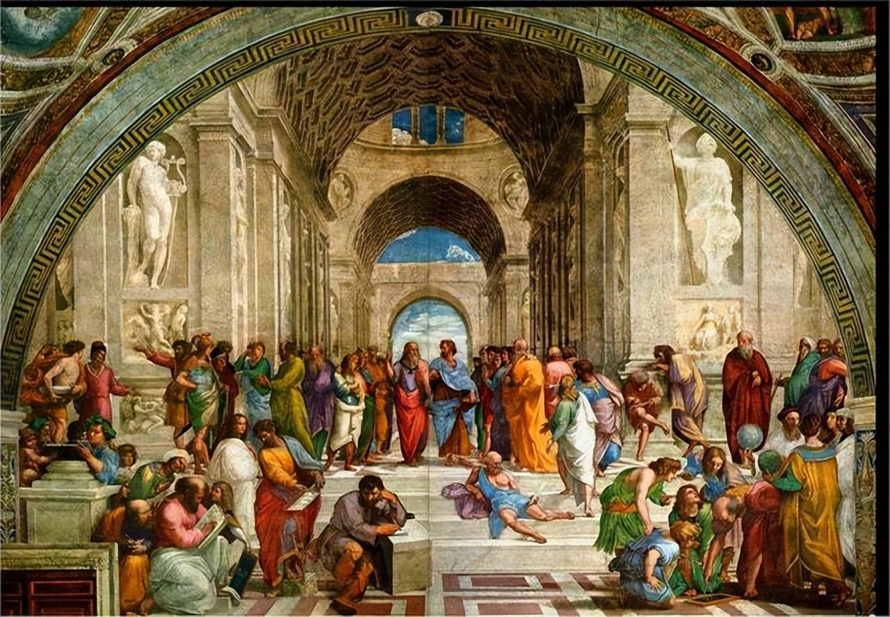

# 《理性、真理与信仰》

讲员：唐崇荣 牧师／讲稿整理：刘国辉 弟兄

## 第一讲
　　
　　我一生有一个很大的责任，就是藉著护教功能来对那些信仰上遇到困难的人讲解为什么我们要信？所以如果你有这样的一个心志，把护教功能和布道的目的配合起来的话，你为你的朋友祷告，把他们带到主的面前来，如果必要，替他们出钱，明天请他们一同来。如果没有钱，告诉我，我替你出。
　　
　　我一生有一个很大的责任，就是藉著护教功能来对那些信仰上遇到困难的人讲解为什么我们要信？所以如果你有这样的一个心志，把护教功能和布道的目的配合起来的话，你为你的朋友祷告，把他们带到主的面前来，如果必要，替他们出钱，明天请他们一同来。如果没有钱，告诉我，我替你出。
　　我很不愿意我们的机会过去了，只有我们的经费足够，那不是我们最大的目的，我们最大的目的是在这个时代怎样把人思想里面不属于神的堡垒攻破，把神所造的理性带回创造理性的神真理的面前，那是我们的目的（参：哥林多后书：10章4-5节）。所以我们不要放松我们的目的，我们要继续不断的在神面前求主给我们智慧，给我们能力做我们要做的事。

　　有许许多多模模糊糊的基督徒站在以为自己大有信仰勇敢做工，还有许多糊哩糊涂信仰的基督徒竟然站在好像很有权威的地步发言带领许多的人。而今天你看见有理性功能，而把理性与信仰带到合一的地步，能负责任，能尽理性的交待把信仰传讲出来的人，竟然在这个世界没有发挥有大的雄心的做用。相反的，有许多许多理性方面没有好好顺服真理的人好像正在如火如荼做一些所谓「上帝的工作」，这是很可怜的事情。我盼望我们这个世纪还没有结束以前，整个基督教有一个正确的方向和稳重的根基可以建立起来。我盼望你们还没有变成中年以前你们已经奠定了你整个人生的方向。如果一个人整个的方向已经没有真正的基础和原则的话，他一切的成就都没有用。
　　
每遇见做属灵工作的时候我要先问一个问题 -- 动机是什么？我们的动机里面要达到的目的又是什么？我们行事的原则是什么？那么这样，有时好像慢了一些，但是在神的旨意和神永恒的计划里面，这是绝对不会失败的，求主帮助我们。
　　
新加坡的青年，特别是基督徒应当奠定一些很重要的思想原则-- 我这一生要做什么？我是有理性的人，
　　
我相信宇宙之间有真理吗？宇宙之间如果有真理，我的理性和真理之间的关系是什么？如果有真理的话，我为真理而活到什么地步？如果有真理的话，我今天的基督教信仰，我的基督徒生活到底是站在真理一边或者是不是站在真理的一边？今天整个的西方社会已经以「赚钱」和「经济基础」为他整个生活动态和整个社会思想形态的一个最重要的内容。基督教不是如此，我们的主没有教导这样的事。
　　
　　所以你们在很年青的时候应该奠定一个重要的思想原则 -- 我这一生与真理之间的关系是什么？我要为真理做些什么？我要与人一同分享的真理是根据什么？若是这个没有定，不必事奉上帝。如果这个没有定，也不必称自己是基督徒。因为基督徒乃是要与真理联合在一起为真理做见证的那些人，叫做基督徒。
　　
　　你只能做基督教「教徒」，礼拜堂「堂徒」，某某会的「会徒」（不要笑，我丝毫没有意思和你们谈笑话在这严肃的地步里面），你只能做一个糊哩糊涂的人。
　　
　　这一次你们的海报所用的这一张图画，我不知道谁知道这张图原先是谁画的，你们知道吗？谁知道的请举手？这张图里面有两个人，一个比较老的，一个比较壮的，在一个大门框的下面，而前后一大堆的人，有的蹲在地上，有的围在旁边，有的正在自己思考。这张图有哪一个参加这次聚会的人知道是谁画的吗？这张原先的图画是谁画的？有谁知道，请举手？一个都没有？那我就不知道你们这个时代知识份子到底所要想的是什么了？
　　
这张图是文艺复兴高派最后一个伟大的艺术家画的， 这个 High Renaissance的最后一个图画家的最大的，以后还有一些没有这么大，三个高派的，后期的义大利文艺复兴最伟大的画家最后三个是达文西 (Leonardo da Vinci, 1452-1519)、米开朗基(Michelangelo,1475-1564) 和拉斐尔 (Raphael,1483-1520)，而这一张是拉斐尔画的。我先把这一张图画稍微解释一下，本来这张图画做为海报，我是不知道的，我今天才看到。但我认为这个有启发性，也愿意和大家分享一下。
　　
拉斐尔是跟米开朗基罗同时期的，而米开朗基罗又是跟达文西同时期。达文西到现在可能被认为是在历史上曾经活过的最大的天才之一。达文西的图画以「神秘的微笑」和很深奥的智慧做他图画的特色，所以是「智」的代表。与他同时的另外一个大的天才叫做米开朗基罗，他的图画里面有勇敢、刚毅、绝对不妥协、人性所有角度的美和力量的表现，那个伟大的精神就从「勇」这个字去表达。米开朗基罗同时代达文西以后，另外一个很年青的人，与他同样在一个地方工作，而这个老人，对这个年青的人竟然有这么大的才干，这么被器重，产生一种莫明的怨恨和埋怨嫉妒在里面。
　　
　　所以他一面工作一面对这个年青的有莫明的怨恨和妒忌，虽然他自己的才华一点不在那年青人的下下面。而这个拉斐尔他所表达是人性的仁慈、慈悲、美丽、温柔，所以以「仁」代表。所以文艺复兴后派高派的三大图画家可以用「智、仁、勇」三个字来表达。那么在所有拉斐尔所有作品中间，我认为最有雄厚气魄，有伟大的气慨的，就是这张图。而这张图原先是比你们登出来的更宽大概两倍，但是你们把旁边的右和左都割掉了，所以你们不是「右派」也不是「左派」，你们是「中立派」的。

　　
我要先解释这张图画，这张图中间只有两个人，而旁边好多人。这两个人一个是柏拉图，另外一个是亚里斯多德。那位年老的是代表柏拉图，那位年青的是代表亚里斯多德，你现在拿出来吧，有吗？没有。但你看过这张图了？在报名的时候看到了，我现在放在这里，你以后看的小得不得了了，我也没有办法放在这个地方给你看到，因为不是透明的，我把一个素描画出来好了。在这个很大的殿堂的里面，本来这里还有两座雕刻，这两座雕刻都是很美的人体，裸体的雕刻被放在这里。这里有两个人，一个是年老的正看著那年青的，他手指著天上。这边一个年青人，他在这边手指著下面。这下面这边有一些人，那边还有一些人。这个年老的是柏拉图，他手中拿著一本书，名字是《泰米亚斯》 (Timaeus)，《泰米亚斯》原是柏拉图所写的很多书里面的很重要的一本书，这本书就是他的Cosmology，叫做「宇宙论」，宇宙的来源是怎样的？宇宙之间的关系是怎么样的？形上、形下之间的关系是怎么样的？这个是「宇宙论」。这亚里斯多德拿在他左手的书叫做Ethiscs 就是《伦理学》。所以一个是柏拉图，他所讲的，他整个讲论的中心是整个宇宙的问题。而柏拉图所谈的宇宙论是「唯心」的，所以柏拉图在哲学历史中被称为「唯心论之父」 (The father of idealism)。Idea这个字，我们中文番译成「心」、「心意」、 「观念」、「意念」、「看法」、「见解」， What is your idea? 「你的见解如何？」「你有什么样的计划？」「你有什么样的意念？」 Idea。我个人对哲学历史里面中文的番译每一个关于 Idea的表达的字我认为都不够，所以我自己在哲学词典找不到满意的词句，我给 Idea一个很特别的名称的番译，这个番译你们满意不满意你们也有自己的 Idea 就是了。我把 Idea 不番译成「意念」、「观念」... 等等，我把它番译成「思观」，在思想里面的那个观念，所以是「思观」。所以 Idealism 如果番译成「唯心主义」那是比较不是照字意来番译的。那「思观主义」，或者你说「理想主义」 Ideal，Where is your ideal project? 你的整个理想的计划到底是什么？
　　
那 Ideal 是理想，所以有人把 Idealism 番译成「理想主义」，但我认为这个好像又离开哲学思想太远了。所以我用「思观」；「思观」可以代表「意念」、「观念」，而 Idealism就用「思观主义」就是了。他（柏拉图）是第一个认为宇宙的一切不是在物质界里面可以找到答案的。所以如果你在物质里面盼望找到答案，你一定是失望的。而一切的一切的原委不在看得见的世界，而在看不见的世界。所以他这张图画，画图的人不是随便拿起笔来画画人体结构，涂上一些颜色卖钱就算了。这个画的人是实实在在真正明白那个整个西方古代哲学的思想家所要寻找的是什么。所以一个伟大的图画简直就是一个哲学的写照。我相信新加坡人是不大注意这方面，所以你们是一个很现代化，很著重科技和商业发展的国家，但是你们在文、哲、史这方面的人才是很缺乏的，香港也是很糟糕的。所以这一代的青年人需多一些更深入一层的思想，否则的话我们表面做一个有钱的人生活很富足，什么都不懂的人是很可怜的。
　　
在西方的历史中间为什么民主和自由是那么样的勇敢？为什么西方的民主和自由有那么大的力量？在东方没办法。当年青人对邓小平说 Give us democracy or give us death! 邓小平说： Ok, give you death. 所以东方这个没办法，而西方那个勇敢民主从哪里来？就从这个人（亚里斯多德）对这个人（柏拉图）的态度来的。我们无论如何总是老师对，总是年纪大一定对，无论如何不能和他辩。但是西方不是的，这是所有学生里面唯一和老师辩得体无完肤的。所以他的老师没有办法，结果他的老师不得不承认， 我的学院 (Academe)里面所有的学生这么多，他说「我整个学院只有两件事情构成的，第一就是所有学生的身体，第二就是亚里斯多德的头脑。」换句话说，柏拉图承认整个学院里面只有一个脑，其他的只有脑袋、空袋、有袋无脑，而整个学院里面有这么多的人只有一个脑，就是敢和他辩论，敢反对他的这个脑。他当然也不大舒服，但是内心之中真正敬佩的只有这个人。
　　
我今天不是说要称赞这个或是称赞那个，因为这两个都不是基督徒，而柏拉图和亚里斯多德都在基督以前四世纪的人。所以耶稣基督到世界上来的时候他们已经死了三、四百年了，所以这是很早的事情，大概是孟子的时代，但是孟子的时代比苏格拉底迟一点，苏格拉底六十八岁死的时候，柏拉图只有二十八岁。他不是说读书四年拿了学位快快走，他一生一世跟著他的老师，跟到他老师被人弄死了以后他才不得不走。我想如果苏格拉底不走，他就跟苏格拉底学到「底」，他就不走了，因为当时的人对真理的爱好是到这样的一个地步。他不是单单为了学位，为了一时的名气快快学就完了，不是的，乃是一生一世追求，钻研，了解，要探索，要明白，要持守什么叫做真理的。
　　
为了真理的缘故也不惜需要的时候争起来，辩论起来很强烈的把自己的意见表彰出来，西方的文化受这几个人的影响是很大的。
　　
有一个人说「柏拉图、亚里斯多德和苏格拉底在这三个头脑里面所想过的，所闪过的东西可能是全世界的人想过也没有超过的。」凡是人想过的问题都曾经在这三个人的脑子里面闪过了，你可以想像是这么大这么大的人物。而亚里斯多德一个人写的书超过一千本，包括了天文学直到动物生态学。From heavens 一直到 On the move of animals。连猫走动的时候她的腿筋怎么动他都记载下来了。解剖学、生理学、我们的血液怎么样循环，他的猜测他都写书了，所以他写了一千多本书，这些人的头脑是大得不得了的。但是请你注意这张图画里面，如果以后有机会你再注意，这个题目叫做「雅典学派」(The School of Athens)，这张图画的名字叫做「雅典学派」。雅典学派也就是描写古希腊运用理性思考和探讨真理到最高峰的那一个学派的描写。
　　
在这个所有的里面，你注意，他画图画到一个艺术和哲学配合到这么深的地步，所有的人都在大房子里面。只有这两个人虽然在大房子里面，他们脑的背后是蓝色的天空，什么意思呢？只有他们的思想是冲出限制的 (Break through the limit)，明白我的意思吗？所以你一看这个图的时候，你就看见只有两个脑袋背后是天空，无限的，其他人的脑袋都在房子里面是有限的。
　　
　　所以以后你们买图画不买「哇！黄色、红色配得很好。」就买了，人家好的图画里面有无限的思想在里面，你懂吗？那这两个头脑是Universal，那为什么苏格拉底这个时间不被画在这里呢？苏格拉底影响这两个人，而历史上人了解苏格拉底根本是透过柏拉图，因为苏格拉底自己没有写书，所以只有在柏拉图的书里面你才看见苏格拉底曾经怎么教，曾经怎么想，曾经怎么说。有许多伟大的圣人「述而不著」，自己没有著作，只有述说，只有讲，有人把它写下来。当然，这个世界有两种人，如果你能够在两种中间做一种也不错了。第一种就是你讲道人家不得不写下来的。第二、你写到人家不得不拿出来讲的，两种都可以。但如果你自己讲没有人要写，自己写没有人要讲两个都失败了，但是今天有很多人就是那种人。
　　
好，我们继续再讲下去了。这个什么叫做 Universal呢？就是说他们相信有「普遍性的真理」。我要从这里提到今天的题目了，「普遍性的真理」。中国人明白「真理」的普遍性是很难得到共同的追认的。所以许多许多认为的「真理」是另外许多许多人认为「非真理」的。在共产主义被认为是对的事情，在西方被认为是不对的，而在西方被认为是天公地道的事情，在共产主义被认为是很有毒素的思想刺激。所以什么叫做「真理」呢？这就变成一个非常相对性的一个名词。但是，无论东方，无论西方都相信有真理的存在。所以，东方不信西方的真理是因为东方认为真理在东方，西方所以不相信东方的真理，因为西方认为真理在西方。而无论在何方，大家都相信真理是存在的。如果真理是存在的，只在这里不在那里，那么真理就变成有局限的The limit truth is not truth. 有局限的真理是「真理」吗？
　　
如果真理在我这里不在你那里，这样的真理可以叫做「真理」吗？相反的，如果真理在你那里不在我这里，那样的真理可以叫做「真理」吗？你说，真的共产党相信真理吗？希特勒相信真理吗？希特勒为什么奋斗？为他所认为的真理奋斗，他的那本《我的奋斗》那本书平均每一个字使世界上死了几千个人。所以全本书使世界上死了几千万人，就是因为他那本书，因为他一想「奋斗」就把别人「斗」掉了，那叫做「奋斗」，所以他为他所认为的真理奋斗。毛泽东当然也是为他所想像的真理在奋斗，但是在毛泽东统治之下，从共产党立党直到一九七六年他死的时候，中国被杀、误杀的人至少有七千多万人。到了一九六二年的时候莫斯科电台宣布，因为当时中国和苏联的关系已经搞翻了，两个电台彼此宣布对方一共杀了多少人。北京宣布在史达林手下一共死了两千多万人，而莫斯科宣布在毛泽东手下死了三千五百多万人，而文化大革命而死的人比那三千多万还更多，所以至少有七千多万人死于非命。
　　（略去100字）
　　
　　这些就表示，你说你有真理在我来说，我不信；我说我有真理在你来说你也不信，所以用中国最简单的名词来表达这个相对性的东西，就是很简单到每一个人都懂的叫做「公说公有理，婆说婆有理」。但是「理」是「公」的吗？如果理是「公」的「婆」不认，或者理是「婆」的「公」不认，「公理」、「婆理」都不是理的话，有没有「公婆合理」的呢？如果有一些理是公要承认，婆也要承认的话，那么那种理是什么理？那种是叫Universal，这个叫做「共相」， 在中文的哲学名词番译叫「共相」，或是「共同所能接受的真理的那个本相」。那这个共相就是普遍性的真理The Universal Truth正是苏格拉底、柏拉图、亚里斯多德所相信的。这张图的背后是蓝色的天空，表示突破了限制；突破了有形的建筑、有形的民族、有形的物质界的限制到了无限的地步。如果真理是存在的话，那我问你，你凭什么知道真理存在？如果真理是存在的话，请问你用什么话来解说真理？How can you know that is truth? How could you define what is truth? 今天如果我请你们现在用两分钟的时间你们谈谈，几个人交头接耳谈，谈完了以后把你们认为的「真理」的定义先告诉我一下，那我们再接下去的时间我们就会发现许许多多的人都有不同的定义。
　　
为了表示这句话是对的，我们现在马上实行，现在你们自己先谈一下，几个人谈一下，几个人一组随便你，我们给你一分钟半的时间，完了以后我就要请你们中间无论哪一个人要站起来把你们那一组讨论的「真理」的定义你讲出来，给你们自由，另外有半分钟的时间你们有谁要讲的，现在讲，现在谈。什么叫做「真理」？你信有真理吗？你怎么知道有真理？真理是什么？不讲话的我特别请他站起来演讲一下。现在你们快快谈，有没有真理？你怎么知道有真理？真理是什么？
　　
好了，时间到了。如果一分钟里面就讨论出真理来，那是很有真理的。好，有哪一个人要表示那一组的意见，要表达你们的定义的？谁都可以站起来。「真理是什么？」有没有？请站起来讲，把你们的定义和意见讲出来。

　　答：真理是永远不会改变的道理，例如一加一等于二，昨天是一样，今天也是一样。
　　真理是「永远不改变的道理」？请你再解释什么叫「道理」？好，还有没有？没有了？刚才谈些什么？还有哪一个人，快点，不要怕，最多讲错了。讲，你们有没有讨论？讲嘛！你们现在讲嘛！
　　答：真理是真实的道理，客观事物在人的意识中的正确反应。
　　
请再慢一点讲，大声一点，站起来讲。
　　哪一本字典哪？是莫斯科出的或者美国出的？「真实的道理」，什么叫「道理」啊？什么东西的反应？「事物的反应」？人反应它或者它在我们里面的反应？还有什么？
　　
好，我们现在要请大家来看一些圣经，以弗所书第四章第二十四节，翻到一同来读：「并且穿上新人；这新人是照著上帝的形像造的，有真理的仁义，和圣洁。」
　　
人，一个新的人是有神的形像的，这个「形像」是什么样的形像呢？是有真理的仁义和圣洁。在这一段的圣经里面我们看见了三个名词并列在这里。而这三个名词之中有一个就是我们刚刚所讲的，有「真理」的仁义和圣洁。
　　
真理的仁义和什么？----
　　
圣洁。在这里我们看见，前面的这个本性成为后面两件事情的基本本性。所以，真「义」、真「洁」。「洁」是建立在真实的本质上，「义」也是建立在真实的本质上面。这样，人之所以为人，因为人是照著上帝的形像造的。这样，人像上帝是从什么地方看的？人像上帝就从人有这三个本性来看的。这样，神的形像你就不难了解了，在全本圣经里面多处提到「人是照著上帝的形像造的」，或者说「人像上帝」，但是「像上帝」是怎么样去了解它呢？其他的圣经在旧约里面没有提，新约别处也没有提，唯一提到形像的解释的，就是以弗所书四章二十四节。所以从归正宗，或者改革宗神学很严谨的把它演译出来的话，我们看见这里有三大本性。
　　
第一个本性就是「真理」在人的心中，表示人是有理性的。「仁义」在人的生命里面，表示人是有法性的。「圣洁」在人的生命中间表示人是有德性的。这样，你看见了「人之所以为人」，与所有动物不同的地方有这三个基本的本性使人有资格被称为「神的形像」。「人之所以为人」，在这三个本性里面，给我们看出「人可以做上帝的代表」。
　　
「人之所以为人」， 因为人是有理性的活物， rational being, nature of reasoning。
　　
第二样， 人之所以为人，因为人有「法性」的功能，nature of law 这就是人能够思想公义、不义、法律、 制裁、审判、批判....这些功能的基础。 人之所以为人， 因为人有「德性」的功能， the nature of morality 所以人与动物就不一样。人之为人与动物之间的不同，有许多的思想家曾经做一些很重要的探讨，但是没有一个人曾经超越过圣经所提示出来的这三大本质。
　　
　　人是有理性的活物，人是有法性的活物，人是有德性的活物。在我们还没有考虑到什么是真理？怎么界定真理以前，我们来思想人与动物之间的分别在什么地方？
　　
我们刚才思想的许多许多的思想家，无论是东方，无论是西方，曾经在这个大的题目下做一个很严谨，也是非常深入的探讨。那么我们先思想到在这个古代人文主义之父的思想，这个人叫做普罗达哥拉斯(Protagoras 484-411 BC)，普罗达哥拉斯是第一个把人的重要性提出来的人，可能他提得太过份了，但是至少他发现了人与万物是不一样的。把「人」与「物」等量齐观的人一定缺乏人性，或者缺乏对人性的了解。人绝对不是物，物绝对不是人；人有物的成份而超越物，物组成人的成份，但却不是人。人之所以是人，因为人有「超物」的这个成份在里面。
　　
那么， 普罗达哥拉斯被称为「人文主义之父」(The Father of Ancient Humanism)，这个「人文主义之父」重要的有两个人， 第一个就是普罗达哥拉斯， 另外一个人叫做格而齐亚(Gorgias 483-375 BC)。普罗达哥拉斯对人的定义是什么呢？他用一句的希腊文文来表达出来，这句叫做 HOMO MENSULA，HOMO 就是man；MENSULA 就是 measure，整句话的表达就是 Man is the measure of all things人是万物的衡量，人之所以为人，因为人会估价万物，人能衡量万物。
　　
我们有时候对小孩子说：「你不懂事，这么重要的事情你都不注意，不重要的一直注意」，为什么？因为他没有价值观衡量的可能。我第一次把我的两个孩子带到加拿大去的时候，我带他去看尼加拉瀑布，我以为他们会很欢喜，你知道他们两个一个五岁，一个两岁，不看瀑布，他们一直看那个望远镜。我说，「望远镜是为了看那个」，他说「不，这个好看，这个很好看！」我说，「那个是世界最大的。」他也不知道什么叫「世界最大的」，就是看这个很好玩，因为那个是跟家里的水龙头有一点一样的，而这个东西是家里没有的，所以他不能衡量哪一个是大，哪一个是不大；哪一个重要，哪一个不重要，这个「衡量」的功能等他长大以后慢慢的了解起来了。但是我告诉你动物看见大的尼加拉瀑布也不会站在那里欣赏一下然后说：「嗯，比我乡村里的那个小瀑布大得多！」连这个衡量都不可能。所以普罗达哥拉斯的思想是对的，这一方面就是「人是唯一能衡量者」 --Man is the measure of all things. 如果这个「 things」，后面的这字「万物衡量」只是指物质界里面的话，那么这句话没有多大的错误。但是如果这句话可以表示每一个个人都可以用主观性的绝对权威来衡量一切，让一切都在主观性的衡量之下被定价值的话，那是危险的。我再讲一次，如果人是在物质界里面是唯一能够做衡量，有这种衡量功能的活物的话，那这一句话对人类本性的解释是没有错误的。但是如果说每一个个人都能够，都可以用他主观性的衡量当做绝对的权威来给万物定价值的话，那这是很危险的。因为每一个人会在个人主义的绝对化里面走了一个非常狭窄，有限制而有可能错误的道路。如果把这种有可能错误的主观当做是可以绝对化来使自己当做真理的话，那么这个衡量可能变成了一个真理的仇敌，那是很危险的。所以从这方面看，这句话是不够的，这句话是有危机在里面的。
　　
那么，普罗达哥拉斯他虽然讲了这句话，与他同时代的另外一个人文主义很重要的大师（格而齐亚）竟然从另外一个角度发现到另外一个很大的相对性的一方面，也就是说，当你有了某种的「知」以后，你没有办法把你的「知」传给别人，你传的时候一定产生折扣，产生折扣的时候使受知的启发者与知的启发者之间的观念有很大的差别。所以他就定下了三个定律，这定律的第一条叫做Nothing exist。第二条：If something exist can not be understood。第三条：If something exist can't be understood, cannot be convicted or communicated. 所以，无一物存在，若有任何物存在，没有办法真正了解。如果你真正了解，也没有办法告诉别人。
　　
现在我问你，贝多芬 (Ludwing van Beethoven, 1770-1827)所写的诗歌和指挥家对贝多芬了解的音乐之间有没有差别？我再问你，指挥的人要他的乐团演出来的，指挥所了解的和乐团所了解的有没有差别？有。乐团所了解的，「是的，这个地方应该大声」，和他手要大声大不出来，这个「要」表达的和「已经」表达的有没有差别？有。那么他表达出来的，和他那个时因为他要表达出来，表达得很准，但是因为音调得不准，或是因为动了好久那个弦稍微拉长一点，又有没有差别？有差别。他表达出来了以后，经过麦克风，经过扬声器到你耳中的有没有差别？又有差别。那么，你所听的和你所感受到这么好这么好的，和原先贝多芬要表达的差多少？不是差「多少」，差「多多」，对不对？所以这个道理还是有道理在里面。所以普罗达哥拉斯提到measurement 的问题，the ability of measuring something. 但是，格而齐亚提到的是communication 和 understanding的问题。我想，这些问题把每一个问题把它更深入的思考，把它研讨，把它表达出来，你就发现都是很大的问题。当然，我们这样想下去可能会变成神精错乱的人了。但是，我要告诉你们一件事情就是我们的理性是有限制的，我们的理性功能也是有限制的。
　　
所以有一些青年人刚刚读高中，刚刚才读高中眼睛就又「高」又「中」的话，那是很危险的。刚刚念大学就以为自己的理性就是一切的话，那是很危险的。所以我今天要你们很谨慎的思考关于「思考的本身」是否有限制的问题。
　　
那普罗达哥拉斯，把人当做是与万物有别的，人与万物有别，因为人是「万物的衡量」。这是人类历史中间第一个对人下一个很重要定义的思想家。但是，可能比普罗达哥拉斯还更早的时候，中国人已经给人类下一个比普罗达哥拉斯更好的定论了。中国不是说人是万物之「衡量」，人是万物之什么？----万物之灵。
　　
「人是万物之灵」，所以这里就把「灵界」和「物界」做了一个分割。而人是唯一能在这两界当中能够有所了解物，有所灵的感应的。所以「人是万物之灵」，在万物中间只有人，具有物质身体的人，竟然有灵性的反应。所以我们提到「心灵」、「性灵」、「灵感」、「灵意」这些的东西有「灵敏」、「灵活」的反应，这些名词实正表达了人实在是万物之灵。所以西方的哲学提到人是万物之衡量，是和物更靠近物的，这一方面对物的研究的。而另一方面东方就提到人是「万物之灵」，是更提到人对物的反应和里面的感受的问题。那这个「感受」就产生了不得不整个东方比较进到了属乎灵界看不见范围之间的那个唯心的走向。
　　
而西方就比较靠近对物质的衡量的研究，比较唯物的科学的那个趋势。而东方的走势、西方的走势这两个走势都告诉我们整个东、西文化不同的地方有所偏重的不同点。
　　
在东方以「心性」为主，「灵」的感受，「灵」的反应是很重要的。在西方，对「物」的衡量，对「物」的研究是很重要的。所以西方的科学比东方更发达那就是很自然的事情。而东方的宗教比西方更发达，那也是很自然的事情，因为东、西方对「人」的了解有不同的重点。
　　
　　这样，到底人是怎样？我们继续再思考人与万物之间不同的地方在哪里？是不是在东方里面没有思想到人与物质之间的关系和可能产生科学知识的这些工具和程序呢？不是的。如果你把孔子的思想，从人自己怎样在整个过程中间达到最后的目的时候，你发现他第一个步骤就是与物质发生关系。所以孔子的整个人生责任从什么地方开始的？从「格物致知」、「修身养性」，然后「齐家、治国、平天下」。
　　
这里「格物」这个字，和希腊文里面「万物的衡量」是没有相差太远的。你「格物」，就是你懂得怎样在物质的中间找到它的规格，怎样去研究它，分析它，很严谨的了解这个物质。「格物致知」，也就是在物质的研究中间达到了科学的可能。所以在这里，东方并不是没有提到关于与物质的关系怎样产生科学的可能。西方也不是没有提到与心灵的关系产生的宗教的可能。因为就在普罗达哥拉斯以前一百年，就已经有了一个很重要的人叫做毕达哥拉斯 (Pythagoras)，这两个都叫「哥拉斯」，一个是毕达哥拉斯，一个是普罗达哥拉斯。毕达哥拉斯是一个人有四职在他的身上；他是一个哲学家；他是一个数学家；他是一个音乐家；他又是一个宗教家。很少人在这四方面同时是有天才的。他是一个哲学家，因为他在形上学的探讨里面提出了「数目是一切万有最基本的原先状态」(The total universe is based on ultimate reality, and the ultimate reality of the universe is number.)
　　
所以你要和谁讲话，在全世界你只要在电话机上面按数目就可以找到那个人了，对不对呢？你在每一个音乐的音里面可以找到振动的数目，对不对？你甚至在光的速度里面可以找到数目；不但在你头上的头发找到数目，在你整个身体的细胞找到数目，连整个宇宙的构成都是由原子的数目产生大小的分别。所以他在哲学界里面第一个提到number is the basic and ultimate reality of composing everything existing in the world.
　　
这个是从哲学方面。第二方面，他不但是哲学家，他也是一个几何学家，所以你们读过数学的人就知道有毕达哥拉斯的三角形定理，有没有？你还记得吗？
　　
这毕达哥拉斯在几何学，在数学里面给我们带来的贡献，直到今天教育界不能否认的。
　　
第三样，毕达哥拉斯是一个音乐家，因为他就从「数」这方面来定音的高低，所以这是西方乐理里面第一个很有重要贡献的人。不但如此，他是宗教家。我不相信他曾经坐过飞机从希腊跑去找释迦牟尼，这两个人的时代差不多一样的。但是为什么他能够在那时候就找出了好像与释迦牟尼几乎相同的宗教理论，他认为人死了以后有一个永恒性存在，这永恒性要怎么样追求到最后的良善呢？所以他想，大概死了以后并没有办法就完了，所以在投胎转世，再追求，再追求不完，以后死了又再生、三生、四生、五、六、七、八生，这个叫做「六道轮回」。
　　
所以在东方释迦牟尼有这个 reincarnation 的观念，在西方的毕达哥拉斯也有 reincarnation 的观念。
　　
这样说来，西方偏重格物致知的科学方法，此外他并不是没有宗教观念在里面。而东方是著重心灵感应的宗教和形上学、唯心论的发展里面并不是没有格物致知的科学思想。只是我们看见东、西方都在寻找真理。而真理存在吗？真理存在。如果真理不存在，对真理感到需要的这个本能也不会存在。你不能说「我很爱吃香蕉」但是世界上没有香蕉。你不能说「我现在长大了需要结婚」但是世界上没有异性。没有这样的事情。所以这个「里面的需要」和「外面客观的存在」的这个事实的配合是一件很清楚的一个道理。而我们看见了，在宇宙中间几乎没有一个不存在的东西需要你继续不断的去思考、研究、甚至著书立说来护卫、来传扬的。
　　
你说「上帝不存在，但是你们基督徒偏偏要用各样的证明来证明他」，「上帝看不见，你们偏偏说梦见他」，所以不用看，就用「梦」来代替，「上帝不能证实」，你就用各样的办法来强辞夺理来说他是存在。我告诉你，不存在的事物没有可能在人性中间有这么强烈的需要、护卫、经历、和印证....等等的事情产生出来。
　　
相反的，我们中国人说有「龙」的存在，外国人也说有龙的存在。那么在差不多所有重要的文化里面「龙」这个字都曾经出现过，但是却没有人继续不断钻研、研究、分析、做梦然后见证他与龙的关系是什么？为什么呢？因为这根本是一个不是真正存在的事物，不过是在想像中间，或者曾经有好像龙一样的东西出现过传流下来的。所以，「真实的客观性的存在」与「主观性的探求」之间的那个合一的关系是我们不能否认的。这样，你说真理若不存在为什么许多人正在寻找真理呢？连莫斯科的报纸也都把他们报纸的名称叫做《真理报》，虽然报的不一定是真理。你看到了吗？真理是存在的。
　　
我们继续思想下去，西方的探讨到了一个地步就出来另外一个人，这个人是谁呢？不是毕达哥拉斯，而是苏格拉底。苏格拉底相信大家说来说去不同的看法，有不同的主见产生彼此的争论是不必要的。
　　
因为我们如果实实在在在探求，你就可以找到那普遍性的真理，结束「公理」、「婆理」之间的纷争。所以苏格拉底这个观念就带到柏拉图、亚里斯多德的正统哲学思想里面。在正统哲学里面都相信我们虽然有限，但是我们相信，在我们有限之外一定有超越限制的普遍真理，以致于那个真理是高过你的观念，那个真理也高过我的观念。当我发现我的观念有限的时候，我并不这样灰心，立志不再追求，当我发现你的观念有限制的时候，我也不认为我们就没有办法，我们相信有普遍性的真理是高过你所认为的真理，也高过我所认为的真理，那个真理就叫做「普世的公理」，那真理是永远不变的真理，是放诸四海皆准，立万代而常新的，那真理一定是存在的！虽然我们在捉摸不定，虽然我们在模棱两可，我们在不能达到肯定答案之前，我们很难真正的印证出那真理是什么，但是至少可以摸到真理的某一方面。
　　
那么，希特勒讲过一句话是根据他手下的一位将军讲的，他说：「把谎话了一百次就变成真理了。」这里，他们是在历史里面对真理的观念最模糊和最低级的表达，因为他观念中间把真理的「真」字和变化的「变」字连在一起。
　　
　　「真」和「变」不能连在一起的，因为「真金不怕火炼」，所以你怎么把它炼，怎么把它继续不断的陶冶你发现，真金的颜色还是真金的颜色，因为它不变所以才叫「真」。这样，「变」和「真」连在一起，这观念就表达出来出于一种故意侮蔑，或是一种不故意误解真理而产生出来的。真理的本身是不改变的！刚才你们中间有人提出来了。那永远不改变的，昨天是这样，今天是这样，以后也是这样的，虽然他还没有活过以后是怎么样的生活，他已经讲出来，那个真理的概念是超时间，超空间的。
　　
我们继续再思想下去。在中国人中间孟子提到人与万物不同的地方在哪里？我们人里面有一个同情心，怜恤别人的心，这种「同情心」就把人与万物之间分别出来了。所以在孟子的思想中间用现在更容易了解的名词来说，就是那个「良心」的感应把人与动物分别出来了。人之所以是人，人不是畜，畜不是人，因为人有天良，人有里面这个良心的反应。这个「良心的感应」把人与动物分别出来了，这个是孟子的思想。孔子提到人可以格物致知，人还可以祭上帝，祭天，「郊社之礼所以祭上帝也」（参：《中庸》十九章）。这样，人与那宇宙的主宰的关连，那是人与万物之间不同的地方。在希腊里面最重要的一个人应该就是亚里斯多德，我们刚才提到和他老师辩论的那个人。亚里斯多德提到人与动物之间最大的不同在哪里？就在一件事情，这件事情就是「理性」。人之所以是人因为人有理性，因为人有理性的缘故，人和动物分开来了。所以，什么东西使我们成为人呢？孟子说「天良」，普罗达哥拉斯说「衡量」，中国人说「灵的感应」，亚里斯多德说「理性」。我们到了二十世纪的时候看见，这所谓的「灵的感应」、「悟性」、「宗教观念」似乎慢慢被现代人看为比较低级不重要，被撇开了。但是「理性」被现代人看为非常非常重要，我相信我们要回溯到亚里斯多德这方面所提出来的异点来做好好的思考。
　　
The reasoning is the only function that cause the difference between men and animals. 我们有理性的功能， 我们能分辨「真理」与「非真理」，我们能数算，我们能分析，我们能演译，我们能研究，我们能够把许多的东西、结构做成组织、做成数目字的统计，然后把它发挥出来，这些的可能性在动物界里面没有的。所以理性成为人与万物中间最大的不同的地方。我们再思考的两方面，东、西方哲学中间两个很重要的观念，我们就回到圣经里面来。
　　
在东方的哲学里面还有一样，也就是印度，印度的思想中间对「理性」和「宇宙」之间的关系他们的表达是什么呢？他们用两个字来做表达。我现在画一个很简单的地图，这个是欧洲，这个是非洲，这个是阿拉伯，这个是印度，这个是亚洲，这个是中国、越南、你在这里，台湾、海南岛、菲律宾、澳洲、纽西兰、英国。印度是一个很重要的地方，因为印度对真理的思考有他独特的贡献和独特的路线。中国也有很重要的独特的思考和贡献，希腊有很重要的思考和贡献，埃及有许多的成就，但是对真理的了解和思考，没有太大的普世性的贡献。至于巴比伦有很大的文化源流，也没有太多的记录下来怎么思考真理。至于希伯来文化那是很独特的领受，从神而来的启示的文化，以后有机会我们再谈。
　　
现在我们看见希腊里面有一派的思想家和印度的一派思想家有一些相靠近的地方。在印度教中间，他们有一个很重要的字，这个字在人内心里面，这个在人内心里面的，和在人外面的有内外相呼应的功能。所以当你里面的东西，和外界的那个东西接触的时候，你就可以明白真理。真理的明白因为人里面有这个东西，而这个东西是什么呢？印度人给它一个名称叫做「阿特曼」 (Atman)，「阿特曼」就是等于好像人心中的小道来讲的。中国人谈「道」，孔子谈道，老子谈道，「道可道非常道，名可名非常名」；「道生一，一生二，二生三，三生万物」；「道也者，不可须臾离也」（《中庸》第一章）。印度人的道，用小道来说叫做「阿特曼」，印度人对宇宙界中间他们相信有一个「大道」，这大道是大到一个地步，整个宇宙都靠它而立的。
　　
那个大道是什么呢？ 那叫做「布拉曼」（梵天）（梵天 Brahman）。那「布拉曼」（梵天）就是「创造者」。在印度的神中间有三个最高最高的神，第一个神叫做「布拉曼」（梵天），第二个神叫做「毗湿奴」 (Visnu)，第三个神叫做「湿婆」 (Siva)，你们都不知道？你们只知道「门神」、「灶神」、「土地公」，就是这几种。这中国人真是糟糕，中国人只有一个神 --「钱」，你还会笑啊？我对中国文化有很多很悲观的批判，不论你怎么讲，中国人我到世界去看的，除了这个字，其他都不是价值，只有一个价值（钱）。
　　
我们再看下去。这个大道「布拉曼」（梵天），最高的是「布拉曼」（梵天）、「毗湿奴」和「湿婆」。「布拉曼」（梵天）在印度的宗教里面是谁呢？ 是 creator 「创造者」，「毗湿奴」是protector，是「保护神」，而「湿婆」是什么神呢？destroyer，是毁灭神。如果你问印度人这三神中间最高的是哪一个？他们马上说是最后一个，是湿婆，就是那毁灭的神是至高的神，The highest, the supreme god is god of destruction.所以这个毁灭的神是最高的，印度人怕它怕得要命。
　　
在印尼的中爪哇的日惹 (Yogyakarta)有两个庙应该列入世界最大和最伟大的庙，佛庙叫做「婆罗浮屠」(Borobudur)，你知道为了修建已经一千两百年全世界最大的佛庙（不在中国，不在印度，在印尼，所以你不可以看不起印尼），为了修这个庙就建了全世界第一座「石头医院」 (The hospital from the stones)。
　　
　　所以哪一种石头？经过多少年？出哪一种细菌？哪一种病会产生？都研究出来了。联合国派人在那边建了一个石头医院，用了几千万美金才把它修好的庙，就在中爪哇，离雅加达大概三十八公里的地方，我去了好几次了，这个庙在那里。另外一座庙就靠近那个地方离差不多四十多公里的地方，是印度庙。所以在一千两百年以前，在印尼有印度庙被建造，有佛庙建造，是大到你不敢想像的。这个印度庙的高度差不多等于四十八公尺，也就是等于现代的楼（一楼三公尺）差不多十六楼，十六层楼高。那是一千两百多年以前建的，完全没有钢筋水泥，用石头勾石头勾石头，在石与石之间有一些缝让流水流到水道到地下，以致于石头与石头之间有流水所以不容易毁坏，这样的东西在那时候建成功了。现在那个印度庙正在大肆修建，在庙中最中央最大的庙，竟然不是布拉曼（梵天）的，是湿婆的，毁灭之神的庙占了最重要的地方，所以你一看就知道与基督教的思想相差太远了。
　　
我们继续看下去，「布拉曼」（梵天）不但是「创造者」而已，是那个「创造之道」。所以这个布拉曼（梵天）运行在大宇宙的中间这是宇宙的大道，但是阿特曼在人的心中，就是人心中的小道。「小道」与「大道」之间有什么关系呢？当「阿特曼」与「布拉曼」（梵天）结连的时候，你就恍然大悟明白宇宙之间一切的真理，这是「阿特曼」与「布拉曼」（梵天）。而这个「阿特曼」不在其他万物之中，而只在一种活物，就是人的生命中间，only exisit in human life 只有人有这个道。这是东方的一个很重要的文化 --印度文化里面的一个很重要的发现。那么在西方里面有没有这样的思想呢？有。在西方中间有一派的哲学，这派的哲学在主前四百年的时候开始，一直到主后四百年才开始衰微下来。所以前后差不多统治了西方最高层的知识份子有八个世纪，有八百年之多。如果你研究历史你就发现苏格拉底就在主前四百多年，主后四百多年也就是差不多奥古斯丁(St. Augustine, 354-430) 的时代。
　　
所以在这前差不多八百年的时间，为什么不是苏格拉底的思想影响，也不是亚里斯多德的思想影响，也不是柏拉图的思想影响，是这一派的思想影响。这一派到底是什么派？现在我把这个名称提出来，这一派叫做「斯多亚派」的哲学Stoicism，那么保罗传道的时候到了雅典，上到亚略巴古的石头山上面，就在那个地方与这两派的思想辩论， 一派叫做「以彼古罗派」(Epicureanism) 「以彼古罗派」，另外一派叫做「斯多亚派」(Stoicism)。
　　
以彼古罗派是以「人生以追求快乐为目的」来活在世界上的；斯多亚派的人生是以「追求良善」为目的来活在世界上的，所以这两派有许许多多的跟从者。当然，比较有深入思想的人是不会跟那些比较低级的、只求感观快乐做为人生目的的以彼古罗派来走的，那些有思想的人都走在这条路线。所以刚才我说斯多亚派的思想竟然统治人类当时最高层的知识份子差不多八百年之久。那么你说，是不是当时只有那些高阶层的贵族和有学问的人才跟从斯多亚派的哲学？不是的，很奇怪的，在历史中间我想也只有这一派曾经上自皇帝，下自奴隶都受他们的吸引，这很不简单的。所以在主后第二世纪的时候，有一个很大的罗马皇帝叫做马可奥热流 (Marcus　Aurelius)，马可奥热流是一个非常伟大的皇帝，因为他不是以他的权和他的武力来治国，他是以他的品德来治国。「以德服人」在中国的思想里面，这是一个很高级的统治者，不是以权势来威吓百姓，人家怕你怕得不得了，不得不乖，那个是「假乖」。你以德服人，以善来待民，这样的皇帝是很伟大的，所以在义大利直到现在，如果你到罗马城去，你去看一个叫做「罗马市政厅」的广场，你发现市政厅下面的设计漂亮得不得了，用那个义大利的大理石铺在整个广场中间，花纹的设计是义大利特别的记号。
　　
上面中间有一个很大的皇帝在一个铜像的上面，骑著一匹马，那位皇帝不是凯撒犹流 (Caesar, Julius)，那皇帝不是奥古士督(Augustus) ， 那皇帝不是提多 (Titus)，那皇帝也不是维斯帕先(Vespasian)，也不是其他的人，比如说卡拉可拉 (Caracalla)， 或者尼禄王 (Nero)；
　　
他们选的就是这一个人叫做马可奥热流，所以这一派的思想影响到王族里面去。而柏拉图思想中间最好的统治者应当是智勇双全的人。有智无勇，英雄无用武之地；有勇无智，或者有勇无谋世界大乱。所以柏拉图说「伟大的统治者应当叫做philosopher king，是一个哲学家做皇帝，或者一个皇帝做哲学家。中国的孔子有头脑没有王位，许多的王位有权势，没有头脑。
　　
　　而这个马可奥热流就是这样的一个人，又有哲学思想，很智慧，又是一个有权柄的人。所以他可以说是具体化了柏拉图政治思想中间那个智慧的君子做君王，又是正人君子，又是万人的君主的这样的一个人。他受斯多亚派思想的影响。不但如此，斯多亚派也影响了最下层最卑贱的人，甚至有一个人很著名的哲学家出生是奴隶，这个人叫爱比克泰德 (Epictetus,55?-135?) 所以上至君王，下至奴隶都受这一派伟大的思想的影响。
　　
这一派的思想伟大的一个地步，甚至当基督教传给他们的时候，他们发现许多基督教的社会伦理观念，他们不单单是观念，早就行出来了。什么叫「男女平等」，什么叫做「停止战争」，什么叫做「善待俘掳」，什么叫做「万族不要彼此歧视」，「世界大同」....这些重要的基督教社会道德观念，他们早就已经在他们的哲学里面找到而且行出来了。这派的思想所缺乏的就是「救赎」、「脱离罪恶」以及「与神和好」的基督教的这样的东西。斯多亚派像印度教一样的，他们对宇宙有一个了解，认为在宇宙万物中间有一个公理运行，这个可能受了苏格拉底的影响。意思就是说，在万有中间都有道理的，因为这个道理不是单单在你里面，也不是单单在他里面，或者在我里面，这个道理是运行在万界之中。无论是道德界，无论是天文界，无论是物理界，无论是宇宙土质界，地理界，什么界都一样的，有一些伟大的真理统一性的在运行，这个，他们给它一个名称叫做Logos。如果你们读过希腊文，你知道约翰福音第一章第一个字：太初有什么？有「道」，「道」的希腊文是什么？就是这个字 (Logos)。所以有一些新派的神学家，他们说，「基督教是受了斯多亚派哲学的影响，把他们的名称拿来用，把他们的观念借用到新约圣经里面。」我告诉你，不是的，乃是神许可那些非基督徒在普遍启示(general revalation)中间用了一个他们不大明白的名词来表达他们对真理了解的片面观念，直到圣灵启示约翰的时候，才让约翰正确的，完整的把上帝的道的概念很清楚的表达出来了。因为神的启示才成全了人对普遍启示的了解。
　　
这个 Logos 运行在万有的中间，是宇宙一切思想之因，也是一切思想之母。你会思想吗？因为有一个母，你能有理性吗？因为有一个因。那个宇宙之因，思想之母叫做　　Logos。那么你呢？你和动物不一样。猫不会想的，狗不会想的，没有一种动物是有理性的，只有人有理性，为什么？因为斯多亚派说，「人是Logikos 」。 Logos 是什么？是宇宙的大道，Logikos是什么？是人心中的小道。所以这个就表示和印度教有差不多的东、西方互相呼应的那个相似点在那里。在印度的思想里面，有宇宙的布拉曼（梵天），在我里面有人心的阿特曼。在希腊的思想中间有宇宙的Logos， 在我里面有我里面的Logikos， 所以当 Logikos 有一天回到 Logos的时候，我们就可以停止一切的辩论。当我们今天还在 Logikos的范围里面，你说你的对，我说我的对；你说我没有道理，我说你岂有此理。那个人都相信「理」是存在的，但是就不在你那里，在我这里；每一个人都认为自己才有那个理，那个理之间与理之间与理之间超过万理之上的公理是什么呢？他们说叫做Logos。
　　
马可奥热流这个皇帝还没有死以前写了一些的论文，其中有一篇信是写给他的家人的，他这样说：「我死了以后，你们不要担忧，你们也不要为我哭，因为我乃是回到了理性之母 Logos 那里去，在那里我要与 Logos 合而为一。」这种观念，好像有基督徒的某一种信仰的观念在里面。意思就是说，「理性应当归回真理，在宇宙的理的里面找到你自己的皈依。」这样，这个道理相当靠近基督教的真理。那么如果在东方里面有「格物致知」的可能，孔子的学说，在印度里面有「阿特曼」与「布拉曼」（梵天）合而为一的可能，这是印度教的学说。在西方有「人是理性的活物」，亚里斯多德的学说。还有斯多亚派的Logikos和 Logos会合的这个可能的这种斯多亚派的哲学。那么圣经怎么讲呢？圣经告诉我们，「人是照著上帝的形像造的」。我告诉你，没有任何一派的思想，没有任何一派的哲学比这本圣经，把人最大的尊严，最正确的价值和最高的可能性表达出来。感谢上帝！人不是在碎片中间盼望合一，人不是在小道中间摸索什么是真理，人是神的形像We are like God，我们像上帝一样的，我们是照著上帝的形像造的。所以这里我们看见了，这三大本性的源头，不是单单一个本性，如果在阿特曼和布拉曼（梵天）中间；在 Logikos 和Logos中间，我们看见只有提到一方面，圣经让我们看见三方面人与神之间的关系。人之所以是人，因为人有理性；人之所以是人，因为人有法性；人之所以是人，因为人有德性。
　　
我们这个理性的功用是使我们像上帝的第一方面，我们的法性的功用是使我们像上帝的第二方面，我们的德性的功用，是使我们像上帝的第三方面。这样，你看见，唯有一本的圣经，就是基督教领受了上帝启示的这本书，给我们看见的，不像东、西方哲学、和文化里面的片断了解，not fragmentary understanding just like eastern civilization or western philosophy, but the total understanding of the unity of the truth is revealed in the Bible to the Christian. 你看到了没有？天下只有这一本书把那统一性的了解，The total understanding, the unity of the truth.整个真理的统一性完整的启示赐下来给我们看见人性是什么。人不但是有理性的一方面，人不但有法性的一方面，人还有德性的一方面。
　　
而这三方面和心灵的反应结合起来，信仰的可能结合起来，就是当这些和源头发生关系的时候。当理性和理性的源头发生关系的时候，当法性和法性的源头发生关系的时候，当德性和德性的源头发生关系的时候，你看见这个「关系」的本身就发生变化，变成「灵性」的本身。所以这里我们这几天要思想的是在那个理性与原先的真理的源头发生关系所产生的是什么，我给它一个名称叫做「信仰」。
　　
　　所以这个理性的源头是什么呢？理性的源头就是真理的本身，真理就是理性所思考的，真理就是理性所追求的，真理就是理性所爱慕的。在希腊文Eros 后来变现在的成肉身之爱的erotic，这个字原先的意思不是如此的。我爱慕真理，我愿意明白真理，这个爱慕的方向使我们理性与真理合而为一，而这个真理的本身是成为理性之本，成为法性之本，也成为我们德性之本。圣经在这里给我们很清楚的看见人之所以为人，因为人是有理性的。
　　
现在我要问几个问题，让你们现在在这几个问题中间做一些思考，以后我就结束今天的讲论。
    　　第一、我要你们注意的就是是不是有宗教的人都是为了肯定理性否定信仰的人？或者有宗教的人都是肯定信仰而否定理性的人？你们现在就把答案想一下勾一下，是或者不是。有宗教的人是不是都是肯定信仰的人？
    　　第二、肯定信仰的人是不是都一定要否定理性呢？
    　　第三、理性与信仰是不是有可能调和的？在调合的中间哪一方面必须做出更多的让步和牺牲？
    　　第四、信仰是不是为了供应生命整个的需要，而理性只是生命部份的需要？所以可以忽略理性的？
    　　第五、为了坚定信仰，是不是许多人应该放弃理性追讨与探讨，甚至扼杀理性的功能？
    　　第六、我要怎么样达到一个有纯正信仰而没有做一个违背理性的基督徒？
　　
我要你们今天回去的时候好好思考这些大的题目，就是理性与信仰之间的问题。
　　
我们低头祷告：
　　「主啊，我们感谢，我们赞美你，你创造了有理性的人，乃是按照你的形像和样式而造的。我们如今在你的面前成为一个有存在的，有生命的人，乃是因为照著你的旨意被造成有理性的人而如此存在的。我们肯求你帮助我们，当我们遇见理性和信仰冲突的时候，主啊，你把智慧赐下来，你把顺从的心也赐下来，更求你用真理的光照耀我们的理性。我们在你面前恭敬，把我们每一人在信仰路程中间的困难带到你的面前，主啊，求主你继续向我们施恩，为我们预备那一条行在义路中间顺服你的道路，使我们不是做一个理性的浪子。主啊，你听我们的祷告，我们感谢，我们赞美你，奉主耶稣基督的圣名求的。阿们。」
　　

## 第二讲
　　
　　我们大家一同看两处的圣经，第一处的圣经记载在罗马书第一章 十八节，我们翻到以后一同来念两次，我先念一次，以后第二次请大家一同开声来读，罗马书第一章第十八节：「原来上帝的忿怒，从天上显明在一切不虔不义的人身上，就是那些 行不义阻挡真理的人。」我们再看约翰福音十六章，我们念十二节、十三节，翻到了一同 开声来读：「我还有好些事要告诉你，但你们现在担当不了。只等真理的圣灵来 了，他要引导你们明白一切的真理；因为他不是凭自己说的，乃是把他所听见的都说出来；并要把将来的事告诉你们。」「你们担当不了」，你们现在不能领受，虽然那些事是真理，但 是你们担当不了。在这里耶稣基督提到了我们对真理领受的程度还是有限的。而这个限度在时间里面是有关系的，所以他说「现在」你们 担当不了。不但是你们承担的程度有限，在时间过程中间时候没有到以前，你们不能接受，直到等到真理的圣灵来了，有一位是「真理的 圣灵」，那圣洁的灵是真理的灵，他来了，他要引导你们明白，或者原文另外一个可以番译的字，就是「进入」，引导你们进入一切的真 理，因为他不是凭著自己说的，乃是要把他听见的都说出来。这样，　　
真理还有更高的源头是连圣灵都要顺从那个源头所吩咐他的来讲的。 这样，源头把这个真理吩咐交待了圣灵，而圣灵就成为真理的灵。圣灵是真理的灵，他引导人进入并且明白一切的真理，又把将来的事告 诉你们。这样，就超现在式的，真理是超时间性的，真理有超历史的本质，因为真理也包含了那些还没有发生的事情。所以真理的范围到 底多大？真理的本质到底多真？而真理到底与人的生命有多大的关系？我们今天要思想的实在是非常非常多的事情，我们现在要开始思想 今天的题目。我们昨天在这里思想到人是有理性的，这是东、西哲学家所给我们看到的一个很重要的区别。人之所以为人，因为人不是万物，万物不等于人，而万物中间竟然有一种叫做「人」的生命存在著，而人的生命很清楚的把人的「自己」与非人的「非己」把它分开来。我之所以是我，因为我里面有一个「我」的感应；而能有我的感应的这个人不但在我里面，也在我四周其他的生命中间。所以今天坐在你左边的，坐在你右边的，坐在你前面或者后面（除非你前面没有人，后面没有人的），那些与你相似的，与你相同有生命的也叫做「人」。而这些人里面有一个观念和你一样的，就是「己」与「非己」之间的分别。「我」是「己」，不是我的叫「非己」。在「己」与「非己」之间 有一个很清楚的界线。不但「己」与「非己」之间有一个很清楚的界限，我对「己」的觉悟是超过对「非己」的觉悟的。这样，当我醒的时候，我清楚的觉悟到我是醒著的。当我睡觉的时候，我甚至不能绝对否认我也觉悟我正在睡觉，你听懂最后这句话吗？连你正在睡觉的时候你也觉悟到你正在睡觉。虽然这个觉悟是比起你觉悟你醒著的时候是更模糊的。但是这个正在觉悟睡觉的我是不要被吵扰的，所以当人家打扰你的时候，你会很自觉的说「我正在睡觉不要吵我」。而那个对己我正在睡觉还有一个自我觉悟的那个好像醒著觉悟关连的那个存在的觉悟The awareness of your own existence.这种自我存在的觉悟是「我」是人与「非我」不同的那个分界。这个「我」的存在里面，我对我自己存在的觉悟性里面有一个对我存在觉悟的理解，而这个理解就是人与动物不同的地方， 人是有理性的 (We are rational beings)，因为我是理性的，你是理性的，所以我们许多的事情不能马上就这样接受的。
　　
无论人讲了多么多的道理，无论人讲多么多动听的话语，我们不能马上就这样接受，因为我们在内中自我存在里面，有一个很清楚的觉悟，就是「我需要有一些分析、研究、然后参考、比较、结果有理性的交待，把我所听的接受，需要有一些理 性的交待」， 这种「理性的交待」的责任感， the sense of the rational responsibility 使我做人的时候才不是一个糊哩糊涂的人 。
　　
当我需要解释「为什么我是这样」的时候，你解释的时候你是用理性的功能解释了你所领受的，或是你所肯定的一些事情。这样，我们对人生有一种理性交待的责任感，这个理性的功能是很清楚的是所有 的动物所没有的。这是人之所以为人，人与动物之间很清楚的不同的地方，而这个不同的地方可以说不是在份量上的不同；这个不同的地 方应当说是在本质上的不同。
　　
这里我把「份量」的不同与「本质」的不同做一个很清楚的分化 。 本质的不同就是 qualitative difference，份量的不同是 quantitative difference。 ，「三块钱」和「五块钱」其间的分别 是差两块钱，所以差来差去还不过是钱的量数的差别， 这个叫做 quantitative difference。 但是如果你有两个孩子，他有三条狗，虽然他比你多一个，但是他与你所不同的是「人」与「狗」之间的差 别， 这个叫做 qualitative difference，而「本质」的差别与「份 量」的差别之间的差别是有差别的。「本质」的差别与「份量」之间 的差别也叫做「本质的差别」，The qualitative difference is not quantitative difference, the quantitative difference is not qualitative difference. The difference between the quantitative difference and qualitative differnce is qualitative difference.
　　
所以在「本质」差别与「份量」差别之间的差别乃是个「本质」的差别。这样，「人」与「动物」之间的差别就不能用「原子学说」 (Atomic Philosophy)，所谓的「原子学说」 或者「原子论」的哲学家， 包括德谟克拉脱 (Democritus, 460-370 B. C.)、 卢克莱修 (Lucretius, circa 99-55 B.C.)、 安培多葛 (Empedocles, 493-433 BC)、多元主义 (Pluralism) 的这些人， 这 些西方古代哲学家认为人与人、人与物、物与生物、生物与人、人与 植物、植物以及所谓的「灵界」所有的差别只有一件事， 就是 the difference in quantity 份量的差别。
　　
那么你问他说，「这个份量的差别是哪一种份量的差别呢？」他的答案只有一样，就是「构成我们的原子的份量多，那么我们就变成比较重，构成我们原子的份量少 ，我们就比较轻。构成你的原子比较精细，你就比较聪明；构成你的原子比较不精细，那你就比较笨。」这样，「更粗的原子就产生了物质，更细的原子就产生了人的生命。」这样，他们整个宇宙分别等级这个原则就是用「份量」来做原则的。但是这种以份量来定原则，以份量做为所有等级的差别乃是非常愚昧，或非常低级的思想的一种看法。照样的，把整个人与人之间整个社会的构成用「资本论」做为社会阶级斗争的基本原因，那就是共产理论的哲学也是很肤浅的。照样的推论，把性的关系，性的满足当做是绝对的一个因素来影响人心理的发展，这个弗洛伊德 (Sigmund Freud) 的理论照样是肤浅的。
　　
因为这些的人都 over simplified，太过简化了一切复杂现象所带来的可能，而且他们忽略了本质差异是超过份量差异的这个很重要的，很肯定性的一个事实。所以「人」与「非人」之间的差别，不是份量的差别；「己」与「非己」之间同样是人的差别，是「份量」的差别， 但是「人类」以及「非人类」之间的差别不是「份量」的差别，乃是「本质」的差别。而这个本质的差别乃是圣经所记载的，「人是有真 理的仁义与圣洁」（以弗所书：4 章 24 节）。在西方的哲学在东方的宗教，在东、西文化中间曾经从不同的角度中间片面的寻找到普遍 启示中间的某一些份量， 某一些片断真理 (fragmentary truth) 。 所谓的「片断的真理」就是部份角度所产生的，发现的真理。但是这些部份或者片断式的真理不能代表完整的、统一性的整个的真理。这 个「统一性的整个的真理」也就是基督教信仰与所有其他的宗教，甚至非基督教的科学所不同的地方。非基督教的信仰对于真理的认识是 片断式的，是支离破碎的，是非统一的，也是非完整的。但是在基督教的信仰里面对真理的认识是统一的，是完整的，是整个的，是绝对 的，而且是以启示的源头，真理的本身所带出来的。所以这个也是一种本质的差异，是完全不同的事情。我想这前面几分钟的话语你们应 当在录音带中间再听三遍到四遍才会慢慢吸收，但是我不要浪费时间，因为你的生命不长，我也不长，所以我们好好利用时间就继续再讲下去了。我相信你们需要好好把录音带再听，我不是开玩笑的，也不是在推销录音带，因为我不是盼望从录音带争取什么东西，我是盼望争取你有理性的头脑，对真理真正的了解。这样，你们再听的时候去把这些咀嚼，把它慢慢的咀嚼消化了，对你有一些基本上的、完整性的了解产生的改变和影响，不但对你，还对别人。这样的人对真理的认识只可能在神所启示的伟大的信仰里面产生统一性和完整性的肯定，但是今天我们还没有谈到那个地方以前，我们要提到在普遍的，我不站在以说教者的身份不断的提出信仰的那些教条叫你「信」、「不信」就是这样！我不是这种人。我这一生很清楚的知道神创造人给人理性功能和理性的特权是人之所以是人与动物不同。为这个缘故，在理性功能的过程中间我愿意与你们一同寻找、一同探索，最后与你们一同欢喜快乐明白真理所得到的享受在生命的供应到底是什么。所以，为这个缘故，我站在与你们很有耐性的寻找真理的地步中间把这个过程中间重演一遍，这个是教育里面很重要的一方面。许多基督教的传讲者，把信仰的结论带出来就走了，而对整个推论的过程没有加以启道式的等候和忍耐，我认为我不应当如此。所以愿意与你们一同站在寻找真理，一同明白真理的过程中间再一次经历理性的程序，以致于圣灵就在这个程序中间照著基督的应许引导我们进入、引导我们明白，而这个「进入」和「明白」的本身，也就是「信」的一个很实际的表 达，也是「信」里面很实际的一个内容。
　　
我从普遍的观念中间知道我们每一个人都相信真理是存在的。这个对真理存在的「信仰」是普遍的，虽然对真理的范围的解释是人人相异的。你对真理的看法和我对真理的看法都不一样的。所以昨天有的人就把他的看法提出来，有一些人不敢把自己的看法提出来，就把字典的看法提出来了，你看到了没有？为什么呢？因为他对自己对真理上认识多少没有肯定的把握。但是他对某一种权威比较有信任的可能，就把字典搬出来的时候就比较有「权威」了，你看见了没有？那么那些写字典的人他也一定要把握的写出来，认为他知道的真理是这样的，他写出来的时候，人家不赞成的话他还要收回，为什么？因为他盼望他的字典还可以卖钱，对不对呢？所以，这样，对真理的探索变成普世性的东西了。你盼望你明白真理，我盼望我明白真理，在还没有对明白真理有所盼望以前我们都已经有了一个很重要的前提 (presupposition)， 这样 In our presupossition we presuppose already the turth is there. 真理是存在的。先在「预想」中间（ 我不用「假设」，因为「假设」的本身已经是包含一个不肯定的答案），但是我在这里说我们有一个「预想」，而这个「预想」是根据一 个不能分析的、公认的一个真理的本身，也就是「真理是存在的」。
　　
相信真理是存在的这个「相信」本身也是真理的一部份 (To believe the truth is part of the truth itself.)。 所以对真理是存在的 ，有一个信仰是人生很重要的生命力的表现，这个「生命力」是很重要的一件事情。
　　
一个人之所以能奋斗，因为他有生命力；一个人之所以能坚持立场，因为他有生命力；一个人能抵挡潮流，因为他有生命力；一个人能做中流砥柱，因为他有生命力；一个人能够发挥他的潜在能，因为他有生命力；一个人能分析大自然，因为他有生命力，这个「生命力」的存在是一件事实。
　　
在法国的一个思想家叫做亨利-贝尔生的思想里面他用一个名称 叫做「 Alen Fetor 」（音译），这个叫做「生命的力量」，这个生命力量的存在本身是一件很重要存在的基因 the gene of existence. 我存在这里， 因为我里面有一个生命力，而这个生命力使我的存在不随便被淘汰掉，使我的存在不随便被「无意义化」，就是给人讲到最后变得没有意义了。我这个存在有一个「意义」和「生命」之间的关连，而这个关连要寻找出那个意义在哪里？要寻找出「意义在哪里」就先预想，而且有信仰的说「意义是存在的」！要明白真理是什么，就先信「真理是存在的」，因为对「真理存在」的信仰是生命的力量的一部份，所以这是很重要的。科学家到底是先找出真理才信有真理，或者是先信有真理才努力的去找真理呢？回答！科学家是先信可以找出一些的真实的事情，然后变成公理来教导大家先信有真理的存在才去找出那些物理学、化学、天文学、.... 其他各种学问里面的真理？或者说他先找到了才信有真理呢？如果你说「先找到那些理才信」的话，我告诉你，连你都不科学了。因为科学家是站在信的里面，以信为前提 presuppose the truth is there so he try to make all kinds of efforts in order to make possible to discover the truth hidden in the nature.把自然界中间隐藏的真理，隐藏的那些定律，隐藏的原则有系统的把它找出来，挖掘出来，再把系统化的东西变成一整套的在范围中间有各科不同的范围的限制的学问，这个叫做「科学」。科学家之所以是科学家，因为他从信仰做出发点去把真理挖掘出来。这样，「信仰」与「真理」是不能分开的。如果你说「我要真正合理的事情我才信」的话，你已经先相信这句话是真理了，你听懂这句话吗？如果还不懂，你还不大明白真理。如果你说「一定要合理的事情我才信」的话，那么你已经先相信这句话是「合理」的，你已经先相信「合理」和「信仰」一定要结合在一起，而且你这句话的本身是还没有真正实验出来的，但你这句话已经是一个「信仰」了。所以那些说「我不能信」的已经信了什么？信「他不能信」。那些说「我不能做决定」的人已经决定了，决定什么？决定「还不要做决定」，你听懂吗？这样，在前提中间没有一个没有信仰的任何知识论 (Epistemology) 知识论的可能， There is noepistemological posibility of any system without the presuppositionof faith. 「前提中间的信仰」是成为知识论所有系统可能的原因。 甚至在逻辑推演的过程中间也没有办法完全脱离「信仰」成为「意识」的基础。 在这个三段论法的逻辑演译里面 (Syllogistism in deduction， 这个是从亚里斯多德开始的)，那么你要论三段论法的时候，你先把事理推演到结果，从逻辑的过程去定一个定律的时候，你一定要先有一个大前提，大前提再加上小前提就产生了结论，这个 叫做 Major premise plus minor premise然后就产生了一个结论(conclusion)。我做一个很简单很简单的例子，这个例子就是我们常常说的话。比如说「人人都会死的」，你懂吗？好了，你的弟弟说「懂」，那你对弟弟说「你是人（弟弟是人）所以你会死」。「人人都会死」是一个大前提，「因为弟弟啊，你是人」，这个是小前提，「所以你会死。」这个叫做「真理」。那么，在这整个推理过程整的三 段中间，syllogism 里面你发现什么呢？第一个前提的本身不是「逻辑」，第一个前提，就是大前提的本身是一个「信仰」，对不对？「 人人都会死」，你怎么知道？「因为我看我爸爸死了、妈妈死了、叔叔死了....就「人人都会死」嘛！」但是叔母还没有死呀，你老婆也没有死呀，可能你自己没有死呀。你说「大概不可能吧，因为他们也是这样，而且他四十六岁的时候得的病我四十二岁就有了，所以可能我也会死的。」「可能会死」不等于「一定会死」。所以当你说「 人人都会死」的时候，你是站在一个「非理」的而是信仰阶段中间。 所以连deduction 甚至 induction 的本身需要有一个前提，而这个前提是「信」的范围，不是「理」的范围。这样，在整个推理的过程，你盼望更合理的能达到一个可信的又可知的肯定性的答案，而这个过程中间所有的漏洞是那最基本的前提，因为基本的前提的本身并不是一个「推理」乃是一个「信仰」。
　　
从这个角度来看，这个世界有多少的人冒充知识份子而其实不是真正的。冒充爱好真理的，而其实最基本的动机里面「意志」的功用和「意志」的因素是超过「理性」的因素。
　　
尼采 (Friedrich Wilhelm　Nietzsche,1844-1900)（现在在泥土里面给人家踩）Friedrich Nietzsche，这个人在一个旧货摊里面找到一本书叫做"The World As the Phenomenon of theWill"《意志表像的世界》，在那本旧货摊的书里面他找到了另外一个与他同国，同做一行的人，另外一个哲学家所写的书，已经给人丢了，忘了，他就在旧货摊里找到一本活的时候没有人要读他的书，活的时候没有人要上他的课，一个没有人认为有什么成就的人，就从那个思想家刺激产生一个火花，引发了一个新的思想，结果他就把整个世界震动了。
　　
尼采在那本书中间发现了「意志」的重要性，the will。根据那本书的思想，那本 书的作者叫做叔本华 (Arthur,Schopenhauer, 1788-1860) 这个人 在柏林大学 (University of Berlin)故意开课要和另外一个大哲学 家叫做黑格尔 (George Wihelm Friedrich Hegel, 1770-1831)来相抗，分庭抗礼，在他开课的时候，「我也开课，看看你厉害，我比你更厉害。」结果一开课的时候，没有一个人上他的课，他自己讲。这样一个失败的思想家，竟然在他思想中间影响了另外一个很大很大的思想家，而那一个思想家（尼采）结果就发明了一个名称，那个名称 美国人半知不解结果就变成了 Superman （超人）的电影。写《超人》那本书的人是尼采， 而他的意思不是美国这个种Superman，他的意思是好像是耶稣基督显现以前，施洗约翰怎么样为他预备在旷野呼喊，等候耶稣的来临，对整个世界的那个大大的改变。照样，尼采认为他就像那个超人的一个前锋The pioneer of the coming superman。 这样，他为人类的前途制造一条道路，而这个 Superman一来的时候是完全反对基督教的。所以好像他正在做敌基督的先锋一 样，而尼采的这个思想是以「意志」为中心，不是以「理性」为中心。所以当他要把「意志超越理性」的这个重要性提出来的时候，他要好好藉用理性的工具来交待，结果写出来要那些有头脑的人来读，读了以后告诉你「头脑不重要」。现在告诉你「头脑不重要」都要用头脑讲清楚，你还不清楚那你就没有头脑了。告诉你思想不是最重要的，为什么呢？一条一条的讲，还是要用思想来表达「思想不太重要」，「理性」是在「意志」之下，所以尼采就用了这叔本华的思想来建立他的思想体系。而叔本华有一个很重要的思想，他认为许多的人许多时候我们的意志是在我们的理智之前的，所以人的整个理智只做了我们意志的奴才来替意志铺路，替意志制造内容。你要很谨慎你的行动，有许多许多的人他们不是想清楚了才做，是因为他喜欢了就用各样的办法来为他的意志来做内容，你注意看你一生是不是这样？我有时候跟一个人谈话，几句话我就知道他什么东西在控制什么了，他的动机如何？他的哪一个因素在哪一个因素的上面，很清楚的看出来。
　　
你如果没有这种训练，你做人你不容易看见别人是谁；但是如果你有很严格的训练，你马上知道这个人什么事情在控制什么事情。
　　
比如说，在学校里面你不喜欢一个人，你就做一些规条，而那些规条在制造的中间你心目中就是为了要对付那个人，你懂吗？所以一条一条讲的都是为了对付那个人。等到三年以后规条定了，才发现你自己的孩子就是犯那些规的，你马上又再改那个规条了。结果你所有想的怎么样运用规条不过是为了你的意志正在驱动你。这样的人很危险，因为他要自己制造网罗把自己绑住。所以一个人一生一世要有一个很严肃的做人的原则，这个原则很肯定了以后他怎么跑都没办法跑掉，怎么错都不会错得太厉害。你信耶稣以后有没有更聪明？我问你 ，你信了耶稣以后如果没有更聪明，可能你的牧师有毛病，不要笑，可能你自己有毛病，你要重头审察你的信仰和你自己理性生活的关系是什么。
　　
好，我们继续再讲下去。当意志正在指挥理智的时候，理智就变成了意志的奴仆了，而理智却大发挥它的功能不知道他本身是站在被利用的地步。许多时候你先定下了，然后你才找理由来替自己解围。
　　
所以人家问：「为什么你这么做？」「嗯，因为第一、.... 第二、 .... 第三、....。」那些根本不是理由，因为你先定下了意志做为理性的支配方向，然后理智才做意志的奴仆做它爪牙的工具，这样的人是很危险很危险的。但是我告诉你许多许多人实实在在一生一世是 过这样的生活。那么，如果一个人的理智不是站在最高的指挥台来引导他的感情和意志的话，这个人很可能一生会糊哩糊涂会自我矛盾，自我冲突，自我抵销，自我冤枉路跑了一大堆自己不自觉。所以我们在这里看见了人应该好好发挥他的理性功能。
　　
这个 Cosmic reason 是运行在宇宙中间的那个大理性， 而人里面的对 Logos 可能的了解里面，这个叫做 Logikos小理性。但是这个小理性与宇宙之间的理性之间的关系是什么？他们没有办法解释。 所以冥冥之中对这两件事的了解和盼望产生的关连其中真正关系的原因和破离的原因没有办法找到。所以他们认为人好像是那个宇宙理性 支离破碎的碎片，正像你现在倒一杯水，走的时候有一些就流出来了，那些流在隔壁的一点一滴的东西原是从这个母体出生的，而这个与 母体分离的那些碎片的本身就有与母体相同的本质，但是所不同的是失去了关连，你明白这个意思吗？那只有等有一天归回母体的时候才 能找到自己的方位，还没有找到自己方位以前，乃是一个孤独的碎片。所以每一个人好像在宇宙中间是一个孤独的碎片，这个孤独的碎片 因为有了与母体相同的本质，所以我们会思想。我是有理性功能的小碎片，你是有理性功能的小碎片；我这个小碎片和整个宇宙的理性的母体是有关连的，但是这个关连在哪里我不知道，所以我就过著一个孤立的碎片的自我存在的生活。
　　
这个到了二十世纪就变成「存在主义 」所说的 Every existence is an isolated island.
　　
你是一个孤独的岛，我是一个孤独的岛，甚至于两个人结婚了，在一起生活，在一起睡觉过了几十年还是两个孤独的碎片。所以你不能讲通我，我也不能讲通你，我一直要你了解我，你一直要我了解你，但是我越了解你越不能了解你，你越了解我越发现我越难了解。
　　
所以结果这些孤独的碎片本身就自己产生一个整套性的知识，用自己的理性盼望解释整个宇宙 (Try to comprehend, try to understand the total universe.) 那以自己的碎片做母体，做本体去了解整个宇宙，这怎么可能呢？但是人就在这个矛盾中间过了一生，到最后死的时候还没有解决理性与真理之间的关系，然后盼望死了以后归回母体。这样， 结束了这一生孤独存在所遇来的痛苦紧张关系和自我抵销片断真理的不关连和那个存在的孤独感，这个是真实的情形。但是虽然如此，因为人是唯有盼望归回母体的那个 Logikos，所以人在万物中间还是最高的。
　　
这样，从斯多亚派的思想来看，人之所以为人，因为人在一个很高的层次里面，在他们的层次观念中间最低的是「被动界」。什么叫做「被动界」呢？就是「物质界」。所以物质界是一个完全被动的存在 (the passive existence)，因为物质是被动的存在，所以物质是静止性的，是 steady。物质界是 steady 是 nonconciousness, no self awareness.
　　
不可能有自我存在，不可能有自我存在的觉悟。所以虽然存在，却没有对「自我存在」觉悟的可能。这样，物质界是完全被动而消极的，静止而无能的，这个叫做「物质」。
　　
但是在生物界中间我们看见进到第二层，所以在生物界中间我们看见有「感性」的存在。所以「物性」是最低的，但是「感性」是超过「物性」的。感性之所以超过物性，因为感性产生对于伤害它一切行动有所反应。所以这个反应越高的就因为感受越强，而感受越强的，就感觉到痛苦越深。而感受越强的，很可能就是最高超的存在的形 式 The form of existence is higher and higher when you have the more conciousness of the suffering and can response more sensibility. 你把一把刀砍在树上的时候， 这棵树摇一摇，它静下来，就流了一些没有声音的眼泪，那个叫做「树胶」，对不对呢？但是你拿一把刀还没有砍到狗头上的时候，它「汪」一声就跑掉了。这个敏锐是从它的视线和它想像中的危机和本能的逃避很快的反射出来了，这个就是一个有感性的世界。在有感性的世界的中间，所有的活物就比没有感性的物质界更容易保护自己。有感性的世界中间与本能连在一起就与生命发生关系了，所以这是有生命界的第二范围，在有生命界的范围就比物性更高了。但是，斯多亚派说人不但有「物性」有「感性」，人还有「理性」。所以人的理性不是单单觉悟到自己的存在，不是单单反应那些对自我存在有所威胁的动作而已，他还需要了解我与我以外的一切，甚至了解我自己是什么？所以这个对理性的存在从哪里来的？很清楚的，斯多亚派没有交待，但是斯多亚派很清楚的告诉我们「人是最高的」。
　　
这样，在有限界能看见的范围中间，人是有理性，所以人与万物不但分界了，而且高过各界。人会思想，人会思想关于「我」的问题，思想「非我」的问题，思想「物质」的问题，思想「科学」的问题，甚至思想「真理」的问题。这是表示用「抽象」的思想，思想了抽象的「非物质」的存在。而这个所谓的「真理的本身」不是单单物质界的，因为真理的本身范围是高过物质界的，而真理的本身不能用物质界的范围去定方位，或者测验它的存在，或者测量它的大小重量。
　　
「真理」是不能测量大小或是重量的；「真理」是不能定它的方位的；「真理」是不能眼见看见的。这样，真理的存在是一个「信仰界」里面的东西；真理的存在如果是一个信仰界里面的东西，在物质界里面没有办法去衡量出来的话，我竟然在思想里面想了关于真理的问题 。 这样，「思想」的本身就是超物质的， the thought itself is super a material因为思想的本身是超物质的，所以这个「思想」和我的存在就关连到我能思想的意义在哪里。这样，人是很高超的。但是这个理性的高度高过所有的生物界，高过所有的非生物界；理性的程度使我们与万物有所分别，这个理性从哪里来？理性的内容怎么达到？理性怎么肯定真理？完全在哲学界里面还是没有答案的。
　　
我们再思想比斯多亚派更早期的一个思想家，也就是亚里斯多德的老师叫做柏拉图。柏拉图不是把「物界」与「非物界」分开，乃是把人自己的生命再分开了。人自己里面就有三界，人自己里面就有物性的存在，就有感性的存在还有理性的存在。所以人的本身里面就有物性的叫做「身体」；人有感性的叫做「感情」；人有理性的叫做「思想」。
　　
所以这个是不是凑巧的被人所了解？我认为不是，我认为这是神创造的奇妙。上帝造人的时候就把头脑放在很高的地方，你看到了没有？如果你的脑在这里，你的心在那里，会发生什么事我是不明白的。但是我相信不需要多多去考虑那种可能，因为根本不可能，而神已经这么造了。所以上帝把我们器官的安排都相当含有某一种方位意义的价值观去把它定下来了。柏拉图说，「一个最粗俗的人，或者最野蛮的人是以「意志」统治一切的，但是比较高一点的人是用「感情」管理他的「意志」的，最高的人是用「思想」管理感情和意志的。」如果我们现在把人分成「感情」、「理性」、「意志」的话，柏拉图也有这样的观念，但是他的意志根本就在腰里面，感情在胸里面，而理智在头里面。理智用什么？就用头脑来做这个代表，感情用心脏来做代表，而意志他是用性欲来做代表。这一方面在近代的心理学家里面不是完全同意的。但是在柏拉图中间意志的中心就是「性的欲念」，而感情的中心就是「心里面的感受」，而思想的中心就是「脑袋的功用」。照柏拉图的思想，一个用性欲来支配一切的人，他因为要满足性欲，他的爱是为了性欲，而性不是为了爱；他的思想是为著他所爱的，他就要去思想，而不是他所思想的决定他应当爱什么。这样的人是从下面支配到上面的，那是很粗俗很低级的人。一个正人君子是以思想来引导感情，再用感情来引导你一切的意志和行动。所以你所行的，你所要的，你所爱的最后你想清楚了没有？用你的理性去支配整个人生的人是高级的。但是最后就停到这个地方没有下文了。
　　
所以我虽然在每一堂我的讲学里面把一些很重要的中西古今哲学提出来，我的动机不是介绍哲学，也不是告诉你我懂哲学，我不必告诉你我早就知道我懂哲学了，而且我懂很久了。但是我要告诉你的是什么？我要告诉你的是没有一个哲学体系是超越上帝所启示的这本圣经的。如果你以为你在哲学的体系里面已经找到了真理，我告诉你，你是大大搞错了。有没有搞错？有，搞错！你如果在哲学里面已经找到了真理的话，你是自己欺骗自己，因为你把整个哲学体系谈到最后的时候，你发现不过是刚才我讲的，是「支离破碎片断式的了解」，是一个不能统一，也不能整个性的关连的那一种支离破碎的了解。
　　
柏拉图的思想这么伟大，以理性管理心思意念和性欲，这个人他行动是受到对智慧的了解来支配的，这是伟大的人，这是有思想的人。我刚才提到叔本华的思想告诉我们很多人不是如此的。如果真的你可以做到像这样的人的话，我还要问你，那你的头脑受谁支配？这是哲学没有办法看到的。所有的哲学没有办法看到还有比头脑更高的支配力量。那你说「斯多亚派的哲学不是提到有宇宙理性吗？」这个宇宙理性所代表的这个字是不是他们所讲的？在上帝的启示里面亲自告诉我们这就是「道成肉身」的基督。相反的，如果我们用基督教的眼光来看，在基督的生命中间给我们看到整个生活指导的最高标准，他是活生生的表达出来了最大的圣洁、公义、良善、真理和智慧、能力，最大的道德生活表达在他整个历史的见证里面。这个在历史中间见证了良善、智慧、圣洁、公义、美德的这位基督，如果以他成为我们思想的模范的话，再用这个道来管理头脑，那就好得不得了了，这是基督教的信仰与所有哲学还不同的地方，感谢上帝！这样，我们看到 了，无论是西方的，无论是东方的，对理性，对心性的了解，到结果还是和真正的源头没有发生关系。那现在，我刚才提到了，我们虽然不能肯定真理是什么？以受造的，堕落的，和已经犯罪受到玷污的人的思想想出真理到底是什么那是不可能的。那么我们却相信真理是存在的，虽然不知道这个存在的真理到底是谁？但是我们相信真理是存在的。就因为这个对「真理存在」的信仰，所以科学家开始了他们的研究，伟大的教育家开始了他们的教导工作，母亲不辞劳苦的把孩子养大，因为她相信真理是存在的，意义是有的，生命是有价值的，所以她付代价、奋斗。就因为真理是存在的，所以政治家盼望把他们的理想付诸社会的现实里面。因为相信真理是存在的，所以我们看见了所有的奋斗成为一种社会的动力，也变成可能了。但是，只有人有这种对真理的了解和需要，虽然真理的存在不能让我们凭著分别的、个别片碎性的理性来去自己做一个主观的肯定，因为这会产生破坏大同性的个人主义。所以，你所认为的「真理」可能就是我所认为的「非真理」。而我所认为的「真理」可能就是与你完全格格不入的你所抗拒的「非真理」。所以怎样否定，怎样可以减少，怎样可以预防个人的主观主义破坏整体性的真理观念呢？那，基督教提出来的和世界上哲学提出来的，不同的地方就是基督教提出了一位有位格的上帝是真理的源头，The personal God is the source and self of the truth。
　　
我再讲一次，基督教的信仰提出了一位有位格的上帝是真理的源头。这个真理的源头就保证了真理的统一性，大同性，普世性和永恒性在那里。这个关于真理的源头和真理本身的本质到底是什么？我们就要更严肃而且更慎重的去把它推演出来。但是，支离破碎式的片断式的生命、孤独存在的自我个人能不能从这个出发点去想出普世的真理，永恒的真理是怎样的呢？这是不可能的。所以基督教提到了这个真理的源头产生的「自我启示」成为结束各样的个人和个体的真理主观性的争辩，止住了争辩，使我们在启示之中蒙受光照的可能。
　　
所以在这两件很大的事情上我个人看见基督教真理的伟大性是本质上 差异而超越了所有的哲学体系和其他的宗教。我们相信有真理的本体 ，我们相信真理的本体是自我启示的 We believe in the reality of the truth himself and we believe also the one who share initiatively the truth of in the revelation to men. 这样，神的自我真理本在和神的自我真理启示就成为我们信仰的一个很重要的中心。但我刚才说我不愿意把独断式的教条就这样的当做结论提出来，所以我还要与大家同从头再好好再探讨有关于这方面的事情。
　　
我们接著继续思想到真理到底是什么？有一个简单的比喻来嘲笑《真理报》常常不报导真理的事情。《真理报》敢用《真理报》来做这个前题乃是他们真正信仰真理是存在的，否则没有《真理报》对不对？他盼望人家相信他们所写的就是真理，正像《人民日报》盼望人家相信他是为人而写的。但是，是不是名叫《人民日报》的就是真正为人民写的呢？名叫《真理报》的真正为真理而写的？这个你不想可以自知的，因为每一个人都在支离破碎的独立主观的个体里面把自己绝对化了。但是，虽然把自己绝对化，或者把真理强断独有化，还不能否定说真理本身是存在的，绝对本身也是存在的。如果绝对本身不存在的话，如果真理的本身不存在的话，那么我们连这个名词讲出来都没有意思。所以有一次英国的一个科学会议在十九世纪举行的时候，有一个老科学家他又是科学家，又是社会学家，又是散文学家，又是思想关于进化论的支持者， 这个人叫做史宾塞 (Sir Herbert Spencer, 1820-1903) 他在其中站起来很严肃的讲「 I believe there is nothing abslutein the world.」（这个世界没有绝对的事情）。他讲完了，凭著他的威风和他在社会上的知名度他就很权威的坐下来以为真理已经表达很清楚了。 「 I think there is nothing abslute in the world. 」他坐下来了，一个青年的科学家就站起来了，很严肃的追究他说：「 Mr. Hebert Spencer did you say that there is nothing abslute in the world? 」「 Yes, I did say it. 」「 Do you believe that theory? 」「 Do you believe your own statement that there is nothing abslute in the world? 」「 Yes I believe it. 」这个青年人再问更严肃的一 句话： 「 Do you believe it abslutely? 」「 Um...I believe that... 」「 You believe abslutely that there is noting abslute? 」你绝对相信没有绝对的事吗？如果没有绝对的事，你怎么可以很肯定的把你这个「没有绝对的事」很绝对的把它表达出来？ 你明白吗？所以当你正在肯定一件事的时候，当你正在绝对化一件事的时候，你的「内容」可以否定绝对，但是你的「绝对态度」已经站 在肯定绝对了。你用肯定的态度来否定你认为你可以利用的肯定，而你理论上否定了。如果你把这个违背逻辑的所谓「逻辑」看清楚了， 青年人就不会血气方刚常被人利用了。
　　
共产党是相信「唯物论」的吗？我竟然发现他所有的手段都是「唯心论」的手段，你明白吗？西方是走唯心论有宗教的吗？西方整个的行动是为了物质是为了金钱而前进的，他们的目的是唯物论的。所以唯物论的理论宣扬者的内心中间有唯心的方法论；在唯心的信仰中间竟然有唯物的实践论。这样，我们看见了反对绝对者他们反对的那么厉害，就表示他们相信需要用「绝对精神」去反对他们所讨厌的绝对论，你明白吗？我盼望你绝对明白。
　　
有一个人对我说「我很反对学位」。我说为什么？「因为根本学位不重要嘛！」我说「我很赞成学位不重要。但是我要告诉你，因为学位不重要，不重要到你不需要反对，因为没有人需要反对很不重要的事情。」你还不懂？很简单的事情。我不知道今天有多少的基督徒好好的利用你的头脑、理性、逻辑曾经经过很严肃的锻练。我们说我们是「知识份子」，我看看这些知识份子不知，不识，不份，不子。
　　
许多在美国研究到原子能博士的，物理学博士的，天文学博士的，结果我看他除了那一门懂一些东西以外，整个整个性，统一性的真理没有清楚。
　　
有一天我在纽约讲完道出来，看见一个人在推一摊的生力面，你们叫 instant noodle. 另外一个牧师说「唐牧师我给你介绍，这是某某人博士，他是哥伦比亚大学毕业的原子能博士」。我说「你现在在做什么？」「我在卖面。」我心里想「多么可惜，这个人只要把他的十分之一带到东南亚去就可以在许多知识份子中间影响很多的人。」真的是「知识份子」吗？你的知识是片断的，某一个自然层次的一 部门，或者你的知识和整体性的智慧和生命的真理了解完整的打成一片？你以为所有的哲学已经给人带了真理的了解吗？你以为你相信真理的存在是真正就是完整的吗？没有一个哲学体系能带到完整的真理和统一性的智慧里面，除非你需要另外一方面，就是在神所启示的道里面产生完整的信仰。
　　
个莫斯科的《真理报》一天报导世界汽车大赛成绩揭晓，但是你注意听下面几句话，我不要讲太长，只有几句话：「世界汽车大比赛，结果美国得到最后第二名，苏联得到世界第二名。」所以苏联车得到亚军，美国得到从最后倒数第二名。你知道那个报导的基本是什么呢？不过是因为两部车比赛。
　　
这两部车比赛，一部是美国车，一部是苏联车。美国车胜了，苏联车败了。他报导的时候，因为《真理报》一定要报「真理」嘛！所以就报导美国拿到世界最后第二名，而苏联得到全世界第二名。
　　
我现在问你，他讲的是真的是假的？真的。有没有一句谎话在里面？没有。我再问你，他讲的是不是真理？他讲的是真理吗？好，我再问你，他讲的是不是事实？是。所以第一方面，「真理」是什么？ 我们现在给它下定义，昨天你们有很多定义，现在我们来下定义。第一、真理是事实。所以刚才一位弟兄说「他讲的是真理」，我也没有说「对」，也没有说「错」，因为真理包含「事实」这一方面，但是事实本身不包容整个的真理，阿们？可以接受吗？真理包含了「事实」这一方面，但是事实不能包含整个的真理。为什么呢？因为这两辆 车比赛本来是「国际」，因为两国之间所以叫「国际」嘛！对不对呢？美国实实在在是最后第二名嘛，而苏联实实在在从头第二名，没有一句话是错的。从事实来看，这个报导完全是根据事实。但是，这个报导如果说就等于这个事实，这个事实就等于真理的全部的话，我们会否认的。为什么呢？因为在报导事实的中间，有另外一个意志做动机来左右来把这个报导不完全讲出来。所以这个事实里面还有一些没有讲出来的东西也是真理的一部份。所以第一、真理是事实而大于事实 Truth is fact but also bigger than the fact. 真理是有事实的成份，但是真理大于事实。那么 What is lacking?什么东西在这个报导中间丢失了呢？就是那「诚实的动机」不见了。他不敢说「美国第一，苏联第二」。他说「美国最后第二」，把「第一」讲成「最后第二」，而完全没有与事实冲突，这是技巧大得不得了的。因为接受报导的人根本不知道那个事实的全面。接受报导的只有接受事实的片面。所以片段真理、支离破碎的事实和非统一性的某个角度的事实本身是很危险的。
　　
所以 The Partial truth is not truth, the partial truth is not equal to the total truth. 部份的真理不等于完全的真理，我们要很谨慎。
　　
部份的真理可能与完整的真理不冲突；部份的真理也可能故意被 利用当做完整真理的仇敌，这是政治家玩弄手腕中间使你无法抓到他毛病的那个所谓「属世的智慧」。而你们青年人在有基督信仰的生活中间不要效法这种智慧，因为这种智慧是灭亡人的智慧。许多的青年人就败在不是仇敌手中，败在自己的小聪明的手下。你们看过这样的人吗？他的小聪明所用的都是真的，都是事实，你抓不到他的毛病。
　　
有许多的法律专家，许多的律师为利害的关系遮盖了是非，他们竟然可以从法律与法律，规条与规条的中间找到了空隙，以致于在法与法中间犯法免于被罚叫做「法律专家」。一个「法律专家」可以在法律与法律之间找到了违背法律的空隙做犯法的事情结果不必被罚，能够越多这样做而不必犯法的越是叫做「法律天才」。真理包含事实，但是真理不等于就是事实「而已」，真理大过事实。
　　
从这个简单的例子我们看真理进到另外一个范围里面，那就是事实背后有一个动机的问题。动机的「正」、「误」和事实之间的关系又牵涉到整个的真理的表达。所以，动机的「正」应当被列入真理的一部份。这样，基督教的信仰不是单单提到你「做了些什么」，上帝要看你「为什么做」，比你「做了什么」还更要紧。如果你「为什么做」没有正面的支持，你做的很成功在神眼中还是不成功。在圣经中间所记念的圣殿被建成功的一共有三座。另外一座是预表，还有一座是预言。所以预表就是在有形中间的以色列的会幕，预表就是以西结书里面所讲的未来的殿的情形。而在「预表」与「预言」的中间已经曾经用过的暂时的会幕和未来的伟大还没有建成的预殿中间我们看见三座曾经建过的殿。第一座是所罗门的，第二座是所罗巴伯的，第三座是希律王的。所罗门的殿建了七年才成功，所罗巴伯的殿建不太久，因为很小，但是希律王的殿建了一共多少年等一下我告诉你。当耶稣在世界上的时候他说「你们拆毁这殿，我三日内要再建立起来。」（约翰福音：2章 19节）他们大发脾气，马上就听了人的话没有清楚知道是什么随便反应，这种人是笨人，你懂吗？许多时候我和一些人谈话没有耐性，因为还没谈他已经有答案了。而他的答案先误解我产生错的答案，我就不爱讲了。犹太人说：「我们这个殿建了四十六年，你怎么可以把它三天里面就建起来呢？」（参：约翰福音：2 章 20 节）四十六年，那个时候大概是主后三十年。
　　
这个殿到耶稣升天以后继续再建，再建三十四年才成功。所以四十六加三十四多少？八十年。什么七十年？算数这么差还参加我的讲座。四十六加三十四是八十年，你知道吗？到主后六十四年才建成功，刚刚建成功以后六年就全部被烧掉了。表示什么呢？神并不看重你伟大的成就，你明白吗？「希律王你为什么建殿呢？是为了敬拜我吗？」不是的，你是拉拢百姓的宗教心理使他赞成你的政治思想，你明白吗？你为我建殿吗？你建得这么荣耀，这么大，我已经看见你的心是为你不是为我，你没有敬畏我的心。所以在教会的工作上，注意，不要以为你奉献钱多了，快快得到一些钱，快快把事情做成功了，很伟大，神可以给你用八 十年建以后四年就把它烧掉。如果你很清楚看见圣经神的威严和原则，你不能随便太快做事情，不能太急的，你要以神的永恒性，神的宝座为你敬畏的一个内容，然后你好好行出来。
　　
好，「动机」应当被列入真理的一部份，这样我就请大家注意在这两个字的后面有很不同的范围正在跳出来。在事实的背后是物质的现象，在动机的背后是心灵的现象。所以如果把真理只概括在物质界的话，你所能认识的不过是科学。我得讲一次，如果把真理只概括在物质界的范围里面的话，你所认识的不过是科学。我再讲一次，如果把真理只有包括在物质的现象范围的事实的Data 里面的话，你所认识的真理不过是科学的范围而已，那是很低的层次 very low sphere。我相信近代的知识份子很不愿意我讲这一句话「科学的知识，科学的真理是很低级的一个层次。」你说「就是因为你不是读科学的你就看不起科学家，岂有此理这个传道人！」我告诉你，不是的，我不是单单对你们新加坡人这样讲，我对那些科学教授，科学院的院长讲同样的话。在美国有一次我的讲道里，有一个人对我说「你知道今天来听你讲道的有多少人是博士吗？」我说「我不知道。」他说我们这间教会有七十四个 Ph.D在听你讲道。还有一次我在美国西岸一个很重要的高级知识份子聚集的地方讲道，九百个人来听，他们对我说大概三分之一是 Ph.D 另外三分之一是Master degree，其他的正在大学念书，而且可能是 Graduate School。我不是信口开河，我不能随便讲我体会对的就随便讲。为什么把科学放在很低的层次里面呢？因为科学所要发现的事实，完全只在物质界的范围里面。而这个物质的范围在圣经里面是为了人而被造的。因为物为人而造，而人就变成物的主人，而物就变成被人使用的工具。人把物质当做人所使用的工具，人本身是高过物，人成为宇宙之主而宇宙成为人下面的一个使用工具 。这样，对物的了解只有产生物质性的事实，物质性的事实所带出来的是科学的范围，而科学范围在物质界里面是低的。
　　
这样，如果你现在能用某一种化学成品和另外一种化学成品造成一种刺激人性欲的迷幻药，你能造出那种很高级的、很低的成本产生很大的刺激作用，甚至混乱人的思想和情绪的那种药物，刺激你肝里面的化学功能以致于你变成迷幻的，你是科学家。但是，当你用这种物质的知识制造一种混乱人的生活以致于败坏社会的道德和毁灭了那个人的前途的话，你的动机是不科学的，你明白我的意思吗？你用的方法，你的成就是科学的，是「事实」，是「自然科学」的一部份，可以算是「部份的真理」，但是你这个人的动机，你做出来的东西是危害青年人的，使青年人受毒，使青年人迷幻，使青年人放纵，使青年人毁灭他们的前途，你的动机不好，这个已经不是生理的和物质界的，这个已经跳出来进到心灵界了，这样，你的动机是「非真理」的。所以我说，第二个范围已经跳一个层次出来了。
　　
真理如果单单只是在一个范围里面，那个真理是太过肤浅的。跳到第二个范围里面我们看见马上就牵涉到第三个范围，那就是关于伦理的问题了。因为「动机」在里面，我们看不见，神看见了。但是这个动机藉著物质把它表达成行动的时候就产生了社会位格与位格之间是不是「合理」和「不合理」的行为问题。行为问题合理不合理这叫做「伦理」。人与人之间的伦次，人与人之间的五常照孔子的社会结构五个大关系就是君臣、父子、兄弟、夫妇与朋友，这个君臣、父子 、兄弟、夫妇、朋友五个关系中间人伦之间的关系应当以「德」来彼此相效，以「德」来彼此相关。这样，人伦之间的关系是也有道理，这个叫做「伦理」。如果真理只不过是科学的范围的话，这对真理的了解和界定是太低级了。真理进到「动机」里面就已经有一个心灵的主观性的感受和与真理之间的灵界的关系。当真理产生行动的时候就变成伦理界的道理了。所以「真理」不是单单是科学的，真理不单单是哲学思想界的，真理也在伦理范围里面的范畴问题，「可以做」，「不可以做」；「应该做」，「不应该做」，这应当包括在真理里面。
　　
能做一个原子弹，这个叫做「科学」，做了原子弹「可以不可以用」？这个叫做伦理学。怎么可以说「只要懂科学就懂真理」呢？怎么可以说「不管伦理的问题，这个不重要」？新加坡政府在这二十年中间继续不断再寻找怎样可以使新加坡变成一个强国。最后感觉到应该「少生孩子」比较强，结果过了几十年少生孩子，这么少的人越来越老就变成比较「老」，老了以后就越多生孩子，才再给你赏金一点，所以这个是在变化的程序中间还没有找到最后的真理的一个表现，你看到了没有？那每一个时代有一个新的条例出来「应该这样」、「应该那样」的时候，心中盼望「那样更合理」，但是更合什么理呢？更合什么理的那个「什么」还不知道。所以到底人类要经过几千年的经验才明白整个性的真理呢？因为人不愿意马上接受所谓「主动启示」所带下来的信仰真理。所以经过了三十年以后共产党才在中国开始讲一句从前很少讲的话 -- 「实践是检验真理的唯一标准」。换句话说真理在过去他们的观念中间是存在的，那怎么样去肯定那个真理是可以被监定是真的真理呢？还要用「实践 」。但是实践真理的人本身是不是就等于比真理更大呢？那是个很大的问题了Which one should subject to which one? 哪一个应当服在哪一个的下面？我们谈了这么许多，我们已经发现了真理是有生命者才会想到的，而有生命者中间不是所有的有生命者都会想到真理的，只有人才会想到真理的。所以真理似乎是唯有与人才有关系的。但是在「与人有关系的」这件特殊中地位中间， 我们看见人不能垄断 We can not monopolise。为什么？因为许多违背物理定律的动物都要死在违背物理定律的恶果之下。相反的，那些与人有关系的真理与动物也有关系。你吃错东西你会肚子痛，这个要表示人会思想真理，而真理和我的生命有关系。但是老虎吃毒也会死的，所以他也不能逃避那个理，那个理也正在控制著它，但是问题是控制它的理是它不明白之理，而控制我之理是我要明白之理。所以我要明白这个理，就表示生命在人里面有与动物不同的地方，因为我们是能明白理而甚至要发现理，然后好好运用理的。明天我们要继续思想在人的生命与「理」-- 「真理」之间的了解中间，乃一个大哪一个小怎样去处理。我想这个事情本来我以为一、两次可以讲清楚了，后来发现越讲越讲不清楚，因为真理太大了。昨天国大的一位教授在这里楼教授，他说「唐牧师（他在六年前在康乃尔大学念博士的时候我去他们那边讲道，他已经听过我讲这一篇了，是简短的，那时候我是用一天的时间提到这个题目，这次我用四天讲这个题目，四天够不够？还是不够的，但是我慢慢引导你们的思想，使你们更明白这方面的道理。）」我们第四样要看见的是「真理」与「次序」是有关系的。「次序」就包括了「时空」的观念，「先后」的问题。所以孔子《大学》这本书最开始就提到了「知其先后则近道矣。」表示要靠近真理的原则，你要明白「事有始终，物有本末，知所先后则近道矣。」表示「次序」是很要紧的事情。什么「先」，什么「后」，是不是这样？应该不应该如此？次序关系如何产生？这个「次序」和「关系」明白出来以后，你会把真理安排得更好。所以明天我们要提到了关于理性的架构 the structure of epistemology。我们知道了理，而这个理在哪一个层次中间进上去的？明天我会提。我们还要思想到与真理、生命关系中间那一个层次怎么样发展，然后怎样在信仰中间交待理性所不 能了解的事情。
　　
我们今天就先谈到这个地方，我们低头祷告：「主啊，我们感谢你，你的灵一步一步引导我们的头脑，一步一 步光照我们的思想。我们感谢你，你创造了我们，我们是按照你的形像而被造的。主啊，你把理性放在我们里面，使我们思考、追求、测 透、我们也要了解，甚至照你的应许使我们进入真理。求你帮助我们给我们在思想的过程中间有一个愿意被你的灵引导顺服的心。主啊， 给我们不要在个别的，片断的，主观的狭窄的个人思想里面绝对化自我以致于与你更脱节了。求主帮助我们，求主加添我们力量，帮助我 们建立你所喜悦的信仰系统在我们的生命中间，更让我们很有次序，很有条理的帮助那些与我们同样长大却在黑暗中间摸索不愿意明白真 理的人。主啊，求主听我们的祷告，感谢赞美奉主耶稣基督的名。阿 们。」当我很年青的时候（现在也差不多年青），我非常盼望有人和我 一步一步引导理性到真理的了解。但是我很严肃的告诉你，没有人，一个都没有人这样的引导我。所以有时候我会为你们这一代的人产生嫉妒，我也为你们这一代的人产生可惜，因为你们中间有很多很多的人没还有来参加这样的聚会。原谅我说一句，你跑到美国去，跑到英国去要找这样的讲座，这样的讲法，讲的内容是这样的，你很难找到，因为其中还有很多的东西在书里面还没有的。经过几十年的思考、挣扎、痛苦，把这个系统整理出来，盼望在我还没有死以前对这一代有一些交待，而新加坡的讲座，你们说很多人了，对我来说很少。你说「因为我们这里基督徒本来很少」，那更不对了，因为这个讲座不 是单单对基督徒讲的，对非基督徒还可以讲的，因为你是人，所以你们祷告求主帮助我们，给我们珍惜神给我们的机会，好好利用神给我 们的思想。如果在公元两千年以前有一批的青年人到那时候已经变成半中年人了，已经预备好一个很清楚的思想体系，好好发展，好好坚 固自己，在二十一世纪的时候神要用你们这做精兵去征服这个世界，你听明白我的话吗？我不要你们粗枝大叶、一知半解，随便懂了一点 就大喊大叫，不！我盼望有伟大的基督教思想家产生，任何一个题目你们马上可以用基督教的整个精神，来龙去脉谈得清晰透彻，完完整 整。当你谈完了，人家对你所谈的所有的关系拉出来和你挑战的时候，你就很镇定的一一破解，一一带领他们。这样大的责任是现在许多 的教会领袖没有看到的，或者有人看到很难做到的。我实在说，我盼望比我聪明的人出现在历史的舞台上为真理做合理的交待。你会发现 我不是随便讲基督教的道理吓吓你，我不是大喊大叫盼望把你吓坏了，我不是那种传道人。有时候我也很大声的讲，但是我知道当我意志 这么强的把信息表达出来的背后，我的动机是什么，我知道。还有我的理性是交待的，很清楚的一条一条把你带到真理里面。因为圣灵是 引导人进入真理里面的，我愿意与圣灵同工，我不是盼望我做我的然后强求圣灵与我同工，你抓到这个不同的地方吗？圣灵引导人进入真 理，谁愿意顺服圣灵，靠著圣灵的力量和智慧、办法把人一步一步的带进真理。我盼望这几天完了以后你们中间有一批的人定下心志奉献 自己，而经过这种经历的人，你定下心志奉献自己的时候，你是有这种心志和这种榜样来做你事奉主的表率，以致于你可以在传统的那种 基督教的范围之外看见合乎正统信仰的解释还有别种可能，这是我的 盼望There is still some posibility out is de of trational methodology in preaching the word and approaching the world.
　　
一个很影响二十世纪的神学家叫做布特曼 (Rudolf Bultmann,1884-1976)，德国人，他有一个很伟大的动机但是很错误的方法，他的动机是什么？就是「怎样把古老的信仰传给现代的知识份子？」哇！我听了这句话佩服得五体投地（虽然只有一体）。但是，他用的办法是把圣经里面一大堆的信仰当做是「神话」讨好知识份子。我对他说「 No!
　　
圣经里面你不了解的不等于是神话， 那是超理性的信仰。 」我照样走这条路，怎样把古老的信仰带给现代的知识份子，但是我不破除神话，因为我相信全本圣经是上帝的话，从这条路去带领知识份子，我所做的可能做不成就死了。如果每年这样讲座会讲多少？你们说，「唉呀！你讲得很多呀，我们想得都头痛。」我告诉你，不是，因为你们平常不想这些所以想得头痛。你一直想「爱人在哪里？升学到哪里？要怎么样赚钱？股票多少？」我很少看见执事、长老一直研究神学书籍，一直思考神的道的。照说这是没有资格做执事做长老的。一天到晚想钱的人没有资格做主的工作，因为你们做执事，做长老的是做真理的奥秘事的管家，你应当好好有一段时间研究神的道。
　　
你说「为什么不能马上听了就懂？」没有这样简单的事！任何一个题目都要好好去思想， 我们盼望做一个 Instant noodle Christian，那是不可能的事情。我现在在雅加达有一个主日崇拜，每个礼拜我自己讲。我讲了差不多两个月，约翰福音才讲两章，他们说「我们很佩服，我们很尊重，我们很欣赏你讲的。」如果照这个速度讲，我说这本圣经我一直活著一直讲，每一章讲一个月要讲八十年才讲完，因为每年才五十二个礼拜嘛，对不对呢？一千一百七十四章，每一章讲四次就变成四千五百次，四千五百次，一年五十二次不是八十年才讲完吗？对不对呢？神的道那样丰富。你不要笑，你以为「啊，我知道了。」有一个人我请他信耶稣，他说「啊，我知道了，基督教我早就知道了。」我说「你知道什么？」「耶稣是马利亚的孩子对不对？我知道了。」他以为知道那一句就叫做「基督教」了。我很痛苦，因为我传道传了这几十年我知道得那么少，而很多基督徒以为他都知道了，而所知道的就是那一、两句。「我背了圣经。」「背什么？」「上帝爱世人」「还有什么？」「没有了，就是那一、两节。」求主可怜我们，我们低头祷告：「主啊，我恳求你兴起你要兴起的人。主啊，求你光照我们的心，光照我们的意念。感谢你创造了理性使我们不做牲畜和那些没有智慧的动物，你使我们成为可以思考真理的人。求主帮助我们明白完整的真理，明白你的启示，求你听我们的祷告，我们把我们还有两堂的聚会交托给你，愿主你的灵继续引导我们，奉耶稣基督的圣名。阿们。」我们现在大家开声为明天、后天的聚会恳切祷告，大家开声。

## 第三讲
　　
　　读经：希伯来书十一章第一节：「信就是所望之事的实底，是未见之事的确据。」第二节：「古人在这信上得了美好的证据。」第三节：「我们因著信，就知道诸世界是藉著上帝话造成的；这样，所看见的，并不是从显然之物造出来的。」第六节：「人非有信，就不能得上帝的喜悦；因为到上帝面前来的人，必须有上帝，且信他赏赐那寻求他的人。」第八节：「亚伯拉罕因著信，蒙召的时候，就遵命出去，往将来要得为业的方去；出去的时候，还不知道往那里去。」第十三节：「这些人都是存著信心死的，并没有得著所应许的，却从远处望见，且欢喜迎接，又承认自己在世上是客旅，是寄居的。」第一节提到「信」与「望」之间的关系，「信」与「未见之事」的关系。第二节提到「信」与「证据」之间的关系。第三节提到「信」与「知道」之间的关系，「信」与「创造界」和「被造界」中间关连的关系的关系。「信」与「能见界」和「不能见界」之间那相互统一的关系。第六节提到「信」与「神的感情」的关系，「信」与「神的恩典」之间的关系 To believe in the existenceof God, andto believe in the grace of God.
　　
第八节提到「信」与我们的「动做行为」之间的关系，「信」与对「所应许的不能完全知道的未知数」之间的关系。第十三节提到了「信」与「神的应许」与「我们的感情」以及我们对世界方位，我们在今世的方位的认定之间的关系。这里所要谈的每一节都可以好好的组织成一些东西再来一个讲座。单单这一章就可以讲几天的讲座了，单单这几节圣经足够你思想一生很重要很重要的原理。
　　
我想第一次我在新加坡主持的「罗马书讲义」的第一章里面我提到了「由于信以致于信」的一些些原则。在那一次的讲座中间我提到了「被否定掉的四个罪人中间的前题」。可能你们要从头回去听从前讲罗马书第一章，那时候可能你们还不在，那可能是十年前或者是十一、二年前，那时候你还在幼稚园或者是小学，你还听不懂，你的理性还没有发展到今天这个地步。在那个「由于信以致于信」的前题之下，保罗已经否定了「由于知以致于信」，「由于明白以致于信」，「由于看见以致于信和「由于经历以致于信」的四大前题The four presupposition produced by the fallen reasoning power of man have been denied.
　　
许多人说「我明白了我才信」，「我知道了我才信」，「我看见了我才信」，「我得到了证据以后我才信」，还有「我经历过了我才信」。全本圣经给我们的前题是否定这四个堕落以后的错误前题的。圣经说不是因为「知」然后产生信，圣经说是因为「信」所以产生信 Not from reasoning to faith, but on the the contrary from faith to faith.
　　
「由于信以致于信」是圣经的原则。「由于知以致于信」是堕落的理性所产生出来的一个前题。「你先给我证明我才来信！」这照样是人犯罪之后产生出来的前题，而今天的圣经就给我们看见完全不同的次序。你在第一节里面看到什么呢？「信就是所望之事的实底」，先有「信」然后才「看见」。所以这个盼望是从「信」产生出来的，是「未见之事的确据」，这个「证据」就是「信」的本身，而那个没有看见的在「信」里找到证据。第二节「古人在这信上得了美好的证据」，所以由「信」产生「证」，不是由「证」产生「信」You prove first, then I believe。圣经的原则刚好反过来 You believe first, you will be given evidence.
　　
上帝要把那证据赐给那些有信的人，所以基督教对「信」的观念在圣经里面有一个很统一的，前后一贯，是贯彻始终的原则 consistency of biblical principle。
　　
有一些人把圣经看得一文不值，这样的人实在是一文不值的，因为他们没有看见圣经中间的价值任何一个时代的科学哲学没有办法超越或者否定的。我再讲一次，圣经里面有一个很特别的consistency那个贯彻始终的普世原则、超时代的统一性，这个东西是很少人很注意，或者很强调的把它发挥出来的。很多人根本没有看得很清楚。所以圣经里面没有提到「因为有证明了所以我来相信」，圣经提到「因为你信了就把证据给你」。这样，「信」是「证」之因，而「证」不是「信」之因，次序刚好是倒过来的。许多人说「你给我看见了我才相信，你给我印证了我才相信」，圣经刚好反过来。在这一章的圣经我们读的第一、第二、第三、第六、第八、第十三节都有很多次序的那个连贯性在里面。启示圣经的圣灵从第一本到最后一本本身是超越时间的，虽然在一千六百年中间，他有一个连贯性。你如果注意神学家，每一个神学家早期的思想和后期的思想都发生很大的变化。你注意毛泽东的思想；毛泽东会自己打消自己的思想。毛泽东思想在早期和后期中间你发现产生了变化。不要说，连传道人有时候第一天讲的和最后一天讲得都不一样。还有一个传道，一个刚刚神学院毕业不久的传道人，前面讲的和后面讲的不一样。那种在时间中间被分割的非联贯的片断真理式的传达，很可能是因为他没有咀嚼消化清楚，然后在这里拿一点材料，那里拿一点材料硬拼起来的。但是全本圣经你看见有一个连贯始终，贯彻始终的那个绝对肯定的恒常性consistency，这个恒常性不是「无常性」，这恒常性就是神的道可靠的地方。
　　
感谢上帝，我想这些我不要讲太多了，我要继续提到连到昨天继续思想下去的那些很重要的原则。我们昨天提到了关于真理一定包含「事实」，但是事实不能代表整个的真理。真理的本身一定有事实的成份在里面，因为真理和事实不能隔开。「你讲的是真的吗？」你说「是的，我讲的是真的。」但是这个「事实」的本身不等于完全是真理。
　　
比如说在法院里面有一个人说「我做见证，犯强奸女子罪的就是这个人。」当你讲说「是这个人」，因为你清楚看见他，你可以做见证，你是很诚实做见证的时候，你是把「事实」提出来了，你说「他强奸了人，他做了这个事逃走了以后我看见了他，他还在那里整理他的衣服，他的行动非常可疑，而这个是不能逃脱我的见证的。」但是当你正在做这个见证的时候，你是正在指出一个事实，然后法官问你「你讲的是真的吗？你是凭著诚实的良心讲的吗？你为你所做的见证敢发誓吗？」这个是什么？这个是要用真实的「动机」和「良心」来印证你实实在在替真实的事情做见证。当你说「是的，我敢发誓，我所讲的是真的，是诚实的，他实实在在是那个人」的时候，你正在把一件真理提出来，把一件事实提出来，把一件真实的事情提出来 the fact is that。但是，这个事实和这个真实发生过的事你真正讲出来的是不是真理的本身？不是！因为这奸污女子，或者犯了强奸罪恶这一件事实虽然是事实，这一件事情却不是真理，你明白我的意思吗？所以，到底哪一种事实是真理？哪一种事实不是真理呢？你说，「二加二等于四」这是一件事实，这是一件fact，因为这是实实在在的。二加二就等于四，四也就等于二加二，这个是事实，而这是真理的一部份。这样，真理一定包含有真理的成份，而事实不能等于就是真理，你接受了吗？我们昨天提到莫斯科《真理报》的事情，我想今天不重覆了，昨天没有来的，你当然不知道要怎样懊悔，不过你可以听听录音带，帮助你知道怎么懊悔而不必懊悔。我们提到了事实之上有「动机」的成份在里面，当你讲一件事是真的时候，圣经要求我们讲诚实话以前要用爱心讲，所以「用爱心说诚实话」（以弗所书：4章 15节）圣经的要求是「真理」包括了「动机」。如果一个人所说的都是对的，没有错，却不是存著良善的动机做出来的，这还不是在真理的范围里面，虽然他讲的都是事实。把「真理的动机」和「真理的事实」连在一起的时候，你比较靠近真理了，但是行出来的时候变成「伦理」界的东西，所以真理不但有事实，有内心的动机，有外界伦理的表现，还有真理在次序中间（今天我们要讲的是很重要的）。我相信我们每一个人要好好思想什么叫做「重点」，什么叫做「次序」，什么叫做「关系」这三个要点The center point, the order and the relationship, mutual relationship. 当你看一段东西的时候，你要看到它的重点在哪里？免得你的注意力和你的分解完全的化解在片断中间没有统一的思构，这个叫做「重点」。
　　
第二、次序要清楚。第三、在不同次序中间，在各个等级中间的那个事实与事实之间的关系要弄清楚。解经是如此，看事情是如此。
　　
柏拉图讲过一句话，这句话让我思考很久，但是我认为很有道理。我佩服那些能把大的与小的，小的与大的分清楚的人。那些知道什么是重要，什么是次要，什么是大的，什么是小的。然后把大的与小的，小的与大的关系弄清楚的人，又能够好好处理整个这些次序的人，我要一生一世跟随在他后面。柏拉图讲过这个话。能够把什么是重要的，什么是次要的，大的与小的，小的与大的之间的关系弄得清清楚楚的人，这个人当然不是普通的人。我佩服那些能把大的与小的，小的与大的分清楚的人。那些知道什么是重要，什么是次要，什么是大的，什么是小的。然后把大的与小的，小的与大的关系弄清楚的人，又能够好好处理整个这些次序的人，我要一生一世跟随在他后面。柏拉图讲过这个话。能够把什么是重要的，什么是次要的，大的与小的，小的与大的之间的关系弄得清清楚楚的人，这个人当然不是普通的人。昨天我们提到孔子讲的，「靠近真理的人是一个懂得次序，懂得本末，懂得先后的人。」「物有本末，事有先后， 知其先后」，有始终，有本末，知其先后则什么？ ---- 近道也，你就靠近这个真理了。
　　
所以在真理的本身包含有一种次序的了解。这种对次序的了解，不单是知识里面，更是智慧里面的一件事情。所以，「次序的了解」成为我们今天我们要思考的一件事情。
　　
在我们的生命中间有一个很重要的观念，而为了这个观念我们已经开过一个讲座，就是「基督徒价值观的探索」，我盼望有一天那个讲座可以印成一本书出来。那么这个价值观的存在，乃在乎人被神造的那个潜在的功能而产生出来的。神是价值的源头，人是有价值观念的受造者，而在所有受造界中间唯有人是有价值观念的一种生命存在。所以人在衡量的中间就把他的价值观的功用表现出来，这是很正常的事情。不过，价值观如果曾经受过玷污，衡量的工作就很可能不能达到那真正次序的标准。我们都是有价值观的人，你说「今天不做这个事，明天才做，今天有更重要的事要做。」你说「为什么这个更重要？」「因为照我看这个是更重要」，那个「更」字是什么意思？就是已经「比较」了，对不对？比较了以后就把重要的先做，不重要的不先做。那么重要，不重要，最重要，太重要，有一点重要，不太重要。这些「太」不「太」一大堆的词表示什么？表示在价值观中间已经有等级的观念。而这个等级的观念就产生了次序的安排classification。我们如果不能把次序安排得清楚，我们很难过一个有统一性的观念的生活。
　　
我们与电脑不同的地方在哪里？电脑直到现在还是很笨很笨的东西。你不必有自卑感，电脑所懂得就是「零」和「一」，它所懂得就是收集资料。你把所有的资料输进去之后，它没有办法自己分门别类，是你替它分门别类，把它放在这门，放在那类里面，它就能照著你所分门别类的把它收集下来，就是这样。然后你把你的所谓记忆功能，等级观念、价值、整理、组织、次序把它投入在里面，让它照著你的这个观念有次序的编排，乃是你替它排的。然后，它就照著你这个能编排次序的把所有的资料(Data)，所有的事实放在里面， 照著你 的意思去做。你放错了一个字，它不会在用了一百次之后从错变成对。你错了一个字它就永远错在那里，因为它是绝对忠心的。
　　
但是，你是活的，所以当你在用那些字的时候，用了几次以后发现不对了，你会有「改过来」的可能。这个「改过来」的可能是因为你有一种觉悟是非的能力，这是电脑没有的，对不对？你要改过来的时候有价值观念对决定是非的干扰和干涉。当你干涉到你自己曾经有错而现在有新的价值观念来的时候，你就改进了，这个「自我批判」、「自我改进」的功能是电脑没有的，因为你是有生命的。所以生命有了价值观，生命就有批判功能；生命有了批判功能，生命就有等级的那个能力。
　　
把事物「分等级」的能力和把不同的事实放在不同的等级里面去定位 份的时候，那是人的一个很重要的责任。所以，真理有没有等次的？事实有没有等次的？有。我们现在要从这个「等次」来看我们所认为 的真理应当放在哪一个次序里面？我们昨天提到了「次序」与「关系」的问题，那么用生命去定「次序」与「关系」的问题的时候，我们就看到真理我们怎样去编排它。现在我要请大家注意，我在这里一面解释一面把一个表提出来了。在物体界的里面，所有的物体都成为我们认知的对象。「这个是什么？」我要思想它，我想通的时候，这个「物体」和「知道这个物体的本体」之间有了一个「知」的关系，我「知」了。当每次你讲这句话「我明白了」，无论你的动机如何，已经把「你」和「你要明白的东西」之间的关系用一句话表达出来了。我的理性已经可以负责任，我已经思考过了，我已经领受过某一些的符号所带来了知识冲击，使我的理性功能里面增加一些内容，我知道了。有很多事情你从来不明白「为什么是这样」，「为什么是那样」，有一天你听出来「噢！原来是这样」的时候，你说「我明白了」。有时候你看见某一个人的行动对你实在是另你怀疑，结果你查出原来他的动机不对，你说「我明白了」。当你说「我明白了」的时候，你就与那一件事情发生了一个正面的理性关系。这个正面的理性关系使你有所享受，这个正面的理性关系使你明白事情的时候有所觉悟「噢！我明白了」，「现在我才知道」。我想这些话是大家天天讲的，但是讲的里面背后的哲理的分析你从来不管它。「我明白了，我明白了」，你「明白」什么？你明白事物中间一些的奥秘。当你对物体有所明白的时候，我对物体的认识，这个物体是一个静性的。我对静性的，不动性的物体的认识，很容易产生肯定的答案。但是，「知」的过程和「受知性」的等级不是单单在这里而已，我们看见在物界中间我们有所认识，但是同时我们也看见在物界中间有那个在地界，有在天界之物。在天界之物就是一切的星球、宇宙、太阳系....等等的了解。
　　
地界中间有地理、有地底下的地质和这些其他的化学物质的了解。这整个加起来是在物界里面的认识，而物界的认识所提出来各样的定律叫做「自然科学的知识」，这叫做 science, asphere of scientific knowledge.
　　
自然科学的知识是不是真理？在化学里面的定律是真理的一部份，在物理学的定律里面是真理的一部份，在生理学所得到的一些定律是一些物体方面的知识是定律的一部份。在天文学里面所知道的知识是事实，是真理的一部份。所以真理的最低界乃是在物界中间的知识，在物界中间的知识是真理里面最低的一种层次。但是，难道人的知识不过是为了研究物体之间的关系，物体之间的知识吗？不是。我们看见跳出物体之界的乃是「生理」的，或者「生物界」的范围，有生命的本体。有生命的本体，这样我们看见就是关于「动」的生命本体和「静」的生命本体。这样，有「动物学」的知识，有「植物学」的知识。在「动」的这方面我们看见有许许多多的品种，在「静」的这方面也有许许多多的品种，人是唯一在知识要明白各样事实的中间用价值观定层次的一个位格，人是唯一能这样定的。那我现在如果从下面去谈到上面的话，你的思想会感觉到有一点违背次序的普遍观念，所以我先把低的谈了一点以后，我跳到最高再分下来你就更清楚了。
　　
现在，我要请大家思想圣经到底有没有把次序的观念先给我们一个重要的原则的提示呢？有的，圣经告诉我们上帝创造万有的时候，他就先把万物造成了以后，然后最后才造人，对不对？这样，万物是为人而造的，但是人不是为物而造的，因为物服务于人，而人不是服务于物。虽然人对物有所需要，但是人的目的不在物，所以圣经告诉我们「万物是为人而造的」，却又告诉我们「人是为神自己而造的」。
　　
神这样，创造万有的这位上帝就把这个次序定下来了。要人管理万有，但是神要人顺服神的管理。所以在基督教的层次和次序关系中间给我们看见了三个大的层次，就是神高于人，人高于物。
　　
在过去的一些讲座中间曾经提过这个很重要的原则，而这个原则要经常提醒，使我们建立整个知识论的架构的时候我们有一个很重要的骨架在里面 The epistemological structure。这个知识论的架构建立起来，我们的人生才不会混乱。现在我们就在这个很重要的等级的层次观念中间建立了一个很基本的思想，然后我们再来分类。
　　
圣经继续告诉我们，在「造界」与「被造界」之间有了第一个本 质的差异 the first qualitative difference in the categories 就是「造」与「被造」之间的关系。这个「造界」的关系是怎样的关系呢？是个永恒的善的本体 The creator is in the eternal realm and is in the summum bonum realm.
　　
所以，永恒的，绝对良善的等级是最高的等级。而我们就在良心的最深处知道，如果我能做一些事有永远的价值，又有良善的价值得话，那这件事的等级是很高的。所以，在哲学思想里面有一个很重要的名词叫做 summun bonum； summum bonum 的意思就是「最高的善」 thehighest goodness。最高的善也就是我们人生至终的目标，人追求最高的目的就是要达到那最高的善。而基督教的观念，无论从「理性」与「真理」之间的思想，或者从「善」与「永恒」的思想来看，神的本身就是那最高的善， 永恒的真理和那永远不变的真理的本体，所以上帝就是人的至善 God is the summun bonum ofmen，人应当在最高良善的目的里面建立我们整个追求的方向，而那最高良善追求方向的本体的本身在基督教的信仰里面就是上帝。换句话说，不是无中生出一个神明奇怪的观念，超自然的那个本体，而是相信有这个本体的本身从他创造万有和自然出来。这样，在「造界」与「被造界」中间有了一个很重要的本质的差异The qualitative difference between the creator and creatures.
　　
「被造」与「造物」之间有绝对不能混淆的本质的差异 。「造者」就不是「被造者」，而「被造者」就不是「造者」。「造者」在造者的本体界里面，「被造者」在被造的现象界、受造界里面是绝对不能相混淆的，造者是造者，被造者是被造者。
　　
这个本质的差异的第二个层次就是在受造界中间我们看见又有永恒的受造者，第二又有永恒与暂时混合的受造者，第三又有暂时的受造者。在这里面又产生了两个本质的差异，这本质的差都在同样一个本质的受造界里面产生出来的。换句话说，上帝创造了不同等次的活物。什么叫做「永恒的被造者」呢？就是「被造而永远不再消灭存在的、永远存在的受造者」。什么叫做「永恒与暂时混合的受造者」呢？也就是「有永恒本质却活在暂时世界中间的受造者」。什么叫做「暂时的受造者」呢？就是「被造而有一天会完全消灭，没有永恒的本质的存在的受造者」。更清楚的解释出来，就是「天使界」是在纯灵的受造界中间，是有永恒的存在的活物，而「人」是在暂时与永恒这 个交界中间的受造者，因为人有一个暂时的身体，却有一个永远的灵魂。
　　
第三，就是一切受造在人以下的都是暂时的受造者。无论天长地久何等的长度，何等的长久，我们看见了有限界终究是有限界；有限界因为终究是有限界所以时间既有开始的时刻，也就有结束的时刻。
　　
时间的开始时刻是因为上帝创造「时间」的永恒旨意在暂时中间才存在的。照样，时间的终止时刻也在上帝永恒的创造旨意在时间的历史过程中间因为神而结束的。这样，神是创造时间的上帝，这位创造时间的上帝就给时间定了一个起点、一个终点。这个有起点有终点的时间也就是成为人类历史活动的场所。这样，创造时间的上帝成为时间之因；结束时间的上帝也成为时间之终极。所以圣经给我们看见了信仰上帝是「创始」的，上帝是「成终」的；上帝是起先的，上帝是末后的。圣经给我们看见这个被造界是透过神的话而造的，而这个造成万有的道的本身自我宣布他是「阿拉法」 (Alpha)，他是「俄梅嘎」 (Omega)。
　　
什么意思呢？这个暂时世界的开端是因为基督而开始的叫做「阿拉法」，「阿拉法」是希腊文的第一个字，「俄梅嘎」（是瑞士的手表），「俄梅嘎」就是希腊文的最后一个字。
　　「阿拉法」表示 starting point 「俄梅嘎」表示 the ending point， 从 starting point 到 ending point 中间我们看见 the process of history。
　　
所以在这其间程序就进展了， 请你注意这句话 the process is going on。那么造了有程序的过程的上帝是这个程序起点的源头，也是这个程序终点的归宿，所以上帝本身是创造万有的。他是时间的因，也是时间之归，归点，终点，「始终」从他而来。
　　
这样，整个历史就在永恒上帝的管制之下了。如果你在基督教的信仰里，你发现了这种伟大的原理，你就知道这个信仰不是很简单的事情，也不是任何一个宗教可以与之相比于万一的一件事情。而创造程序的上帝的本身就不在程序的变化律的中间。在程序中间有变化的律，而创造程序的上帝就不在变化律的中间。
　　
所以，无论东方文化的变化规则，西方哲学的变化原理；东方的 《易经》 The book ofchanges，孔子说「给我五年，十年加添我寿命好好研究易经，我就可以减少一些大的错失了。」「假我五十足以学易可以免大过也」（参：《论语》述而第七）。在「易」里面，用四乘二变成八，八乘八变成六十四，所以八挂，八八六十四。在里面一切变化的可能从这里来的。这些变化的程序就在始点与终点的过程中间产生出来。而上帝竟然说，「我是阿拉法，我是俄梅嘎」，这样因为上帝就超越了整个程序的变化律，而整个程序的变化律就在他的手下。这一位上帝有资格向所有人类产生出来的所谓「神明」挑战说：「你们中间有哪一位神像我一样从起初指出末后的事呢？」（参： 以赛亚书： 46 章 10节）这是神自我印证他本质独特性的一个很重要的宣告 The qualitative proclamation of God's own existence and uniqueness。所以上帝把他的独特性用这种本质宣告出来的时候，就把他与万神，与所谓的「神明」的不同的地方很清楚的指出来，成为我们信仰可靠的根据。「你们用怎样的神与我相比呢？我从起初指出末后的事情。」「我是起先的，我是末后的。」在这个历史过程中间，这里我谈的这句话「历史过程中间」是根据圣经所启发的历史观最重要的一个原则，就是 liner type, a liner concept of history历史不是周而复始，变化无穷而没有办法离开这个循环不止息的这个无止的状态。历史乃是有起点有终点的一个直线式进行的程序 liner process。 因为这是 liner process 所以有起点有终点，而这个就使我们可以产生对超历史与历史之间的关系的了解，只有基督徒可以了解历史与超历史之间的关系。而非基督徒只能在历史里面转，团团转而不知道这个历史到哪里去。历史乃是有起点有终点的一个直线式进行的程序liner process。 因为这是 liner process 所以有起点有终点，而这个就使我们可以产生对超历史与历史之间的关系的了解，只有基督徒可以了解历史与超历史之间的关系。而非基督徒只能在历史里面转，团团转而不知道这个历史到哪里去。而现在许多的基督徒没有看到我们要怎样在超历史的认识中间来处理历史意义的解释和历史事件的发生。我们继续再思想下去，这样，在暂时的程序中间的就进到了一个相对界里面。而超越相对界的神的本身就自己在绝对界的里面，而在相对界中间有绝对观念是一件普遍的事实。所以我们昨天提到，不相信「绝对」的人是不可能的，因为当他很肯定的相信没有绝对的时候，他的肯定的本身已经牵涉了绝对的范围，你还记得吗？所以人很矛盾，做人难，人难做，难做人，结果就做难人。为什么做人难呢？因为人就在这个「界」的里面，在「恒暂界」里面挣扎矛盾。而神就照著这样的方式，这样的方位把人放在「恒暂界」的中间。我们又不是天使，我们又不是牲畜We are neither angles nor animals。
　　
所以我们就在一个人固有的很特殊的地位中间挣扎矛盾，而这个挣扎所需要的超脱只有一个字就是「信仰」。
　　
信仰」与「真理」不是没有关系的，是有非常非常肯定而非常复杂而且是非常基要的关系。这个又肯定又基要又复杂的关系就是这几天我们要提到的，因为信仰与真理之间的关系可以透过理性对理性的限制的了解超越理性的信仰去了解超理性的，这是很不简单的事情。但是，这也可以变成非常简单的领受。当我们把这些分析完了以后 ，我盼望你对信仰的了解有一个更肯定而且更负责的理性基础。
　　
在这个暂时界的中间神再给我们一个很清楚的本质差异的分划，就是「有生命」的和「没有生命」的之间的分划。在暂时界中间我们看见神已经创造了能活著的有生命的动性动物（刚才提的），静性的植物。在无生命界里面神就给我们看见了整个物体界（刚才提的），所以在这里我们看见了整个基督教把那个统一性的，完整的真理观带出来，是没有任何的哲学体系，没有任何的宗教观念的揣摩可能达到的。
　　
在老子的《道德经》里面，到最后就没有办法看到一位创造者成 为万有之因，只有看到道，而这个「道」是什么呢？不能再讲下去了。在孔子的思想里面就提到了能见界的人与人之间生命对无生命的「格物致知」，以致于生命对生命之间的「人伦关系」。「夫子之性于天道不可得而闻也」（参：《论语》公冶长第五），所以到了「天道」的事情，孔子没有办法讲了，因为他停在那个地方「子不语怪力乱神」（《论语》述而第七）。
　　
在第一天我们提到印度哲学的阿特曼和布拉曼，希腊哲学的 Logos 和 Logikos 里面我们也没有看见那个「创造」观念的产生。
　　
所以创造的观念是把这个能见界和不能见界沟通在一起，很重要的一个信仰，很重要的一个真理。而这个真理的本身不是从人本猜想出来的，因为这个真理的本身是从创造界启示下来的。在这方面我要你们回头再思想我在新加坡讲过的两大专题，一个就是「启示与启示者」，另外一个就是关于「启示与圣经」，而这两个你再沟通了以后，这个再整个联贯起来你会看到整幅的图画。如果你需要再更明白，我就不再重覆了，那就是上个礼拜在吉隆坡所讲的「普遍启示与特殊启示」，普遍启示的不足性，需要性和特殊启示怎样成为了解普遍启示的唯一钥匙 The key to understand the general revelation is through the special revelation。把这整个编织成整个思想的地图，成为整个理性的架构，那你的信仰就有很清楚的交待了。
　　
在物界中间我们看见有高的方位，但是低的次序，有低的方位也在低的次序。所以整个物界都在低的层次里面。无论它高到天上比太阳大几千万倍的星也好都在人之下。无论它低到像细菌一样那么小的一个生物，或者像很小的物质的一个介子、质子、中子小到肉眼看不见的东西一样，它无论是在天在地都是在比人更低的层次里面。在「生」与「无生」物之间还有一个 qualitative difference， 所以这 里有一个最大的 qualitative difference between the creator and creatures创造的上帝与被造界之间绝对不能相混淆的那个划分的界线。在被造界中间有几个界线，「永恒者」、「永恒与暂时者」与「暂时者」之间的界线。在这个界线之下有生命的无生命之间的界线，那么人在哪里？人在这里。
　　
所以圣经告诉我们，人被造「比天使微小一点，却管理了天上的鸟，地上的兽，海里的鱼与地上一切的一切」，直到今天人成为大地的主人翁，人成为管理一切的一切地球上的主人，这是很清楚的。但是神也给我们清楚看见，因为你有一个暂时的生活，所以你在地上要做主人做不成，有一天你要真正承认你不过是做「客人」，对不对呢？你多么伟大， 或者在地上多么大的成就， 有一天地要对你说 Get out! Your time is up, go!
　　
我不知道我们能不能亲眼看见二十一世纪，因为我也要 go，你懂了？当我在这里看自己像主人一样的，大地在我的下面，我可以做最快的飞机，我可以看见大地从我的眼前掠过去，我可以看见这一切的一切算什么？但是不久，我只能归回土地里面，那块长一公尺，宽两公尺的土地里面，在里面结束我这暂时的生命。
　　
但是，我不是结束我的存在，我只结束在世界这暂时的生命， 我被造在「恒暂混合」的范围里面，我有一个永恒性要去，很奇妙的。这样说来，对每一个层次的认识都应当是真理的。对物理学的了解是真理，对伦理学的了解也是真理，对动物界，植物界的了解是真理，对人本身与人之间的伦理是真理，对动机对次序的了解是真理，对灵界的了解是真理，对神的了解更是真理了！因为他是一切的源头。
　　
真理的范围就不是单单在物界的范围里面，真理的范围就与生命界发生关系了。如果我把物界当做是真理的唯一范围的话，那我对真理的了解是已经受了很大的折扣了。
　　
现在我们要在这三个程序里面，用三个拉丁文的思想来表达出来：我是人，我这个人不能很甘愿做人，除非我好好思想到底什么是什么。「我」是什么？「物」是什么？「非我」是什么？「我」与「非我」之间的关系是什么？所以人是一个发问题的人物。如果没有问题的人一定是「问题人物」。而有问题的人是发问题的人物，而人被造是为了发问题，所以连中国人都明白什么叫「学问」，就是学了要问，问了再学。有学没有问的人是「填鸭式」的知识的自我充实，但是却不是经过计较、了解、从怀疑产生的纯正信仰。我再问，在我问的时候我在思想，在这思想的中间我看见，思想的本身到底是怎样的一个本体？我想一切的时候我变成思想的本体，我的思想变成思想的本体，而思想这思想的本体的时候表示思想有了思想的功用。而我的思想正在思想什么的时候，那个「什么」成为我的思想正在思想的课题。 这样，I am thinking，我正在想，我是一个有理性的人，因为神把理性放在我里面所以我才能想，我能想所以我才是一个人。「能想」是很合理的，而当我想自然界刚才所提到这些众界的事情的时候， 你就发现我的思想功能有许多许多对等次不同的次序之中的要求了解。我要了解地上的东西，我要了解天文学的东西，从天文到地理所有 这些东西的范围多得不得了。地质学、地理学、化学、物理、环境学、空气学、流星学、太阳系的学说。诸天、星云一直到大宇宙，一直到一切一切在最遥远的所有的星之间的学问，这些加起来整个的是什么？这个整个的加起来叫做「自然科学」。我把它放在很低的层次，因为这个是很容易得到答案的。当我正在研究物的时候，物就在我的下面，所以我对物的了解是很容易得到答案的，为什么呢？在这个容易了解物的答案的层次中间，本来上帝造物是为了我而造的，所以这里我们看见一个很重要的原理，就是「目的」与「层次」之间的关系。什么是为了什么，那个目的的要点就比目的的追求者，追求目的的是更重要的。如果物质的存在是为了我的存在，那我的存在是高过物质的存在。如果你认为人生是为了金钱，那么在你的价值观里面「钱」是比你的「生命」更重要的，你明白吗？但是你的价值观会错，所以你把不重要的当做重要。原先是说「钱」为了你，你不是为了「钱」，这样，钱为了你，你是比钱更重要，应该是如此。所以什么是为了什么，那个目的的本身就把层次分开来。现在，这个放大机把我所写的放大在墙壁上，这个放大机的目的是为了要把我的体系把它表达清楚，传达我思想里面的东西成为你们更了解的一层的东西。那么，这个机器是为了服务于我的理念，所以我的理念就比这个机器更重要 ，接受吗？录音机是为了把伟大的声音录下来，把伟大的理论录下来，所以录音机是为了那个理论，而那个理论不是为了录音机。这样，录音机就比那个理论更不重要。从这个角度来看，你就发现了许多科学的成就是很低级的成就，因为它为了要把很伟大的思想传留在这个世界上，把它记录下来。当你看见「诶，这句话很重要」、「这个思想很宝贵」，你就认为很可惜如果不记下来就忘记了，很可惜，你连会忘记都会保证的，你好像很知道自己会忘记，所以快快把它记下来。当你记下来的时候，你的目的是什么？你的目的就是让这个伟大的道理不被时间淘汰掉。这样，这个道理的本身就超越时间性，所以才值得记下来。而你记的时候你用的工具就是笔和纸，笔和纸的存在就是为了服务你要达到的那个目的。这样，每一个要被达到的目的就自然比要达到目的的过程中间任何一个事物有更高的价值。这样，圣经给我们看见这个层次的产生从「目的来定价值」的原则是很清楚的。上帝为人造了万有，万有都是为人造的，所以人的目的是万有服务的终点，人的价值是高过万有。但是，神为自己创造了人，人到最后把神当做自己的至善 God is the summun bonum of men。
　　
人追求到最后能够与神合一的时候，这样，神就比人更高了。
　　
从这个层次来看，我们看见，第一个层次的知识，或者叫做「事实」；天文的事实，地理的事实，光的事实，数学的事实，地质的事实，化学原理的事实，各种元素的事实，还有各种地质里面变化的事实，地震怎么发生的事实，这些原理的记录就变成了汗牛充栋在你的图书馆里千千万万的书把这些科学研究的事实记载下来，这些科学事实是在自然的范围里面所领受的科学。
　　
什么叫做「科学」？「科学」是从希腊文的第一个字出来的 Scio，就是「我知道了」 I know。 从这个范围里面我们看见了，「知」在真理的范围里面是第一界。但是，当我们提到了人自己伦理、动机、行为、生活的问题的时候，我们就想什么？不是单单想物界的问题，如果单单想物界的问题而产生自然科学这个叫做「知」的话，这是很正常的事情；但是当我们思想了关于自己的事情的时候，就想到人与人之间的关系，这个叫做「伦常的原理」，这个就叫做超过物质的真理了，是伦理性的知识。这伦理性的知识常常很难肯定的，所以数学里面二加二等于四可以很简单算出来。E等于 MC 平方还是可以很简单的算出来的，这些很深奥的东西结果可以很肯定的算出来以后，一个科学家讲了以后，另外一个科学家可以证实、证实、证实、....，就表示什么呢？表示它逃脱不了它是静性的，因为静性的容易下定义。简单的做一个比喻：你画一朵花的时候，你很容易画成功；你画一个人在生气的时候，你很难画成功。为什么？因为这朵花很静静乖乖的给你画，它不动的，所以你就画了。当一个人正在生气的时候，你刚刚画一半，他气完了，再气的时候不一样了。所以那个动性的使你很难捉摸，你明白吗？所以在这个界的范围越高的时候得到准确性的事实就越难。因为得到准确性的事实越难，就产生了「越不容易被信靠」的一个很合理的结果。所以你把一个物体交给十个科学家研究会找到十个科学家相同答案的肯定性的知识。但是你把一种很奇怪的病带给十个医生查到底是什么东西产生这个病因的，你会发现十个医生会给你不同的十个答案。你把一个神精病的人交给十派的心理学家去分析他神精病的来龙去脉的时候，你发现弗洛伊德、阿得勒、 和华特生的、和荣格的.... 不同学派的心理学产生出来的答案一定不一样。
　　
所以在这里看见，越高层的知识对肯定的绝对越不能达到。所以很多人在二十世纪的时候就认为不可能达到真正答案的东西不必去信它。因为不能达到肯定性的答案，「算了，反正我们盲目信从都是不合理的事情！」我告诉你，不是不合理，那是高到一个地步，连理性要达到肯定的答案都很难的。
　　
两年前有一幅图画突然间卖了四千八百万美金，或者等于九千五百八十万新加坡钱。九千万？哇！你说这图画一定大得不得了，有没有像世贸中心这样大？我告诉你，就像你坐得椅子再大一点点。哇！
　　
你说「这个图画一定是金钢钻做的。」不是，是一块已经差不多一百年的布上面的一张图画。「这个图画一定画了很特别的精神？」不是，只有几朵花，而这几朵花真花才卖几毛钱，向日葵，谁画的？梵谷 (Vincent Van Gogh, 1853-1890)画的。
　　
这个人活著的时候有时候连吃饭的钱的都没有，这个人活著的时候因为失恋、痛苦、孤单、神精质、曾经痛恨自己，把一把利刀放在耳朵上把它切断了。这是「马勒今」，「马勒古」是古代那个嘛（参：约翰福音：18 章 10 节）， 是不是？你还听不懂。马勒古古代耳切断了，马勒今今代耳朵切断了。马勒古是给彼得切断的，他是自己切断的。后来他的弟弟知道这个事情，吓死了，把他的耳朵压在他的脸上，带到医生那里去缝，结果他也是神精病而死。像这样的一个不正常的人，苦的时候那个向日葵的花瓣，片片都要跑出去。但是很奇怪的，我从九岁的时候就发现梵谷的图画正在讲话。我这句话你听了好好去思想看看对不对？梵谷所画的东西，每一笔都在讲话，这是很多画家没有办法表达出来的。我想会画图的每一个都会，我们小的时候画图，画的牙齿像万里长城一个一个的。我们每一个人都会画图，但是梵谷的图画，他画一张椅子，那张椅子好像正在对你讲很多话，「我在这里，我正在这个房间里面，曾经有人坐在这里，现在没有人在坐了，但是我自己还是一个椅子」好像在讲话。
　　
所以 Art 到底是什么？ 艺术是什么？ Art conveyed something. Art is a representation of the Logogs，道的传递者。而那个道在自然界中间做一些形像的传达，在艺术家里面才能看出来，我们看不出来，奇怪的。几朵花你看了，算了，闻一闻，臭臭的，很久没有换水了。但是，到底在艺术家的眼中他看见什么？我很奇怪的。我们所看的东西忘记了，用照像机拍了就可以记得了，但是照相机所看见的就是没有心灵的东西，而艺术家所看见的就是有心灵的东西，虽然所看到的东西没有心灵，但是因为他用心灵去看，以后连画的东西画出来也把它变成心灵的表达。你看高庚(Paul Gauguin, 1848-1903)、看塞尚 (Paul Cezanne, 1839-1906)、 你看雷诺阿(Pieere Auguste Renoir, 1841-1919)、 你看莫内 (Claude Monet,1840-1926)、你看马奈 (Edouard Manet, 1832-1883)、你看毕卡索 (Pablo Picasso,1881-1973) 、 你看毕沙罗 (Camille Pissarro, 1830-1903)、你看德加 (EdgarDegas)、你看这些人，你大概听不懂我在讲什么吧，我不是信口胡说的，我是深入研究的。当你一张一张的去注意的时候，你发现梵谷所画的那个警察，画的家庭主妇，眼睛正在瞪著你；那个正在快要下雨的阴天，树和心看那个花。日本人凭著什么把一张图画用九千五百八十万新加坡钱把它买去？我不知道。如果卖给你，你买三千块回去一定怀疑有没有买错啊？连镜框连纸全部在一起也不过几块钱，怎么会买几千万呢？但是我告诉你，这个不能了解的事情，正告诉你有一些东西不是「唯物论」可以解答的。「唯物论」永远是不能成为文化主流的哲学思想，唯物论只能昙花一现永远被丢在一边。唯物论从来不能产生伟大的道德刺激；唯物论不能产生伟大的艺术灵感。自从东欧洲被唯物论统治以后，我们看见他们的艺术和他们许多超然的东西都消失了，而那些伟大的心灵却是不在物质界，在受压迫痛苦之间想那些超物质界的知识产生出来。所以在超物质界的范围中间，我们看见另外一个字产生了，不是「知」是永远不断的「想」。在这个范围里面，我告诉你，正是你不能想透而却不能放弃的真理的一部份。
　　
有许多的真理是你不能想透但是又不能放弃的，而唯物论的真理观，「凡是不合理性的都丢掉它。」如果凡是不合理性的都丢掉它的话，我告诉你，你要丢掉的太多了。
　　
你从来不知道为什么口的功用这么多只有一个，眼睛功用只有看要两个？这很不合理嘛，对不对呢？讲话、吃饭、喝水、鼻子不能呼吸它代替、还有骂人、吵架，应该八个口八个功用嘛，对不对？一个吃饭，一个讲话，一个唱歌，一个祷告，一个做见证，一个骂人，应该很多功用。为什么多功用的只有一个单数，少功用的却要双数呢？这个合理吗？我告诉你，太多事情不合理而你就这样接受了。如果你对我说你是「无论什么都要凭著理性才能接受」，我根本就不相信你这一句话！太多事情我不能用理性去分析，但是我却不能否定它有真理的因素在里面。难道理性不能了解的东西都打入非真理的冷宫里面吗？如果是因为理性不能分析，有没有一些是超过理性的东西我要用信心去接受的呢？而信仰是不是抹煞理性的？信仰是不是违背理性的呢？我想不通的事情却竟然与我的生命发生这么大的关系。所以这第二个范围是「想界」，思想界。不但如此，当我思想我的思想的时候，主客体就变成一个没有办法分开的混杂物了。但是，我不但在这个人与人之间的关系，生命对生命的了解的关系上去发挥超过物质的另外一方面，比如说，「人有目的吗？」这不是唯物论，也不是科学所能证明的。「人有道德责任吗？」这也不是科学责任有办法解释出来的。「做人有意义吗？」这更根本不是试验室可以告诉我们的！
　　
几年前，在阿姆斯特丹一九八六年的会议结束以后，我要参加一个很重要的小型会议，因为这个会议是要讨论今年 (1989 年 )在菲律宾举行的全世界分大会。 我是国际的谘询委员 (International consultant of Lausanne movement for the world evangelization)， 所以雷登‧福特 (Leighton Ford,1931- )、葛理翰 (Billy Graham, 1918-)，还有其他各国的代表，重要的董事会开会， 我要去。
　　
但是当我到了阿姆斯特丹的中央车站 (central station) 要换车到开会的地方去的时候，我发现有一件事情使我不能不停在那里，我会迟一、两个钟头才到，我宁愿迟，我一定要很重要的看见这个事情。因为就在阿姆斯特丹的大火车站前面的一个广场，我听见一个人正在用印尼文讲道。讲道到时候就番译成英文，然后再从英文番译成荷兰文，所以这个不是「三位一体」，「三位三体」。讲一句，轮三次；再讲一句，再轮三次。我就听这印尼在荷兰讲道讲些什么。因为这三种文里面，我听得懂印尼文，也听得懂英文。我听不懂荷兰文，那也不必懂，不是我的事。这印尼人讲了。
　　
「我为你们荷兰的教会大大痛哭，因为你们从前把福音带到印尼去，我们从前还不认识耶稣基督，现在印尼的教会兴旺，你们的教会正在没落。」这是事实。荷兰最重要的教会大大复兴了，但是荷兰的教会衰微下去，我为你们痛哭，为你们哀哭。
　　
番译的就番了，I cry for you the church in Holland because you has brought the gospel to my country....，他番译就再番荷兰文了。当大家很注意听的时候，一个小姐，我想大概 in between 二十二到二十四岁之间 ， 就大发脾气， 骂起来， 「 Go back to Indonesia! We do not need anything we had thrown away to be brought back to our country.　　我们所丢掉的东西，你不必带回到这里来。」这句话很有兴趣，原来基督教是荷兰丢掉的，而「丢」是丢掉印尼去的，那我们在垃圾堆里面拾到了耶稣基督，他们不要了？这样吸引人的理论我没有听过的。这个不但是没有违背理性，是超越理性的，所以我就站过去了。我很兴趣的看见一个基督教的仇人正在用很大胆的态度把基督教漫骂一场。
　　
我说，「 You hate this man? 」「 Oh yes, I hate him very much. He is very impolite. He brings to us Christianity. Do you know what is Christianity? 」我说「 I know a little bit. 」我说， 「为什么你很很恨它呢？ 」「 You know what I am studying? I am university student of University of Leiden. 」荷兰雷登大学是很重要的大学，程度可以与哈佛、耶鲁、牛津、剑桥相比的，雷登大学。 我说， 「 What are you studying? 」「 I am studying philosophy, you know? 」然后她反问我「 Do you know philosophy? 你懂不懂哲学？」那我就慢慢移动脚步把她带到别的地方，让那边平安的讲道。
　　
我把她移动到旁边，我说「 Yes, I know philosophy a little bit. 我也懂 一点哲学，我也懂一点基督教。 」她说「 How do you know philosophy? 」她心里面想「你们亚洲人怎么懂哲学呢？ 」我说「Yes, because I am teaching philosophy. 」她说「 What are you teaching?」我说「 All the schools of philosophy and history of philosophy, existentialism and so on. 」我就把我教的哲学一些大纲提出来给她听。 「 Oh, so you arelecturing in philosophy. 」「 Yes. 」她就对我比较客气一点了。然后她就说「 Yes, you teach philosophy, but do you know logical positivism? 你懂不懂什么叫 logical positivism？ 」这个叫做「 逻辑实证主义」。我说「 I know a little bit. 」「 How can you know? 」「 I have been teaching for eighteen years. 」「 Oh, you knowlogical positivism? 」「 Yes, a little bit. 」我说 。 「 What do you mean by a little bit? You know a little bit? 」「 Yes. 」「 You know what about logical positivism? 」「 Yes, Promptly it must be positivism, and started from a French man called Auguste Comte. 」「 Yes, that's right. 」 「 And in the recent years, in the twenty century developed into the logical positivism in the Vienna Circle in the professor Ayer, and final the most important person must be Ludwig Wittgenstein (1889-1951). 」我对她说。 「 Yes, you know. You know. 」她说「Anything else? 」我这么老了还给她考书， 在路上考书。 我说「 Yes, I know something about Wittgenstein, and I know in the logical positivism there is a very very important principle, that is anything that can not be verifiedin the laboratory does not exist. 」「 Yes, you are right, that is the most important principle. 凡是在实验室中间不能被证明出来的东西都是不存在的。」我们就开始谈了。谈了以后，等到她很高兴的时候，她就越谈越小声（因为刚才很大声在骂那边），现在开始跟我有谈有笑谈哲学谈到一半的时候，我突然间问她一个问题，她吓了一跳。 「 But, do you know, the theory that anything that can not beverified in the laboratory does not exists, this theory itself had never be verified in the laboratory.」你知道吗？逻辑实证论里面最重要的理论说，「凡是不能被证明，在实验室里面证实的东西是不存在的」，而这个理论的本身是未曾放在实验室里面被实验的，也未曾被证 实过的， 所以这个理论可能是不可以存在的。 「 Ya, I never thought about that! 我从来没有想过这样的事情。 That is very significant, interesting. 」所以我对她说「 For logical positivism, they don't believe in the religious truth, but for me, I don't believe the logical positive truth, we are about the same. 我们差不多一样的。」我还不告诉她我是基督徒，我不过告诉她，你批判别人不能实验的东西都不存在，你本身这个理论未曾被实验为什么你认为它存在呢？」我把她从根基整个打倒了，把她整个摔下来了。 她说「 Yes, I should go to think it again and again. 」我说「Yes, better you go to think it again and again, and I suggest you think about Christian faith again and again also.
你也好好再思想基督教的道理。」她感到可以接受 ， 她说「 Thank you very much, I have to go now.
」我就说「 God bless you, bye bye. 」她一听到「 God bless you 」， 又来了，因为「 God」这个字是不能在化验室里面试验出来的。 所以她就说「 What did you say? 」我说： 「 God bless you, bye bye. 」「 OK. 」她就勉强的说 OK。至少她知道我懂她懂的，不能随便乱来了。 她就「 Bye bye. 」当她 Byebye 的时候走到一半回头再瞪那个传道人一下才走。
　　
等她走了我就上前说 May I preach? 我可以讲道吗？ 「 Who are you? 」「 I am the speakerin the conference. 」「 How do I know? 」「 I'll show you 」我就把名牌 Stephen Tong, Seminar Leader, Conference of Amsterdam 告诉他。 「 Oh, so you can speak. 你可以讲道。 」我就讲了两个钟头，三篇很重要的东、西文化的分析，然后西方如果不回转归向耶稣基督以后要怎么样，然后呼召很多人接受耶稣基督。
　　
亲爱的弟兄姐妹，我要告诉你，今天许多人把那些所谓「不科学的东西」都打入非真理的冷宫，这一件事情的本身是非科学的。把你认为「不能知清楚的东西都不存在」的这种想法是违背理性的想法，你把那些「凡是不能在实验室里证实出来的东西」都当做不是真理来肯定你这个理论的时候，你已经站在一个非真理的地步里面。今天许多反对基督教的人，自己走在一条很危险的道路中间他们不知道，正像那些相信基督教而不明白为什么信的人一样的危险。我今天不是替礼拜堂讲话，我也不是替基督徒讲话，如果不是为了真理，我也不做基督徒。我不是因为我是基督徒所以基督教的东西都是真理，我是因为这里有真理所以我才成为基督徒的！
　　
昨天我对你说，我不以说教的身份来把信仰的独断性的本质强迫在你的身上，我乃是与你一同站在人性探索真理的可能的程序中间引导你、帮助你进到信仰的地步里面去。今天我另外从一个角度告诉你，我今天也不是把你当做一个只要在基督教范围里面的就是有安全感的人来鼓励你，我告诉你，在教会中间「不知为什么就信」的人，和那些在教会之外，「不知为什么就不信」的人同样是不合理而危险的。当你清楚知道这个原则以后，你就应当把信仰、真理、与理性用很严格的定律把它连在一起，而今天晚上我要在结束以前把一些关系提出来。这个关系我要你注意的就是「生命与真理」之间的这个关系。
　　
人生普遍的相信真理是存在的，因为「真理的存在」这个基本的信仰使我们产生了意义的追求，和我们劳苦价值的肯定。因为真理是存在的，就促进了科学家在假设中间盼望达到的成果以致于他们不厌其烦，继续不断研究，达到今天的成就。所以「生命」与「真理」不可能是没有关系的。「生命」与「真理」之间的关系要怎样去正常化？怎么样去肯定，怎么样去达到最高的果效和价值，那是另外一件事情。但是，我们先要肯定「生命」与「真理」的关系是一定要肯定。
　　
「真理」与「生命」之间的关系是不能被忽略的，没有真理做为追求的内容，没有真理做为生命的方向的人是很可怜的。人需要有真理的观念，有真理的肯定，有相信真理存在的信仰，使他的生存有所基础。接下去我们思想，我的生命与真理之间的关系乃是一个超过我们理性所能完全了解的关系，因为真理大到一个地步，当我们的理性不能接受的时候，我们不等于已经推翻它的存在。真理大到一个地步，当我们理性不能完全了解的时候，我们还不等于已经可以肯定怀疑它，或者废除它在我们生命中间的必须性 The necessity of the truth in our life can never be denied, simply because we are not able to totally understand what truth is.
　　
这是不可能的。所以我们在追求真理的过程中间，当理性发生困难的时候，我们还需要跳跃到一个用整个的生命去肯定那超越理性的真理是我们存在必须的一件重要的内容。这些话我不再重覆了，我希望你们在录音带里面再一次，再一次听，好好去思想去分析，我们的时间非常有限。
　　
我们继续思想下去，当我「知」真理的时候，我得到享受。当我知真理的时候，我得到喜乐。我「知道」了！我「明白」了！我想这种真理与我的生命里面对「知」真理可能的结连而带来的享受、喜乐的果效是没有任何其他的事物可以代替的，你明白吗？你曾经有过这样的经验？从「不知」变成「知」；从「不明白」变成「明白」；从几十年盼望知道而没有人给你解答，结果忽然间得到一个解脱，那种恍然大悟而来的快乐是任何一样东西都不能替代的，那种感觉。这种经历，这种觉悟，表示生命与真理连合在一起的时候， 乃是人的价值提升的时刻。
　　
The time you ascent higher and higher than your origion state is the time you unite yourself witht the truth undestood in your reasoning power.
　　
「我的生命因真理而有所改变，我的生命因为真理而有所内容，我的生命因为真理的缘故有更宽阔的观念」，这句话我用更简单的名词表达出来就是「生命因真理而享受自由」。
　　
一个在监牢里的人可能比在外面自由的人更享受自由。因为他在监牢中间有超越约束的理性的理解。而在外面的人却有不懂的观念、错误的思想带来的约束，你明白这两句话的意思吗？有人在四面楚歌，四壁围绕，无法起坐的痛苦的牢狱里面过著非痛苦的物质性生活，却在里面用信仰的超越过一个无限的享受的自由。相反的，许多人在一个非常自由的环境中间，没有监牢，没有限制，却在自己的错误观念中间把自己绑得半死。
　　
辛尼加 (Lucius Annaeus Seneca, 4 B.C.-65 A.D.) 罗马帝国的一个伟大文学家讲过一句话： 「 The truth does not make you rich, but make you free.」这句话不约而同的与耶稣基督在约翰福音第八章第三十二节里面的话相吻合，而耶稣基督那句话的内容是什么呢？「你们必晓得真理，真理必叫你们得以自由。」耶稣基督说「天父的儿子若叫你们自由，你们就真自由了。」这样，基督与自由释放了人，这个释放的本身不是物质界的，因为真理是超物质界的，所以这个「释放」的本身乃是超物质界的 ，理念界里面的自由 ----The truth set people free。在真理的观念中间，你享受无限的自由。
　　
这样，生命因真理而被充实了，因为真理成为生命的内容。生命因真理而得释放了，因为真理使生命自由。真理在生命过程中间使生命因真理而改变了。我相信没有一个人在明白真理以后没有改变的，而最伟大的变化， 就是观念从「误」变成「正」的那个经历 (From the wrong concept trun and changeinto the right concept, that is one of the most important success inyour process of being man.)。
　　
当你的观念在不断改正的时候，你的人生就不断的归回真理，越来越归回真理，那是你人生成长过程中间最伟大的事情。
　　
我相信今天整个世界最难做的事情就是 the change of the concept对观念的改变是最难的。有许多时候我盼望改变一些人，而那些人不但不要被我改变，他继续对我说「不是这样，是那样」，他要改变我，而他所讲的什么事情我都想过了。我不是说我比人聪明，不是。我实在花很多的思想，很多很多的时间，见了很多的人，把那些程序中间许多不必要的东西都已经闪过了，闪过了，闪过了。我盼望有一天这个时代会看到整个观念的变化是圣灵要做的很大的工作。而今天许多教会，甚至灵恩教会所认识的所谓「圣灵的工作」把它研究出来是非常狭窄的东西，因为他们对整个「圣灵与真理之间的关系」是何等的大的这个了解狭窄到一个非常可怜的地步。真理的圣灵改变人的观念，生命因真理而变化更新，生命因真理而被充实，生命因真理而被释放，生命因真理而定了真正的方向，生命因真理而产生了最稳当的把握。
　　
这样我们也看见了，生命也因真理而被苏醒过来了。在这些重要的经历中间你看见了什么呢？生命与真理之间的关系给我们看到了生命是「被动」而真理是「主动」。我提出一个很重要的结论出来---- Life is still in the passive state, but truth is in the active state.
　　
真理充实了你，真理释放了你，真理引导了你，真理苏醒了你，是真理改变了你，是真理更正了你，真理批判了你。你是站在一个受批判、被释放、需要被充实、需要变化从「误」变成「正」的被动体，你发现了没有呢？当我们思想「生命」与「真理」的关系的时候，竟然最后产生了这个很不同的观念，和很不同的结论，就是寻求真理的生命本身变成一个被动性的了。这个观念我相信是你所有看过的书里面几乎没有看到的，我不敢说没有人想过这些事情，但是我这些思想不是从书来的。
　　
如果你把自己当做主体的 You always think that you are the subject simply because you are seeking for the truth, then I shall tell you, you still do not understand what truth is.
　　
当你找你不见了的钢笔的时候，你是主体，而你找真理好像你找失去的钢笔吗？你是迷失者，或是真理是迷失者呢？你了解我所说的吗？你说，「我在寻找真理！」当你在寻找真理的时候，真迷失了吗？或者从你眼中看不到？从你眼中看不到的叫做「迷失」吗？或者是你迷失了？因为当你找回真理的时候，是「你」产生了新的方向，「你」 领受了新的充实，所以可以说是「真理找回了你」。如果是真理找回了你，而你得回真理的结果， 是你归进正途， 不是真理归进正途 (The truth do not need to return to the right path, but you return to the right path simply because of the knowledge of the truth. Then the conclusion: You are in the pasive state not in the active state。 你不在主动的状态中间，你在被动的状态中间)。如果我是在被动的状态中间，那么这个主动的真理到底是谁？明天我们要很严肃的，很深入的提到这些重要的事情，求主帮助我们，给我们在这四天的过程中间，我们经历一个一生一世中间很少经历过的阶段，而这些东西要使你以后的日子比以前活得更美，更有价值，我们低头祷告：「主啊，我们感谢你，主啊我们赞美你。主啊，我们相信真理是存在的，而你告诉我们你就是真理。主啊，我们堕落失败的理性怎么样在我们这个追求真理的过程中能接受你所启示「你就就是真理」的这个真理，恳求你真理的圣灵引导我们。主啊，我们感谢你，你愿意在我们的思想过程中间用你至圣的真道来光照我们。我们感谢你，你要引导我们，求主帮助我们在人生的过程中间我们不是依靠自己，乃是依靠你的灵寻找正确的方向。主啊，愿你用真理充实我们，用真理释放我们，用真理改变我们，用真理成为我们人生的方向，用真理苏醒我们的心性，奉耶稣的名祷告。阿们。」

## 第四讲
　　
　　有哪一个人四天都来的请举手？三天的？两天的？今天第一次来的？非常欢迎你，但是不知道你昨天在哪里？我想大概我从二十一岁开始带布道会，我就决定了每一次布道会有连贯的信息。我不要今天讲一点启示录，明天讲创世记，后天讲诗篇，我盼望整个聚会有一个系统，因为神的道丰盛到一个地步，用几堂聚会讲一个题目实在还是不够时间，所以我们真是需要在生命的过程中间有一些的时刻是整个的交给主让他来引导我们的思想。圣灵是引导人的上帝，是圣父、圣子所差来的第三个位格。所以我们的生活，我们的思想，我们的事奉，我们的行为中间引导我们的那一位。圣父预备了救恩，圣子成全了救恩，圣灵在施行了救恩的过程中间不但使我们因为圣灵领受了新生命，还因圣灵的引导生活出新的生活。所以这位引导人的圣灵有一个很重要的工作就是引导人的理性The guidence of Holy Spirit on the reason of human being圣灵引导人的理性的过程，而把人的理性带进越靠近、越符合、越顺服真理的地步。而圣灵用什么来引导我们的理性呢？只有一件事，用真理来引导我们的理性。所以我盼望我们每一个人在我们生命的过程中间分出一段的时间，让三位一体上帝的第三个位格用真理来引导我们的思想。
　　
有许多人很愿意看见上帝的大工作，但是所谓的「大工作」不照真理来定夺这个层次，就把大工作局限在看得见的，临时的，或者即时产生的神迹奇事叫做「圣灵的大工作」。其实不是如此的，圣灵恩膏膏抹一个人在施行神迹奇事的时候可以很突然的在很简短的时间里面做成一件大事，但是圣灵引导人的思想，从来没有突然的。他光照你是突然的，引导你进入测不透丰盛的奥秘是需要相当长的时候。而今天的基督教许多许多人盼望过一个不必付代价就可以成功的被圣灵充满。其实圣经里面以弗所书第五章提到「你们要被圣灵充满」，接下来去就讲「当用诗章、颂词、灵歌、彼此对说，口唱心和的赞美主。」（参：以弗所书：5 章 19节）在同一段意义的圣经出现在歌罗西书第三章的时候，乃是说「当用各样的智慧，把基督的道理，丰丰富富的存在心里。」讲完之后接下去又说：「以各样的智慧，用诗章、颂词、灵歌，彼此教导，互相劝戒，心被恩感，歌颂上帝。」（参 ：歌罗西书：3 章 16节）所以这两段圣经相较之下你看见一个被圣灵充满的人也就是一个把基督的道理丰丰富富隐藏在内心之中的人。
　　
因为圣灵不用别的办法，只用上帝的道，就是真理来引导人的生活。
　　
这样，如果一个人只管跑捷迳盼望做一个立刻成功的被圣灵大大充满的基督徒，而不愿意照著圣经的原则来经历这个被真理所引导的过程的话，这个人的生命没有办法做一个很健全的基督徒的生命，也没有办法活出一个真正照真理的原则把上帝的荣耀彰显出来的生活。所以我盼望基督徒在这件事上不要忽略了圣经的原则，因为圣灵是真理的灵，大家说（重覆）。圣灵不但启示真理，圣灵还用真理光照人的心；圣灵不但用真理光照人的心，他还用真理引导那些蒙光照的人。不但如此，他还要带领那些爱真理的人进入神所启示的一切的真理。这样，以真理启示人、引导人、教导人、带领人的圣灵要给我们看见真理的成份是何等的重要，真理的要素是我们不能忽略的一件事情。我盼望你们从青年的时候就要付代价好好学习上帝的道，不要做一个 instant noodle christian 不要做一个马上就成功的，像生力面马上就泡成功的那样的基督徒，那种基督徒没有办法在很丰盛的过程中间把神的荣耀彰显出来，特别是当我们遇到苦难的时候，遇到试炼的时候，我们遇到逼迫的时候，你会发现没有继续不断在真理上受造就的基督徒很难在受逼害的中间彰显上帝的荣耀。这是一个很特别的，很奇特的一个圣经给我们看见的，也是历史给我们印证的一个事实。
　　
但是一个在真理的造就上下功夫、顺服，把真理丰富隐藏在心中又好好施行出来的人，当他遇到痛苦逼迫的时候，神的话会产生无穷的安慰在他的心中。神的道会给他向两刃利剑一样的力量来抵挡魔鬼给他的试探和攻击，愿主赐福我们在这几天所领受的，实实在在成为我们一生蒙福很重要的一个基础。因为我们愿意在真理上来建造自己，正像圣经所说的「要在至圣的真道上造就自己」（犹大书：20 节） Edify yourself, build up your spiritual relaity on the holiest word of God 在上帝至圣的真道上来建造自己。
　　
现在我们一同读几处的圣经，我们看约翰福音第八章三十一、三十二节，以后再读第四十节。
　　
约翰福音八章三十一、三十二节：耶稣对信他的犹太人说：「你们若常常遵守我的道，就真是我的门徒。你们必晓得真理，真理必叫你们得以自由。」约翰福音第八章四十节：「我将在上帝那里所听见的真理，告诉了你们，现在你们却想要杀我 ；这不是亚伯拉罕所行的事。」约翰福音第八章四十三至四十五节：「你们为什么不明白我的话呢？无非是因你们不能听我的话道。你们是出于你们的父魔鬼，你们父的私欲，你们偏要行，他从起初是杀人的，不守真理；因他心里没有真理，他说谎是出于自己，因他本来是说谎的，也是说谎之人的父。我将真理告诉你们，你们就因此不信我。」我们再看约翰福音第十四章第六节：「耶稣说：「我就是道路、真理、生命；若不藉著我，没有人能到父 那里去。」约翰福音十八章三十七、三十八节； 「彼拉多就对他说：「这样，你是王么？」耶稣回答说：「你说我是王；我为此而生，也为此来到世间，特为给真理作见证；凡属真理的 人，就听我的话。」彼拉多说：「真理是什么呢？」说了这话，又出来到犹太那里，对他们说：「我查不出他有什么罪来。」约翰福音十六章十二至十四节：「我还有好些事要告诉你，但你们现在担当不了或作不能领会。只等真理的圣灵来了，他要引导你们明白原文作进入一切的真理；因为他不是凭自己说的，乃是把他所听见的都说出来；并要把将来的事告诉你们。他要荣耀我；因为他要将受于我的，告诉你们。」我们读经就到这个地方。
　　
我们再一次低头祷告：「主啊，求你继续在我们身上显出你的恩惠。主啊，你在软弱人的身上显出你恩典的完全，求主从天上加力量给我们，使无论在台上的或台下的都靠著你的恩刚强起来。主我们中间有一些的人内心深处还有许多的疑惑，恳求你用你的光照耀我们的心，用你纯正的道建立我们纯正的信仰。主啊，你有永生之道，我们还要归从谁呢？主啊，求你今天在我们中间使我们每一个人都愿意照著你的呼召，照著你的感动，照著圣灵的光照顺服在你真理的面前。主啊，你听我们的祷告，奉主耶稣基督的圣名求，阿们。」我们昨天谈到最后的时候，我们提到真理并不是站在一个被动性的地步，乃是站在一个主动性的地步。这件事是一个很大观念的突破，因为当一个人说「我追求真理，我爱真理，我拥护真理，我传扬真理的时候」，在他的前题里面，思想先假定自己是主动的。是我在寻求真理，我在寻找真理。所以真理不过是我动做的一个「对象」，是我整个生活中间的一个「课题」，我是真理的主体和主动追求者。但我们昨天提到不是我在知道了真理以后，我变成一个永恒不变者，乃是真理的不变者改变了我。当我知道真理以后，是「我」改变了，不是「真理」改变了。当我知道真理以后，不是我对真理有所充实，是真理充实了我的生命。所以真理充实我，真理改变我，真理引导我，真理使我得著人生的满足，真理把人生的意义加在我的身上，这些都给我们一个总结论，就是真理是主动而不是被动的，我们昨天就谈到这个地方。当你对这个观念有所突破了以后，你会更思想有关于真理与生命之间的关系。那么圣经很清楚的给我们看见，基督教的信仰从表面看来是很简单的、很浅白、很平易可以了解的一些思想，但是其实在这些字里行间很平易浅白的话语启示里面，给我们非常深奥、超越所有哲学，所有人类文化中间所曾经想出来，所曾经达到的最高的成就，各种思想学说、意识型态、各种的思维系统不能与之相比。在圣经给我们看见，这真理不但是主体性的。圣经给我们看见人与真理的关系，真理不但是主体性的真理，而且真理是供应人的生命，真理在人的生命中间使人因真理而达到提升的可能，达到那已失落而可以得回的更高的价值。换句话说，我们的现状常常使我们不能满足，我们在有限的暂时与无限的永恒观念中间遇到了一个不能避免，也不能够否定的矛盾的实质，这个矛盾的实质 the reality of conflict in our life in between the temperality and eternity case of a lot of confusion, pussle and unresolved problems 这些不能解决的困难和矛盾常常使我们发现，我们有很高的理想，但是我们有很苛刻的限制。我们有很完美的盼望，我们有不能达到不能提升的地步，但是真理把意义加乎生命；真理把那个价值观提升在生命的里面。所以我们在真理的了解中间可以恢复那已经失去的，或者不能达到的那理想中间某一些实质。这样，真理的本身就充实了人的生命。
　　
我们也很清楚的看见「人不是真理」。当你说「我爱真理」的时候，当你说「我追求真理」的时候，或者你说「我需要真理」的时候，就已经很现实的告诉了每一个人你不是真理，你不过是「需要」真理，「追求」真理。你「需要」真理，就表示你没有真理；你需要真理就表明你不是真理。所以最伟大的人间英雄，最伟大的哲士，最伟大的知识份子，在他们追求真理的了解过程中间他们已经先把自己「不是真理」的这件事实显明出来了。所以我「不是真理」我才需要真理，我不是真理，所以我才追求真理。而对真理的追求，基于一个你有能够爱慕，也能够与真理合一以致于了解真理的这个可能。这个可能就是神创造人的时候，那个理性放在人里面的一个很清楚的表达。
　　
所以藉著人对真理的了解，对真理的追求，神表达了一个很重要的事实，就是「人是按照上帝的形像和样式被造的」。所以人有「真理的仁义和圣洁」（参：以弗所书：4章 24 节）。这个对真理的渴慕， 对真理的爱，就使人的命产生了真正的价值。
　　
在圣经里面给我们看见了人的状况中间我们看见了「原位」与「 现位」之间的差别 (the original status and the present status)。我现在的这个位份，我现在的这个状况并不是我原先被造的时候的状况，而对真理的追寻，对真理的渴慕和爱是不是要得回那原先已经失去的状况而已呢？圣经说不是如此，如果我们只不过得回所失去的，我们还没有达到神为我们所定的那最完美的计划和最终极性的目的 (The ultimate goal had not been achieved)。
　　
我们如果达到最完美的目的，最终的成就在神的旨意之中不是单单得回所失去的原位，乃是与原本的、创造万有的上帝的本身合而为一。这样，真理的高超就不是单单在乎所失去的原位的性质和价值的那个层次里面。真理的高超，乃在乎超过所有被造界一切最高的位份，乃是在神自己的里面。为这个缘故，我们要继续思想下去，我因为真理而有所改变。这样，我「知真理以前」和我「知真理以后」我到底发生了什么变化呢？我有时候在想，我们在这样的过程中间实实在在没有办法用我们有限的理性去分析清楚，去完全了解我们到底曾经经历过哪一种明白真理的时候那伟大的生命的改变。当你说「我知道了」，当你没有「知」和你「知」以前，你产生一个变化，这个变化是一去不回头的，你所知过的事就是知过了，你再回到从来不知是很难的，你有办法退回那个「从来不知」的状况吗？没有办法！而历史是不能重写的。所以，当你把这段过程经历了以后，你也没有办法退回那个没有发生「我知真理」某一部份真理以前的地步的时候，你已经在真理中间与你之间的关系产生了一个合一了。那么，如果你所知的不是真理，照样，你不能退回历史。照样的，你所知道的是反真理的事情的话，你正在玷污你的理性 (You are polluting your reasoning)。
　　
所以青年人，当你看好东西的时候，你没有兴趣，看肮脏的，那些不对的事情的时候，你眼睛睁得很大。那这件事请你注意，当你把这些你所谓很感兴趣的，需要或者很愿意明白的奥秘把它看进去以后，你说「我知道了」，你知道什么事呢？你知道一些你爱知道的事，但是你却不知道你已经没有办法归回过去的那种不知邪恶的那种比较严肃的圣洁状况，你没有办法回头。
　　
所以你脑中应当在年青的时候多多充实真理的东西，而不是多多充满那些非真理的东西，甚至反真理的东西。因为你「知」以后，你没有办法再退回变成「未知」以前的那个状况。你了解这其间很大的分别吗？这样，你的知识空间，和你的理性功能所能容纳的，在有限度的知识范围应当怎样分别为圣让那真理继续再塑造你、充实你、帮助你，使你变成更完美，更蒙神悦纳在神的面前，在永恒的过程中间面向永远的家园之前预备好自己，洁身自好让真理支配、约束、控制、管理、引导你。
　　
当我「知真理」和「没有知真理」的时候，什么变化呢？我不能用唯物论的眼光，也不能用科学家的思想来看这个过程。因为当你还没有知道真理以前，和你知道真理以后，是不是脑细胞的方向转了一些东西呢？是不是有什么Data 进去铭刻在你物质性的脑细胞的记忆功能里面呢？我们很难了解，但是我知道一个很重要的事情 ----真理与人一结合以后，这个人一定产生不同的人生观，因为对观念的改变，常常是因为对真理的了解而产生出来的 (The understanding of the truth caused the concept change, the change of the concept.) 当你观念改变的时候，就照圣经所说的「心意更新而变化 」（罗马书：12 章 2节）。一个人在一生的过程中间能继续不断心意更新变化，这个人是非常有福气的人。我们有许多许多的事情我们很盼望变化，但是我们的骄傲使我们的思想中间错误的观念不愿意受更正，我们也不愿意产生变化，这是不合合圣经的。我们需要一个经常预备自己，盼望愿意因真理带来的改变，以致于产生新的观念，更加合乎圣经的思想形态的产生，这样的人是蒙福的人。
　　
我没有知真理以前，我是不知真理的。我知真理以后，我知了真理了，但是我没有知真理以前，真理不会因为我不知道而它变成不存在了。真理也不会因为我知道了真理，真理才存在。因为真理的存在与我的「知」与「不知」没有关系。真理的存在是独立的，在它那里自我的存在，这个独自自我的存在有一个 self sufficiency, self adequency，这个自足、自满、自我存有的真理是完全不受对真理的了解、不了解者产生影响。我知道真理，真理在那里，我不知道真理，真理也在那里。我知道真理以后，真理不改变，我不知道真理以前，真理也不改变。但是我「知」真理和我「不知」真理这个过程的变换中间是我改变了，不是真理改变了。这样，真理本身就有不变性的本质在里面(the substance of unchangebility) ； 这个 unchangebility of the truth是真理的本质里面一个很重要很重要的层面，因为真理是不改变的，所以真理是真理；因为是不改变的，所以真理不在程序的过程中间；因为真理是真理，所以真理就超越了 一些变幻无常的历史过程。因为真理是真理，所以真理也就超空间、超时间。这个超时间的真理才有不变的可能；超时间的真理才不受变幻所左右，所支配；超时间的真理就比历史越有价值。因为历史要在对真理的了解中间产生价值，而价值的本身就在真理的本体里面不需要受历史的过程产生左右。感谢上帝，真理就是超空间的，真理就是不变的，这个真理是不变的，是超空间的，所以真理才是真。
　　
不但真理是不变的，不但真理是超时间的，不但真理是超空间的，真理是在主体性里面不受影响的。我们看见，我没有变真理，但是真理改变了我；我不能改变真理，乃是真理改变了我。我知道真理以后，并没有使真理更充实，相反的，当我知道真理以后，真理使我更充实了，对不对？这样，我的生命，因真理而被充实了，不是真理因为我的知道而更充实了。我因为知道真理以后我受改变，我知道了真理以后我更充实，我知道了真理以后我更向上提升，这样，真理就变成一个供应生命的东西，而人的生命如果没有真理要变成何等贫穷，何等可怜的状态是我们没有办法靠著自己的理性去完全了解的。
　　
你永远不能想像，如果你与生命、真理完全未曾发生关系，你将过一个怎样的生活？但是，感谢上帝！圣经告诉我们，人就因为对真理的了解产生更丰盛更丰盛的生命。现在我要请大家注意的就是几个很重要的原则一条一条连下去的。真理不因为我的存在而产生了真理的存在；相反的，真理的存在决定了我对真理的认识所带来的福份。
　　
所以真理就比我更大。为什么真理是大于我呢？因为我因真理而被充实，真理不因我而被充实；我因为真理而被改变，真理不因我而被改变。这样，真理在主体性的中间他影响了我，他引导了我，这样的一个真理是大于我的。我的生命需要真理，不是真理需要我的生命。我的生命因真理而丰盛，不是真理因为我的知识而丰盛，所以真理是大过我的。真理不但供应我的生命，真理也供应你的生命，真理供应他的生命，真理供应外国人的生命，真理供应普世所有寻求真理之人、了解真理之人的生命。
　　
所以真理的限度就没有任何一个文化可以给它做局限的。没有任何一种的生命，任何一种的文化可以给真理做一个限制对他说「你停在里」。为这个缘故，这个超空，超时间，超过生命的理智的这个真理的本身，到底是有限的呢？或者是无限的呢？如果所有的领受真理的人都因一个真理而得著满足的话，这样，所有的真理在人的生命中间产生的改变总合起来比部份更大。你从数学里面看见，「总合」比「部份」更大。「总合」也比「部份」加「部份」加「部份」.... 更大， 「总合」是最大的，而这个「总合」不等于就是真理的部份。因为所谓的「总合」还是在有限的数目里面产生的总合，但是这个数目会继续不断的加添，真理还继续不断照样可以供应继续不断加添的生命数目。所以，我们知道真理在无限的地步中间继续不断供应有限的。这样，真理不但是永远的，真理不但是普世性的，真理不但是无限性的。这个不改变的真理、无限的真理、永恒的真理、普世的真理，可以说也就是那绝对的真理。因为真理是绝对的，所以真理就不受任何一个变幻无常的因素所改变它的本质，这个真理才叫做「真」。
　　
有时我们讲一句话，「你真是笨」，他笨得很「真」，你懂不懂 ？你说「你实实在在错了」，他「错得很真」你明白吗？所以你「真」是错了。但是当我们反过来讲，你真正是一个很真心的人，在这里你看见了「真」产生了双重的意义。真正的「真」，那么有没有假假的「真」呢？有没有那不真的「真」呢？有一些不够纯洁的真叫做不真的「真」。「你这个金是真的吗？」「是真金」。但是是「纯的真金吗？」你说「是真金，不是假的，但是不是纯真金，因为里面还有一些非金的成份在那里。这些非金的成份掺在其中，这个真金中间有了一些不纯的成份在里面。」那么你说真正的「真」。当你把这个真正的「真」提出来的时候，就是双重的意义了。
　　
这个「双重意义」在我生命中间曾经有一段的时间继续不断的再思考。比方说，当所罗门上帝给他机会说「你要求什么事我给你，你求我就给你。你要求财宝吗？你要求长寿吗？你要求富贵吗？你要求权利吗？你要求什么？」所罗门说什么？所罗门说「我不要求这些」，他说「我要求什么？」----智慧。换句话说，在这些可以达到的，众人所追求的最宝贵的事项中间，他竟然发现比这些更重要的一件才是他真正要求的。他要求「智慧」过于「财宝」；要求「智慧」过于「金钱」；要求「智慧」过于「地位」；要求「智慧」过于世界上的荣华。请问，他这个选择对不对？他这个选择好不好？他这个选择智慧不智慧？所以他是以「智慧」选择「智慧」对不对？他选得很有智慧，怎么知道？因为他选得是「智慧」。他选得很智慧，因为他选择的是智慧，他以智慧选择智慧。这是很简单的例子，所以这个以「智慧」选择「智慧」是双重意义在一个事件里面的产生。照样以真正的「真」，那个真正的「真」就是双重意义在一个事件里面。那么，这个绝对性的真理，也就是不可能有虚假，也不可能被淘汰的真理。
　　
这样，真理的无限性、永恒性、不变性、超时间性、超空间性、独立性、不需要被依靠的、不需要依赖别的而存在的，这些的本质都是「绝对者」本身才有的本质。以老子的《道德经》二十五章里头所提出的一句话语，他说「道的本身是独立而不改的」。这个「独立」这两个字已经成为各国最欢迎的政体上一个引以自豪的字independant， 什么叫做 independant？ 就是 not dependant。 什么叫做 not dependant？就是 without depending others， without depending others Ican stand on my own feet。这 independant 但是 stand on what? On thefloor，所以 depend on the floor 。这「独立」 的意思是 nothing depend没有所靠的绝对的独立。所以这样，真理的本身就有这个本体性的性质就是独立的。真理的本身也就是不改性的独立，这个真理到底是怎样的真理呢？我们提到了真理的不变性、真理的超时间性、真理的超空间性、真理的普世性、真理的无限性、 真理的独立性、 真理的绝对性， 而这真理我们要提到另外一件事情 ----当真理可以供应无限的， 或说无可数算的生命的需要的时候，你再继续在有限的数目再加上去，它还照样供应。人数越来越多的时候，真理照样供应全世界人类的需要。这样，生命因真理而达到更大的价值；生命因真理而产生了有意义的内容；生命因真理而提升了它原来的位份。生命需要真理，请问，如果真理比生命更大，真理的本身是有生命的吗？我们来到一个很重要的一点 ----真理是有生命的！那这句话可能在所有的书里面，人的哲学思想里面没有提到这样简洁而这样大胆的话语「真理是有生命的！」当你说「我爱真理」的时候，人家问你「你爱哪一种真理？」你说「就是社会要公平那个真理，我爱它」。那你所爱的是什么？不过是真理在人伦之间的公义的表达。所以你所提到的是片断式的真理。
　　
你还记得第一天晚上我提到了「片断而非统一的真理」吗？许多片断的真理在受造界、在物质界、在暂时界、神创造万有之后把一些受造界的「理」和「哲」隐藏在他所创造的世界的里面，然后让人靠著神所给人的理性去找出神隐藏在大自然中的法则，把这些法则和道理发掘出来，分门别类，然后教导人学习的时候，这叫做「自然科学」。
　　
而自然科学乃是物质界的理，对整个真理的总合来说，不过是一个部份，是一个片断式的真理。片断式的真理是真理的部份，片断式的真理不能代表真理的整体。而今天我们已经讲到很重要的一点「真理是有生命的」，换句话说，那个整体性的真理不但它供应了生命的需要， 那整体性的真理本身是有生命的 the truth of life, the truth has life。因为那真理是有生命的，所以真理并不是在我们被造界、有限界的中间所寻找的一些片断的原则，不是！乃是那供应生命的生命，乃是那产生生命的生命，乃是那引导生命的生命，那真理是有生命的。
　　
这句话你要在哪一本书看到呢？这样的事情你要在那一种哲学的体系里面明白呢？而这样的话就很清楚的记载在圣经里面。所以当耶稣基督把自己解释出来的时候，他讲了一句非常与所有哲学家的文化的巨子绝对本质相异的话语-- 「我就是道路、真理、生命」（约翰福音：14 章 6节）。原来我们谈了这么多这么大的道理就隐藏在耶稣自我宣传的那一句话里面。
　　
所以，在约翰福音第一章说「太初有道」，这「道」的内涵是什么？第十四章里面就从三方面表达出来了，「太初有道，道与上帝同在，道就是上帝。」「这道太初与上帝同在，道就是上帝。」「道成了肉身住在我们中间」（参：约翰福音：1 章 14节）这个成了肉身住在中间充充满满的有恩典，有真理。你看见了没有呢？全本圣经里面有一个不能被隔绝，不能被分散，不能被忽略的统一性和恒常性The unity and consistency of the total truth in the bible。所以这个道无论是在斯多亚派的思想里，在赫拉克利图斯 (Heraclitus, 544-484 B.C.)的哲学，无论在印度教的思想，在中国儒教和道家的默想中间的那个「道」没有办法与神的启示相比，因为神把这个道很清楚的提出来，这个道把恩典带到人的中间，这个道把真理带到人的中间，这个道也住在人的中间有恩典，有恩典、有真理、有同在，表示有生命，有真理，有道路是从神那里来的。
　　
我们继续看下去，这个有生命的真理也就是那个有位格的真理 the person truth。为什么说有位格的真理呢？因为位格之所以是位格A person is a person that is because the qualification of being a person，乃是因为我有位格的条件，有位格的资格，所以位格才是「位格」。这个名词番译成中文的时候有一点不知道什么「位」而格格不入，所以才叫做「位格」。但是「位格」这两个字是什么意思呢？就是一个有自我肯定，自我觉悟永恒存在的那一个生命，叫做「有位格」。所以，动物里面我们看见它们都没有这个位格，在动物的生命里面没有位格。因为他们都没有自我存在的永恒性的觉悟the eternal consciousness of our own existence。这个自我觉悟存在永恒的观念 I know that I exsist for eternity, 我这个 existence 是 eternal exsitence，对「我」是永恒存在的自我觉悟 -- 「我知道我存在」，这是位格很清楚的一个本质。
　　
在这个本质里面，位格有三个很基本的要素，第一个要素就是「理智」的要素；第二个要素是「情感」的要素；第三个要素是「意志」的要素。当你说「我是一个有位格的人」的时候，你的知识、情感、意志，并不只单单关系本能的需要的那一个层次 not only in the realmof the instinct。如果你不过在本能的需要的层次的里面来表达所谓的肤浅的知识、感情和意志的话，那你还不能显出你是有位格的。
　　
我们看动物有感情吗？有。动物有意志吗？有。动物有知识吗？有，每一种动物都有一些的知识，一些很基本的感情和意志，但是这些动物的感情、意志和知识不过停顿在本能的需要的那个层次上，而不是在那个推敲、研究、钻研、演绎和归纳的理智的功能里面。也不在乎那个伟大的爱克服了那个个人的利害关系而把伟大的伦理表达出来那个层次里面。更不在乎那个把自己的意志化成了永恒的顺从在神永远的过程中间能够跟随主的那个可能性里面。所以，动物虽然有感情，动物虽然有理智，动物虽然有意志，它们只停留在与本能相关的最基本的需要的层次的里面，这个不是位格的记号，位格的记号远远本质上是超过那些的。那么我们看见了这个真理是有生命的，真理不但是有生命的，而真理是有位格的生命的。这「有位格之真理的主体」就是上帝。什么意思呢？神自己用他位格的真理来与人交往，神以有位格的生命的真理的本体来与人交通。所以，当我们认识真理的时候，就不像那些只在片断的自然知识里面找到一些理性的内容然后就自以为义的人一样。当我们认识真理的时候，我们乃是在这个真理的源头，有位格的主宰的面前，我们降服于他，爱他，顺服他，在明白他真理的时候，我们成为属于他的儿女。这样，基督教对真理的认识和那些非基督徒在堕落理性里面模模糊糊寻找出来一些片断真理与他们之间的关系是完全不一样的。
　　
有多少的物理学家，一方面他的物理搞得很好，性生活搞得乱七八糟。有多少的所谓大的知识份子，他在课堂里面教书的时候头头是道，但是他自己的道德生活是非常非常的不可告人的。为什么呢？因为他对片面真理的认识与他生命之间的伦理没有产生关系。但是基督徒不是如此，基督徒在我们整个认识真理的过程中间，因为知道神就是有位格之真理的生命的本身，所以认识神与敬畏神以及被他生命的改变以致于我们的生命更像他，是一个不能缺乏的事情。感谢上帝！
　　
真理是有位格的，我们继续思想下去。这个真理不但是主动的，这个真理不但是绝对的，是超过时间、空间的，是不变的，是永远的，是无限的，真理是普世的，是独立而不改的。真理的本身是，也就是道路、真理、生命住在我们中间。我们继续看下去，这个住在我们中间的生命，有位格的生命，他乃是「主体性的真理」。现在我把「主动」和「主体性」再分开来。「主动」这方面我讲的时候是在解释位格以前，而现在「主体性」我讲的时候，乃是在解释位格之后。什么叫做「主体性的真理」呢？我给它一个英文的名称叫做 subjectivity of the truth； subjectivity of the truth 和 subjective truth 是不一样的。
　　
（请你坐好一点好吗？在比你大一点的年纪的人面前坐好一点比较有礼貌，大家坐得好一点，谢谢你们。你们年纪轻轻，传道人站得很辛苦，你们坐得不像样，真是不像样。好，大家坐好一点，脚放下去，比较合真理。你不能听真理而不像真理，对不对？因为这是位格的交通，我们继续讲下去。所以我不大喜欢我的录音带卖给那些没有参加的人，因为他凭著几块钱就可以听这些东西了。但如果你自己来听，你坐在那里好好听，真正渴慕听，我是比较更尊重这样的人。这几句话也录进去给那些买录音带的人听吧！）思考真理的时候而没有觉悟到需要敬畏这一位我们思考真理的上帝，那是很危险的事（昨天提过这个事了）。我们继续讲下去。
　　
我这里所提的「主体性」和十九世纪祁克果 (Soren Aabye Kierkegaard, 1813-1855)所提的「主观真理」是不一样的。
　　
他在历史的中间，在哲学的过程中间到了十九世纪产生了一个很大的突破，这个突破震撼了二十世纪一些最有头脑的人当时还没有成就以前已经受他的思想影响。所以在十九世纪结束的时候，祁克果已经正在震撼了一些将要影响二十世纪的大思想家的头脑。我盼望我们也有一些人也受了震憾以后影响二十一世纪，否则的话这个世界的历史是没有前途的。
　　
祁克果在哪一件事情上带来很大的震憾？而这个震憾又震憾了哪些人呢？受他影响的人包括巴特 (Karl Barth,1886-1968)、卜仁纳 (Emil Brunner, 1889-1966) 、 马丁布伯 (Martin Buber,1878-1965)、 布特曼 (Rudolf Bultmann, 1884-1976)、 海德格 (Martin Heidegger,1889-1976) 、 沙特 (Jean Paul Sartre, 1905-1980)、 雅斯培 (Karl Jaspers,1883-1969)、 卡谬 (Albert Camus, 1913-1960) 还有许多许多其他的知识份子，包括天主教的马利坦(Jacques Maritain, 1882-1973) 、 贝德叶夫 (Nicolai Berdyaev, 1874-1948) 、包括马色 (Gabriel Marcel, 1889-1973)，还有其他的知识份子，我现在不谈到他的影响有多广。但是这个人把真理当做不是客观性的，而是主观性的。我们平常说「你讲的太主观了，那照你的看法来讲，请你客观一点好不好？」你讲过这句话吗？换句话说，「你所讲的东西让大家都能接受吧，不要单单从你那方面看过来。」但是祁克果就反对这个事情，他说：「真理是主观性的」，意思就是说所谓「客观真理」是理念界中间的一个不能捉摸的东西，但是如果你是亲身经历过以后，你可以在真理中间享有一些曾经主观经历以后的那些把握。所以这个叫做「主观性的真理」(subjective truth)。
　　
在许多的事情你知道，你的「知道」是理念界的一种知识掠过你的理性。但等到你亲身经验以后，你说「我现在懂了，我知道了」，这个「知道」就不是课堂里面的知识、图书馆里面的书籍、或者教育系统里面的学位所能给你的。用很简单的比喻来说，约伯记讲过一句话说：「我从前风闻有你，上帝啊，我如今亲眼看见你。」（参：约伯记：42章 5 节）你读过这段圣经吗？「我从前风闻有你，我如今亲眼看见你。」我曾经做过一个比喻，有一次我们两个孩子大概九岁的时候，我和另外的一个同学在那里玩弹子，一面在地上玩，一面在那里批评我们的一个老师。当批评的时候越讲越厉害（小孩子都是坏蛋得不得了的，越聪明的孩子越坏蛋，我的意思是越坏蛋的可能越聪明），我们在批评他的时候说：「我看他真是不像样，我真是不喜欢他.... 」，讲到一半的时候，忽然间一句话来了：「你们在讲什么？」当那一句「你们在讲什么？」出来的时候，我马上认得那就是我们正在批评的那个老师的声音。 马上我们不知道应当怎么样应付这时刻 this particular moment is so terrible。为什么呢？因为现在谈的他不是一个「他」，是一个「你就在这里」的「你」。所以刚才在谈的时候，他是一个「他」，这个关系和位格不在这里，但是现在谈的那个「他」已经变成正在看著我的那个「他」，而我如果我回头一看他变成「你」不是「他」。你明白这个不同的地方吗？所以我慢慢的慢慢的盼望不是他，但是又不能肯定不是他。所以我们带著很大的理想盼望回过头看的时候是一个很像他而不是他的人。那么，这个存在和位格之间的紧张关系就可以解除了。但是，当我们慢慢转转到最后眼光一触的时候，真的是他！他再问「你们讲什么？」我们那个时候，只能「嗯....，嗯.... 」。
　　
「你嗯什么？你们刚才讲什么？」那你了解了吗？这样， 对他存在位格际之间的 encounter这个正面交锋的关系所带来的对老师的那个觉悟、体会和知识，和当时只有谈谈他而已是完全不一样的。
　　
有许多许多的时候我们的知识是「风闻而来的知识」，有许多时候我们对真理的了解是照书抄书的了解。有许多时候我们所谓的「我明白了」、「我是受教育的人」，不过是从脑中闪过别人的一些经验和我们毫无关系的知识。但是，当你亲自经历了，亲自的了解了，亲自在感观过程中间受了刺激，亲自在当场的位份中间受了同样的遭遇以后，你那个知识是完全不一样的。当这个知识已经变成你生命一部份的时候，你再讲的时候你不一样了，很不一样。那个就是祁克果所提的「主观性的真理」。
　　
人家做寡妇，你说「不要紧啦，主是照顾你的，因为圣经说耶和华是寡妇的伸冤者，是孤儿的父亲，你听见了吗，明白了吗？」我告诉你，不要问她「明白了吗？」你自己不明白。最讨厌的人就是那些一天到晚盼望你明白而自己不明白的人。最讨厌的劝人就是先误会你然后再一直劝你，令人做呕。而今天如果我们对生命的经历没有到一个亲身过来的那一种阶段的话，我们对真理的了解是肤浅得不得了的 。但是我要从头解释另外一句话，否则你们会进到另外一个极端。「如果我们没有经历过的事，那我就绝对不可以讲吗？」不是的，如果什么事都要经验过才可以讲的话，那么你就从来不可以谈天堂、地狱，因为这两个地方你都没有去过。有一些人很轻看别人，因为他没有经验他就讲什么？「我根本不会听他的话，因为他没有经验的。甚至他自己行不出来，你还要听？」你说「哪里圣经有这样教？」你说「有」，耶稣说：「法利赛人坐上教训人的时候，你们要听他，却不要效法他们的行为。他能讲不能行。」（参：马太福音：23 章 2-3 节）他讲的若是真理，你还要听。他讲的若是真理你还要听，不能因为他没有行出来你就不要听，真理还是真理。但是当真理经过你个人的经历，挣扎以后产生的了解，那个可靠的程度，那个宝贵的程度是远远超过你不过在知识的理解中所闪过的那些别人给你的那些条件，给你的那些记号而已，这是很清楚的一件事情。
　　
但是，在这里我要讲的并不是祁克果所讲的「主观真理」，我在这里所讲的是要跳跃过他，比他更深一层的是「主体性的真理」，也就是「真理的本身是永远站在主体性的地位」，它不是一个 object ，它是一个 subject。所以当你提到 subjective truth的时候，你是经历真理才讲出来的。你本身还不是真理，这就是这一天，第四天我们所提到的，我经历真理、我了解真理、我明白真理、我爱慕真理这证明我不是真理。但是当你说「我有主观性真理」的时候，因为你经历了真理的一部份才讲出来，但是这还不能把你和真理合在一起，因为真理还不是你，你还不是真理。但是，这里我要提到的所谓「主体性的真理」the subjectivity of the truth这个「主体性的真理」意思就是说因为真理是有位格的，真理又是主动的，真理又是生命的，而这个生命是供应众生命的生命，所以这个真理是主体性的真理。什么叫做「主体性的真理」呢？就是在真理的面前你永远是一个对象，永远不是个主人。在真理的面前你永远是一个客体，永远不是一个主体 You are always an object before the truth, you will never play the role of subject before the truth。
　　
真理是主体性的，所以当我们思考真理的时候，乃是真理正在引导我们的思想，不是我来思考真理。
　　
当我爱慕真理的时候，也就是真理正在吸引我的时候，不是我正在爱它，乃是它正在吸引我去归向它。正像向日葵当它转过来看太阳叫做「向日葵」的时候，我所看见的不是向日葵的力量，我所看见的是太阳吸引它的力量，你明白吗？当你看到这一点的时候，你才会在认识真理的面前做一个谦卑的人。
　　
我再讲一次，When you truely understand the subject of the truth, that you can remain humble before the truth which you are knowing，你知道了真理，你认识了一些真理，你拥有一些的真理，不可能使你成为骄傲，如果你认识真理永远是站在主体性的地位上。因为真理是站在主体性的地位上，所以你对真理的知识会继续不断使你产生无穷无止境谦卑在真理的面前。这样，就没有一个人可以因为他知道的比别人多就变成骄傲，夺取上帝的荣耀。反过来，如果你没有发现真理的主体性，而你试试看把自己当做主体来面对真理的话，你的危险会大到一个地步，你越以为你懂得真理的时候你就离开真理越远。我再讲一次，如果你不把自己站在一个客体的地位来了解真理的主体性的话，你有一个很大的危险，你越明白真理的结果要使你离开真理越远。
　　
你说「怎么有这个可能呢？」我越明白真理越离开真理越远吗？有这个可能。耶稣基督讲了一句很少宗教家提过的话语，他对那些要逼害他，要捉拿他，要杀死他的犹太人讲一句话，「我将真理告诉你们，你们就因此恨我。」（参：约翰福音：8章 45 节）我将真理告诉你们，你们就因此想杀我；我将真理告诉你们，你们就因此不信我。你看，只有基督以位格真理的本体性来到人间才看见人所谓的「爱真理」虚假到什么样的程度。
　　
小的时候我们不明白为什么有一些的教育家研究教育学到博士的地步，孩子教得乱七八糟；有一些从来没有读过教育系的妈妈，个个孩子很成功。那时候我在想，有没有搞错啊？哪个错了？教育博士教不成好孩子，而没有读过书的母亲把几个孩子个个都教得很成功。这为什么呢？哪一个更靠近真理？真理不停留于理性，真理也不做理性的奴仆。如果你把真理当做理性的奴仆，你把你自己的理性高过真理，把自己站在主体性的地步，把真理当做客体性的地步，你要利用真理，你要支配真理的话，你越「明白真理」，所谓你「明白真理」是使你更离开真理。就在这种定律的下面，你看见宗教可能产生最可怕的人，教育可能教导更可怕的魔鬼，更有智慧的撒但，更聪明的狡猾者。你也可以看到所谓只有「理性」知道真理，而心理没有归向真理的人成为人类最大的危害者。最会破坏法律的可能是法律专家；最会破坏经济的，可能是经济博 士，最会败坏上帝的家的，可能是教会的领袖。所以基督死的时候，不是无神论把他杀死的，是大祭司把他交出来的。基督被钉十字架的时候，是宗教的领袖用仇恨把他交出来的。「我将真理告诉你们，你们就因此想杀我吗？」（参：约翰福音：8章 40节）「我把从主那里的真理传给你们，你们因此恨我吗？」「我把真理告诉你们，你们就因此不信我吗？」你看见了没有呢？我讲这些话不是要你恨教会，也不是要你恨教会的领袖，或者那些对你不好的人你说「就是这句适合于你」。因为我讲这句话的意思就是要你提防你自己不要做那样的人，不关别人，只关你。否则的话，你就是把真理当做被利用，你把自己又当做主体，就是你很危险。
　　
求主帮助我们，当我们看到这些很连贯性的统一关系的时候，你明白了耶稣基督说「我就是」（道路、 真理、 生命） I am the truth, I man the life, and I man the way。这个主体性的真理他不但是主动的，是生命的，是位格的，这主体性的真理也就因为他是主体性的缘故产生了很重要很重要的两个工作。第一个工作就是「真理的启示与光照」。第二、就是「真理的讲解和引导」。什么叫做「真理的启示与光照」呢？revelation and illumination。 在希腊文里「启示」这个字就是「把奥秘打开」这个disclouser of the secret, the disclosur of the mystery。把奥秘打开来，这个叫做「启示」。上帝是启示人的上帝，上帝把这个奥秘向我们显明出来的时候，你看见了，你看见了奥秘，你说「我知道了」，「我明白了」，「我看见了」，这个叫做「启示」。所以真理的本身也成为「启示者」，因为真理的本身成为启示者，所以你不奇怪圣经告诉我们圣灵又叫做「真理的灵」，因为他是启示真理的那一位，他是启示者，他是把真理带到人间的。昨天我提到今天有许多灵恩派的人对圣灵的工作所了解的是在一个非常狭窄很可怜的地步。因为他们对圣灵最大的工作看不清楚，只看见了就是那些比较次要的关于医病说方言的工作。而圣灵最大最大的工作就是把真理从天上带到人间。真理从天上带到人间使那些明白真理的人可以从地上带回天上，这是圣灵最大的工作。所以圣灵把道带到人间的时候，他就用两个层次把这伟大的工作就出来。第一、就是「道成为肉身」。第二、就是「道成为文字」。
　　
在肉身中间的道就是基督在历史的显现。在文字中间的道，也就是神的话在圣经中间的记载。这样，「基督」和「圣经」就成为神引导人明白真理的启示的两个大的内容。
　　
上帝藉著基督启示了他自己，上帝也藉著圣经启示了他自己，「基督」和「圣经」就成为上帝特殊启示的高峰。而基督在历史的显现就变成是这个启示最具体，最高峰所存在的一个形式要向人显明那永恒的旨意。感谢上帝！这样，真理的主动性就把这启示带下来了。真理不但把启示带下来，他继续不断做另外一个工作就是光照人的思想，使人的思想回到神所启示的真理那里去。第一个晚上最后一段我提到那里了，理性归回真理，这样，「领受启示」有结束的一段时刻，「领受光照」就变成继续不断没有停止的时刻。启示会结束，所以现在再没有启示了。现在所存有的那个不停止的启示只一样，就是「普遍启示」 The general revelation is continuing all the time until the end of the history。「诸天述说上帝的荣耀」，今天述 说，明天述说，在耶稣基督再来以前的任何一个时刻，诸天都在述说上帝的荣耀。所以普遍启示没有结束的一天直到历史在 omega point里面做终点的时候才结束。但是，普遍启示虽然不停的向人显明神的存在，特殊启示早已经结束了。所以当这本圣经已经完全记载结束以后，就再也没有特殊启示了。所以今天若有人说他「再领受上帝的启示」，你要非常严谨，很谨慎的保留的不能随便接受这些话。那些人不过是误解了这主动性有位格的真理施行启示工作所带来的另外一件的工作，也就是「光照」。启示圣经的圣灵，不但启示了，他还负责把人带到他对真理的光照的地步的中间。
　　
这样，在这里有几个字是我心中要告诉你的奥秘，因为已经写出来了，所以就表示启示已经放上去了，但是你没有办法看出来，为什么呢？因为没有光照（没有开投影机）。有没有启示？有。有没有光照？没有光照，你明白吗？光照的作用乃是把启示再一次的引导显明出来。所以（开投影机）你看见了，当光照的工作一出来的时候，已经有的启示就显明了。
　　
「光照」不等于「启示」，「启示」不等于「光照」。「启示」有结束的一天，「光照」要继续下去。所以光照乃是使人明白所已经启示的真理。这样，我盼望大家明白圣经的原则以后，不再随便讲糊涂而不能负责任的话语，我盼望大家对神的道的原则有很严谨的认识，交待清楚，遵行出来的时候不是含糊，也不是不负责任的。启示已经在那里了，但是当光照没有行出来的时候，我们没有办法明白这个启示。所以圣灵继续不断的在已经启示的圣经里面继续做光照的工作，在领受启示的人身上就是那些使徒、先知所写下来的话身上圣灵以吹气的方式启示、默示了上帝的道。但是在那些领受使徒、先知教训教会历世历代信徒的心中圣灵再用光照耀他们的心，使他们明白已经启示的圣经。这样，「启示」与「光照」都是主动的由圣灵来做的。因为这个有位格的真理，有生命的主体性就是三位一体的上帝。不但如此，他把这个被光照的真理继续不断在我们心中解释，所以我们不但一方面领受传道人所讲解的，我们一方面也顺服圣灵为传道人所讲解的，所做的那些合乎真理的是圣灵所结的，所给我们见证。我们「为这事做见证」，使徒行传五章三十二节：「上帝赐给顺从之人的圣灵，也为这事作见证。」当圣灵把上帝的真理光照清楚的时候，它就如同光一样解开发亮照明我们的心。这样，圣灵讲解。
　　
我请大家注意，我不赞同，我照我所记得的，我也不曾祷告「主啊，求你帮助我们释放你的话语」。你用这句话吗？「主的仆人要释放你的话，求主给他力量」，谁有资格「释放主的话」？是不是主的话被绑到透不过气来，你把它释放了，他才感谢你？如果你知道真理是主体性的，就没有一个人可以释放主的话。因为当你讲「释放主的话」的时候，你就是把真理当做是客体性的，把真理当做是被动性的， 你发现了没有？ consistency of thinking, consistency understanding of the truth 是一件多么大的事情，所以连这些词句都不能随便的。所以现在许多的青年不要好好学，只要马上奉献马上做大布道家。我注意听他们讲就知道句句漏洞，求主帮助我们。
　　
圣经没有说「上帝的话需要被捆绑，然后需要被释放」的，圣经只有说「上帝的道却不被捆绑」（参： 提摩太后书：2 章 9 节）。
　　
但是圣经说「主的话一解开」（参：诗篇： 119 篇 130 节）你说「 解开」和「释放」不是一样的吗？不一样的，因为「释放」是人要做的工作，主的「仆人释放主的话」，而「解开」是圣灵的工作。因为圣灵帮助你明白圣经的时候，上帝的道就解开了；一解开的时候你就看见亮光了，所以主的话一解开。我只敢祷告说：「主啊，求你给你的仆人把你的真理讲解清楚。」「求主给你的仆人把你的真理讲解，讲出来，解释出来」的时候，而是圣灵把上帝的道解开来的。引导。
　　
耶稣说：「这个时候我还有许多事我不能告诉你，只等真理的圣灵来了，他要引导你们进入一切的真理。」圣灵叫做「真理的灵」，因为他是启示者，他是光照者，他是分解者，讲解者，他也是引导人进入真理的。这样，我们看见了什么叫做「信仰」，在这四天我很少有机会谈到「信」，就谈到「理性」、「真理」，但是在我结束以前，我要把这个名词交待了，在以后的机会如果有可能再谈到一些关于信仰的问题。
　　
我的理性是神所造使我能明白真理的工具。当我的理性所思想的内容是真理的本身的时候，不是我改变他，是他改变我；不是我充实他，是他充实我。结果，这个引导的的功能就把我那错误的、迷失的的理性把它带回到真理的本身来。这个「带回」就是使我所思想的能忠于、能适合于上帝那永远的灵。这个「忠」的本身就是「信心」的意义，faithfulness of the reasoning。
　　
当你注意看好的 stero 的时候，好的音响器材的时候， 你会发现有一个很特别的地方。那特别的地方不是特别大声，或者特别高音，或者特别低音，或者特别强劲 punch, sateless不是，最大的特点（你们如果喜欢音响注意听下面的话）就是它「忠于原音」。我说「哪一种扬声气 (speaker)好你的意见如何？」一个人对我说， 「 这个可以听 Jazz， 那个可以听 classic，这个听 rock music 比较适合....」我就知道这个不懂什么叫做音响了。 好的音响不是说「 适合听哪一种音乐」， 一个好的 speaker哪一种音乐它都要忠，你明白吗？在印尼有好多不懂音响的人大卖音响器材。我为什么说他不懂音响呢？因为他根本没有原本的认识，只有副本的认识，你听懂吗？如果你听有人说「某某人很像唐崇荣」，我要问你的第一个问题「你见过唐崇荣吗？」你说「没有，我只见过他的像」。如果你只有见过我的相片的话，你说「某某人很像我」，你只能说某某人很像他的相片，你懂了吗？像他的相片还要问「哪一张」？因为他照过了几百张照片，像哪一张？像那最丑陋的一张？或是像那最好看的一张？如果像最好看的一张，这个人是photogenic。 那么，你越像就越「不像」了，因为是像他不像的那最好看的一张。如果像的是他最难看的 ，而他本来又是非常不photogenic那他的不像也还是不像，他的像还是不像。所以你说「你很像」，什么叫做「很像」？很像原来那个人，位格性的真理。照样，当我的思想走错路的时候，谁带回来？为什么美国在过去很少能产生好的speaker？美国西部产生的 speaker 包括 JBL, INFINITY 这两个大名牌，在东部产生了很多 BOSE, AR。
　　
为什么在西部的从前不大好呢？因为西部没有好的交响乐，现在西部有一些比较好的交响乐， Philharmonic in Los Angles还有 San Francsico Symphony 这些比较好的交响乐团开始有了。 而东部一向有很好的交响乐， New York Philharmonic, Boston Symphony, Philadelphia Philhomonic, Chicago Symphony 还有 Cleveland Orchestra，这五个最好的交响乐他们是很严谨的。
　　
直到今天最严谨的 Cleveland，因为 Cleveland在调音的时候连那个三百八十级才是Ｃ调，他还是照常顺服那个原来的记号。但是 New York Philharmonic把它加一点点听起来比较 bright， 比较好听。但是 Cleveland 不要。 塞尔 (George Szell,1897-1970) 在 Cleveland用几十年的时间把那一个不像样的小交响乐团弄到世界第一流的交响乐团到现在定下一个规矩不能变，Ｃ调的音符三百八十级就是三百八十级不能变。
　　
那么这样，要忠于原来的音， 做 speaker 的人到底怎么做呢？做 speaker 的人就坐在那里听....，「诶，这喇吧声音是这样的。」「诶，提琴声音是这样的。」有的提琴声音拉出来你再听变成「胡琴」。 有的喇吧吹出来你再听的时候变成Trombone。 所以这个 speaker 好不好，不是在乎能多尖，能多高，能多低，能多强劲，有多大的 strong punch，不是！在乎它与「原音」有没有差别，你明不明白我的意思？如果提琴拉出来就像拉提琴的在你身边拉，鼓打出来就像鼓不像铁桶，那么你就知道这个是好的speaker。那从这个角度你去看， 什么叫做好的 stero 呢，好的 fidelity 呢？就是忠于原来的音的。
　　
怪不得在英国许多好的 speaker 中音特别强，英国的 speaker 的低音和高音不是太强，但是中音特别好，因为他们很注重vocal，很著重钢琴和提琴的声音。
　　
这样，中音表达得很像的时候，真像人的声音。但是在印尼我看见很多从来没有听过好的交响乐的，那些人只懂得副本不懂原本， 买 speaker的时候买扩音机 (amplifire) 每一个高音 (treble) 把它弄得最高， Bass也弄得最高，结果男人的声音像女人，女人的声音像鬼，鼓的声音像大炮，小鼓的声音像铁桶。乱七八糟，很响，刺耳刺得要命。我心里想「可怜他们，不懂原音。」那我要告诉你一件事情，「懂原音」，懂原音的人才是知音的人。
　　
如果你明白这几天讲的，我告诉你，你的生命要受很大的刺激和改变。现在许多人传道，传的时候是离开圣经的真理很远的，特别是你要谨慎那些常常批评别的教会不对只有他们才对的。如果你懂原音， 你传的时候有一个原则，要忠于原来的理， 忠于那真正的理 faithfulness to the origional truth。
　　
这个 faithfulness 的意 思就是 return， always return， return to the truth,to the source of the truth，回到真理的本体界， 回到真理原先的功用，原先的表达，原先的价值，归回，归回。所以请你注意圣经里面很重要的一个课题：「以色列啊，你要归回！亚当啊，你在哪里？回来吧，浪子回来吧。」亲爱的朋友，我可以告诉你，可能你是理性的浪子 (rational prodiagl son)。
　　
理性的浪子不要让真理约束你的头脑，你要自己乱想一通，自以为义，「我要这么想怎么样？我要那么想怎么样？上帝不是给我们自由吗？」是的，自由不受约束很可能变成「自杀」。所以理性的浪子怎么回头呢？就是当上帝的真理引导你，光照你，你觉悟的时候，你发现你的错失，这个真理的圣灵就引导你， 耶稣说：「只等真理的圣灵来了， 他要引导你们进入真理。 」 Go back, return and enter into the truth。
　　
当你进入真理的时候， 你才懂得什么叫做「忠于上帝」，你才懂得什么叫做「真正合理的价值」。
　　
最后，我要把这个「理性归回真理」用一个字来表达，什么叫做「真理」？什么叫做「信心」呢？「信仰」就是「归回」。「信」在「理性」这方面就是「理性的归回」the return of the reason to the origional truth that is called faith。 英文的 faith 希腊文是 Pistis，拉丁文是 fide。 fides 变成 des意思一样，音不大一样，所以还没有「归回原音」。那么，我今天不用希腊文，我用你们比较懂得拉丁文。你说「我哪里懂拉丁文？」你们已经平常听一个字叫做Hi-Fi。 我问美国一个很爱听 Hi-Fi 的说「你知道什么叫 Hi-Fi 吗？」他说「我也不懂什么叫 Hi-Fi，Hi-Fi大概就是 Fi 比 较 High 吧。」 Hi-Fi 是 High fidelity；fidelity 是从 fide 来的。fide的意思是「信心」，而 Hi-Fi 的意思是「高度传真」，「 高度忠于原来的真实」，高度忠实，高度真实。 好的 Hi-Fi给你坐在那里听的时候眼睛一闭，好像整个交响乐团真正在你面前出现了。 这个 Sound image overhead这个许多许多的东西使你感觉到 You are now really in that position, You are within the performance, You are now witnessing the total performance before you。这个传真就在你真正的形像重现的时候，你说「唉呀！ 这个是好的 speaker 」这个叫做什么？这个叫做「忠」， 而这个「忠」就是拉丁文所说的「信」。所以我告诉你什么叫做「理性」，什 么叫做「真理」，什么叫做「信仰」。「信仰」就是「理性归回真理」。什么叫做「真理」？就是原先要我们的理性归回的那个原本的本体。什么叫做「理性」？就是能够忠于真理的思考功能叫做理性。「信心、真理与理性」，当你听完这四天以后，我回头问你：「你真的是一个有信心的人吗？」你不敢随便乱说，你忠于上帝的真理吗？你忠于那一位说：「我就是道路、真理、生命」的基督吗？你对真理的认识是片面的，是部份的，是非统一性的片断真理吗？或者是那统一的，完整的，有生命有位格的那本体的本身？在这本体性的真理面前，你只能顺服和忠心。我们各人如羊走迷，上帝使我们各人的罪都归在他身上，他引导我们回到他的面前来。请问，你愿意不愿意做一个顺服真理，忠于真理的基督徒呢？你不是回答我，你回答你的主。
　　
我们低头祷告：当我们低头闭眼睛的时候，我要很严肃的问两个问题：有哪一个人你说「主啊，求你帮助我，让我一生一世忠于真理，顺服你，归向你，一生一世在你真理的下面承认你是主体性的位格，和我以客体的身份顺服的责任，我在这里，求主帮助我，请你把手举起来，举了就放下去。感谢上帝，好几百个人，举了就放下去。
　　
我问第二个问题，有哪一个人说「主啊，求你帮助我让我对真理有更广泛，更深入，更正确的认识，好叫我不偏行己路，越来越歪曲离开、冲淡、甚至悖逆了你的道理，求主给我力量。」这样的人你安静，我不叫你举手，你自己在主面前祷告。
　　
第三样，有哪一个人你说「主啊，若是你肯用我，我预备自己愿意奉献成为真理的出口，传扬你的道，研究你的真理，传你的福音，领人到你的面前。不单自己忠于你的真理，我要把许多理性的浪子带回羊圈归向你真理的下面」，有这样的人请你把手举起来。感谢主，举了就放下。若是神要使用你做他的仆人，做他的见证人，求主向你显明他为你所定的旨意，对你身上的呼召和给你的恩赐。我们低头祷告。」

## 问题解答
　　
　　感谢主已经带领我们这四天的聚会，求主保守他所给你们的在你们的心中。我要很严肃的说，如果以后还有这些的讲座，你应该清楚知道每一次讲座过去了就不回复了，我们要在不同的题目来继续带领你们。每一次的讲座是一去不返的讲座，当你清楚看见这个原则，你会更加珍重，更加爱惜神给我们的机会。我们的时间是非常有限，还有十六分钟的时间，我可能十六分钟念问题就念完了，所以我就每一个人只给你们一题，多余的，就以后有时间再给你们解答。我们现在开始回答问题：
　　
　　
一、Truth is not fact, and fact is not truth 因为 truth 乃是你的信的， 我不一定信，所以 truth to you may not be truth to me ，所以 truth is not fact。请问有人这样问我我要怎么回答他呢？
　　
答：这个人叫做「问题的回答的回答」，你怎么答他你叫我答，我答你你再答他， 所以是「问题的回答的回答」。
　　
这种思想叫做 Sophism， 而 Sophism 是从普罗达哥拉斯来的，而普罗达哥拉斯就是苏格拉底所反对的。因为普罗达哥拉斯说「人是万物的衡量」， 结果他不是 collective 不是 univeral，是 personal and individual， 因为是 personal and individual所以你认为是真理的你自己去衡量，我认识是真理的我自己衡量，而我 衡量认识是对的你不一定接受，而你认识对的我也不一定接受，所以你的「真理」是我的「非理」，我的「真理」是你的「非理」，结果就叫做中国人所说的「公说公有理，婆说婆有理」，大家都认为其他的人「岂有此理」。苏格拉底反对这个，所以他说「一定有普世公理」，对你也是公理，对我也是公理。所以你的朋友对真理的观念模糊到一个地步，两千多年前人家已经解决的，他现在还没有解决。所以你的朋友问这个问题就表示「进化论」是错的，因为这两千多年来从普罗达哥拉斯错误到现在还没有什么进化。你就这样给他解答吧！
　　
二、唐牧师你好（我好，你也好），在你的神学体系中间你说到「真理的普遍性」，你也认识基督教的基督是普世位格的真理，那么，这个普世性的基督在科学、宗教、文化都是存在的，我的问题是要问，到底巴特(Karl Barth, 1886-1968) 的启示观念对于一切的启示都是具体的普遍的归为基督，而卜仁纳 (Emil Brunner,1889-1966) 的启示观念里面的启示分为普遍和特殊的启示，请问你的普世真理之观念中间是支持哪一种神学的看法？请解释他们之间有否冲突？
　　
答：我从来不想支持任何神学家，因为我蒙召不是为了跟随神学家，也不是为了支持神学家而做传道人，我是为我传扬神的真理，而那些实实在在在神真理中间顺服而发挥神的道的人都是我的同志同道，有先有后的同志从道，我不需追随他，我也不需崇敬他，也不需要否定他，也不需要赞同或者支持他。我要为他感谢上帝，然后在圣灵引导的路线中间发现历史的，一脉相承神的启示和光照the consistency 在这里面继续不断的承先启后的把真理再发扬光大在这个世界上，这是我的责任。
　　
我相信有普遍启示，我相信有特殊启示， 而巴特 (Karl Barth) 不相信有特殊启示， 他只相信唯一的启示就是在基督里面。 卜仁纳(Emil Brunner) 相信有普遍启示，也相信有特殊启示， 所以这两个正统，新正统派的神学家曾经为了这方面的不同笔战了一、二十年。
　　
但是他们的争战不是为面子，不是为个人的感情，他们的争战是为了对真理的看法。所以就这方面来说还是有人格伟大的地方。我们今天为什么争？我们要讨论的是什么？要从神的国度看，不是从个人面子的问题来看。
　　
在这个问题里面是不是卜仁纳 (Emil Brunner)的思想我接受他所以我支持他的理论？我不需要支持他，因为在他以前，在改教的思想里面早就有了，而改教思想里面普遍启示、特殊启示的分法原是圣经自己的思想。所以在诗篇十九篇你看见：「诸天述说上帝的荣耀」 （诗篇：19 篇 1 节），这表示大自然正在见证上帝，而第七节开始：「耶和华的律法全备，能苏醒人心；你的诫命全备，你的话语纯净 ，可以使人眼目苏醒。」表示神用他启示的圣经来见证他的道。这样，诗篇十九篇就浓缩的把两大见证提出来：第一、就是被造界的启示 。 第二、就是文字圣经的启示。 为这个缘故， 在改教思想 reform theology，reformation 的 theology 里面给我们看见已经接受了有所谓的普遍启示 general revelation。 ，第二、有所谓的 literal revelation 就是文字的启示。 而巴特 (Karl Barth)把这个启示当做是一个事件而不当做是一个记录，我认为和圣经的思想是有出入的 。因为圣经里面提到「上帝的话」、「上帝的律法」、「上帝的诫命」、「上帝的道」，这些所提的是 documental writting，是提到话语和话语的记录。圣经是上帝的话，圣经是上帝的默示，上帝的话是我们的依靠。人活著是依靠上帝的话，「你的话说」、「你的书上记著说」、「耶和华如此说」....
　　
这一类的话语几千次的记录在圣经里面。所以只把启示当做是一种事件，而不把启示当做是可能记录下来的文字，我认为这方面是他缺乏的地方。
　　
三、请告诉我怎样从理性化的过程中间不会走向「理性主义」？
　　
答：这个人是很聪明的，而这两句话已经隐藏了他的智慧，他表达了一句这三天我还没有表达的事情。但是我要表达的这件事和这句话在过去的讲座提过了，A Christian should be rational, but not a rationalist。
　　
一个好基督徒应当是尽量发挥理性，而不是「理性主 义者」， 什么叫做rational？我们要做一个理性的基督徒，表示我们要尽量发挥理性的功用。什么叫「不做理性主义者」？我们不可把理性当做上帝神化它 We must not absolutize, deify our reasoning, but we should use our reason in the maximum way, maximumly use our reasoning power。尽量使用发挥我们理性的功能，一面发挥一面承认它的限制。一面用尽我们的理性功能，一面把 它交在圣灵的下面，这是很重要的。
　　
四、到底理性化方面的发展有什么危机和缺点？太过理性化灵性会忽略吗？
　　
答：什么叫做「太过理性化」？有的人「太属灵」，会「太」吗？属灵到死都不够属灵还会「太」属灵吗？理性怎么想真理想到死都没有完全清楚还会「太」理性吗？所以所谓「太理性化」讲这句话的人是 站在一个不要用头脑，看见别人用头脑就不高兴，就认为别人太理性化，而最用理性来了解圣经的人还不够理性，因为真理是比理性更大 的。
　　
我在这几天的观念中间提到真理是主体性，你的思想是被动性， 真理是有生命的，真理和生命是有关连的，明天还要提更多了，真理是大过理性的。这些如果你抓到了，你就知道你一生好好思想上帝的 话还不够的。所以圣经说「你应当好好思想，要尽量理性化」。你说「圣经哪里有说」？有，「昼夜思想耶和华的律法」，白天想不够，晚上还要想，对不对？你只有想两个钟头就不想了，还骂人家太过理性化，这是你不够化理性。要尽量思想，昼夜想上帝的话。我敢说，我不是懒惰思想的人，虽然我并不最勤劳，也不太勤劳，但是我敢说 ，凡是基督教信仰所应该想的，我都尽我的能力去想了，我敢说。我从做传道到现在，没有一篇讲章是抄人家的，直到今天我没有一篇讲章是照人家的把它背出来讲的，没有。我看了很多的书，想了很多的事情。而每一次我想过的，再看别人怎么想，发现里面有不合圣经的地方我就马上可以批判它。当你听见我的讲道或是讲学里面有许多的用的词句是引用别人的思想的时候，不要以为我是在搬他的东西给你，不是的。我一面讲一面批判，而批判的角度都是我从圣经领受的， 想过的以后去批判它。所以我敢说，我表达了许多第一手原创的思想(origional thinks。 而这个 origional thinks的意思不是要夸耀自己，我只是告诉你，我不是随便囫囵吞枣把别人的东西搬来搬去，我乃是实实在在下功夫去思想的。我如果在十五岁的孩子面前讲这话，那就好像骗孩子一样。我敢在神学院院长的面前讲这话，叶牧师在这里，他看的书多得不得了。很多东西我是好好的去想，然后做批判再告诉你们。我多么愿意有一个心志，把我里面挣扎过的东西交待给这一代的青年好好去承受这个产业，但是很多人还没有把应当对这样的聚会看重到应当有的地步。你明白我这句话的意思吗？你们还没有把这样的聚会和重要性看到应该看的地步。你听不懂就算了！不要笑 。
　　
五、太过理性化会把神的认识分得「主体」、「客体」清晰分别渐渐将神学属性的理性化去研究，那神也变成无情的对象了，与我们就没有亲切之感了。
　　
答：我信多伦斯 (Thomas F. Torrance, 1913- )提到一事情，换句话说，就是位格性的关连，是「位格」与「位格」之间的一个关系，是亲自同在的一个关系。我们中国人表达这句话的时候怎么说呢？说我们「论神如神在」，换句话说，对神的研究，不是对一个理论的思想，乃是对一个位格的降服 the total submission, the total surrender before the exsisting and controling life giving personal of God Himself。我们今天在讨论的时候，不要以为神远远的，我们在讨论他的事情他不知道。他正在我们的中间，正在引导讲的，也引导正在听的人的思想。这一位上帝就在我们的思想过程中正在引导我们。所以刚才叶牧师祷告的时候提到一句很重要的话：「主的灵引导我们进入真理。 」那个是 Action fo person, the personal involvement, the personal action, the perennial leading, the guidence of a person，所以上帝的灵引导我们进入那个真理，他在这里。阿们？为什么阿们？就是「你叫我阿们我就阿们」？我相信我们需要有一个「爱神」与「认识神」并进的心。我教神学的时候，我常对我的学生说：「如果今天的东西增加你一些知识，或者增加你以后讲道的材料而已，你应当被咒诅。如果今天的东西增加你敬畏上帝的心，你就蒙福了。」每一堂聚会完了你更靠近上帝，每一堂神学课程结束以后，你更认识他，也更爱他，好吗？求主帮助我们。
　　
现在我的感觉可能错误，但是照我的想像是冷气关掉了，这个大概是告诉我们时间是差不多到了，但是也提醒我们凡是怕热的人都要快快信耶稣，因为地狱是很热的。
　　
六、基督徒在追求神学知识的过程中，是否表现出他的灵性和他的这些知识一起增长呢？
　　
答：如果你存敬畏上帝的心来研究思想他的话，而觉悟到他在话中间是以位格与你存在来引导你的，那你的知识和灵性一起增长。但是，灵性知识一定增长以后，知识在记忆里面留下了痕迹，灵性却不容易继续不断停留在那里。所以，当你的知识不能忘记的时候，灵性会再退后的，就变成一个未来的危机。你听懂这句话吗？不是现在，你现在有敬畏上帝的心，听上帝的话，也明白了，你就领受，灵性也增进，知识也增进，但是过后，知识就记住了，但是灵性不会继续保持的时候你会退后的，这是未来的危机不是现在的。如果现在你存心不过要预备讲章，听听诶，「很好。」有的人说，「听你讲学有好处，以后我与人家辩论比较容易胜。」有一个我的学生对别人讲这句话，我很讨厌，气死了！我就开始为他祷告，因为他的动机不对了。还有的人说，「唐牧师，我听你讲得很好，后来你知道吗？你给我很大帮助。」我说「什么帮助？」「后来我在神学院做论文的时候就把你的东西写进去，得到相当好的分数。」我告诉你，那个是不大属灵的事情。很多人偷我的东西，我告诉你。我不敢，谁讲什么话，我引用的时候说「谁讲的」。应该是他的，归荣耀给他，应该是圣经的话，我就说「是圣经的」，这样讲。人家做诗歌，作者的名字要写上去。因为他没有拿你的版权费，把他的心血给你，你连名字都把他除掉，这个叫做「没有良心的东西」。刚才那首我写的，你没有把我的名字写上去，人还活著就这样了，死了你把我丢到哪里去？你说「唐牧师，你不要这样爱名。」我不是「爱名」，连保罗都说「我保罗写信」，这不是爱名，这表示负责任。所以那首诗你唱的时候，里面信仰对不对？你可以用我的名字去考查对不对，是这个意思。
　　
七、「真理」是绝对的吗？
　　
答：是。
　　
八、为了免别人能向你指出圣经的错误，令你的信仰动摇，「把我的信心建立在基督的身上吧，而不是建立在圣经的上面。」这句话你同意吗？这是否也是巴特(Karl Barth) 的思想？
　　
答：「把信仰建立在基督的身上」是对的。但是你怎么认识基督呢？你要透过圣灵在圣经中间给你的见证。所以，否定圣经的人不可能真正明白基督，而没有接受圣灵引导的人不可能真正明白圣经。这样，圣父、圣子、圣灵、圣经、圣徒，这五「圣」一定要永远拉在一起。
　　
圣徒藉著圣经明白基督，而明白基督的时候是圣灵正在引导人从圣徒进到圣子的救赎里面，透过圣子把我引到圣父那里去。所以圣父、圣子、圣灵、圣经、圣徒，大家说（重覆）。如果你不明白，那就变成 是圣父、圣子、圣灵、圣经、糊涂。
　　
九、当一切的观念和概念都是相对的时候，我们怎样带著一个主观的态度来讲解和接受真理呢？我们要带著一个以客体的身份，顺服，忠于圣经的态度来讲解和思想真理。而且信的过程中间我们带著恳切的心志，难道这不是受意志的驱使吗？
　　
答：一个真正的信仰包括理性归回真理，感情归回圣爱，意志归回上帝的旨意。所以信里面不能没有理智的功用，不能没有感情的功用，也不能没有意志的功用。而圣灵做工的时候是透过真理引导你，然后使你在真理的引导之下爱真理，结果降服真理。所以「知真理」的结果一定会「爱真理」，而真正「知」和真正「爱」的结果一定会降服于真理，这样就变成从理智、感情到意志一连串的归回上帝的整个个体位格的活动，这是叫做「信仰」。
　　
十、你说人有理性、感性和悟性，可否用灵、魂、体来看待？
　　
答：我个人相信，人有一个看得见的身体和一个看不见的灵魂，而看得见的身体属于暂时性的，看不见的灵魂属于永恒性的。而人的灵魂里面有神的形像，所以有感情、意志和理智这些成份。但是，不是说理智、情感、意志是在「魂」这方面，只有神的自觉和神的觉悟在「灵」的那一方面。当你的理性归向真理的时候，就自动变成灵性；当你的感情，感性归向圣爱的时候，你那个归于圣爱的感情就变成灵性，所以不是把理智、情感、意志放在魂这边，因为这不是圣经的教训 。圣经没有任何一节告诉我们，理智、情感、意志是在「魂」里面的 。
　　
十一、万物被造没有上帝的形像，却有上帝的计划和目的使万物互相归依和影响，人类自亚当犯罪以后破坏了这生命的道，知识不断的增长，各样的学识争战，请问你对人类前途的看法如何？
　　
答：这样大的题目，五个讲座都讲不清楚，哪里会解答一题？对人类的前途如何？只有两样：信耶稣得救，不信耶稣不得救，那就是人类的前途。
　　
十二、当面对一个决定的时候，我们怎样分辨这个决定是出于意志还是出于理性？
　　
答：未决定以前应当好好思考，然后用真理引导头脑，结果为了顺服 上帝的原因才下合乎真理判断的一个顺服。许多时候我们根本没有办法分辨是理性带动意志，还是意志带动理性。如果你没有办法分清楚 ，表示你理性的功用还不大好，所以你应当好好思想你有没有顺服圣 经。Manare created in order to think after God's thinking 人被造为要照著神的思想来思考。当你能照神的思想思考，照神所爱的 去爱，照神所恨的去恨，照神所定的旨意（意志）去行的话，你是一个与主同行，是一个属灵的人。
　　
十三、伦理学动性的知识似乎比较难以学习，而我们是不是一个钻研伦理学而把理性的探讨放在 second priority ？
　　
答：无论你钻研什么学术你都要用理性去钻研，而理性先顺服真理， 圣灵用真理引导你的理性，你就用那个被圣灵引导的理性去研究任何学问。
　　
十四、你对「人工智慧」有什么看法？
　　
答：Artificial intelligent什么叫做「人工智慧」？人想出来的智慧。如果人自以为自己有聪明智慧，那个智慧不服在圣灵的引导之下，那是很危险的。
　　
十五、你昨晚说灵恩派教会局限了圣灵的工作，你可以更具体的说明吗？如果灵恩派教会同样著注理性的教导，他们不算是局限圣灵的工作是吗？
　　
答：灵恩派的人应当好好注意全本圣经全面性、统一性、恒常性贯彻始终的教导，而不是单单注重一、两方面。而且灵恩派的人应当清楚知道，圣经不是要我们什么灵都相信，相反的，要我们试验那灵是不是出于上帝？所以如果没有试验诸灵就什么灵都相信，那是一个很大的危机。注意，圣经提到说方言与番译方言以前先提到另外一个恩赐，那就是「辨别诸灵」的恩赐 prior to the speaking of tongues。
　　
十六、信的开始也需要知，如果我不知道耶稣是救主怎么信他呢？而且上帝也带领我们的理性来认识他吗？
　　
答：这已经知道了。
　　
十七、你说教会对灵恩的工作的看法很狭窄的，如果传统的教会不注重医病和行异能的恩赐，那不也是局限圣灵的工作吗？
　　
答：传统的教会为什么不为病人祷告？传统教会还是为继续病人祷告啊。我们为病人祷告，但是神医治不医治我们不可以替神做决定。圣经没有说「凡是为病人祷告都会好」，圣经也没有说「凡是要医的都会好，有信心都可以来」用这个办法请人来听道，所以我们应当用基督徒的权利，照著神给我们的来为病人祷告，但是却不能用虚假的诺言叫人来听你讲道，这是不可以的。我个人常为病人祷告，有一些很重的病主都医治了，这表示神是活著的，还是医病，还是行神迹的。但是我不用那个办法来做为我的布道的动机。
　　
十八、什么是真理，在寻求真理的时候除了基督圣经的道理之外，我们怎样分辨真理？还是我们受了其他思想的影响。
　　
答：在圣经明讲之下你要顺服，圣经不明讲之下你要明白全本圣经带出来的原则 the biblical principle，圣经的原则能使我们判断什么是真理。好像圣经没有说「不可以赌博」，你说「感谢主，好在它没有说，我要到银顶上面好好去把「银」转到「顶」，叫做「银顶」。我告诉你，圣经没有说「不可赌博」，但是圣经明文记载「不可贪心」，而赌博的人唯一的动机就是「贪别人的钱」，以不法的手段把别人的钱抢过来，在桌子上游泳就发财。那个明显是与圣经相反的，所以你不可以去行。凡是圣经上没有明文规定的，都要用三个原则：第一、是不是荣耀上帝？第二、是不是造就别人？第三、是不是被罪所捆绑？十九、你说「真理是绝对的」，真理既然是绝对的，会有「相对真理 」的存在吗？
　　
答：「相对的真理」其实不是真理。那个不过是被适用于历史中间暂时的那些理，通用之理而不是真正的理，真正的真理是永远不改变的。基督是真理，所以基督耶稣昨日、今日、直到永远是没有改变的。全本圣经的恒常统一性你要好好的去注意。
　　
二十、我怎么知道所有在我的觉悟之外的存在物呢？
　　
答：我提到知识论中间有许许多多的信仰，而我们基督徒信仰的基点乃是在于神的普遍启示做为出发点，神的普遍启示构成了我们基本的知识的基础，也是基本的信心的基础。所以如果你把神普遍的启示压制下去，或者抵挡下去，你就没有办法继续在知识和信仰过程中长大，所以圣经说「由于信以致于信」的第一个「信」，我把它解释成对「普遍启示的正统的顺从」，而对普遍启示能够真正的了解，还要透过特殊启示。这样，全本圣经带出来的真理原则是很重要的。
　　
二十一、人的一切智慧是不是都从上帝而来的？
　　
答：如果你所提的「智慧」是指良善的、公义的、圣洁的，那是从上帝而来的。但如果你用骗人的手段当做是智慧那不是从上帝而来的，那是从魔鬼而来的，那也不是真正的智慧，因为真正的智慧和真正的道德连在一起；而真正的道德和真正的幸福和喜乐也连在一起。所以无论是苏格拉底、柏拉图、 亚里斯多德这三个人都同意一个原则，the true wisdom is true virture, and true virture is equal to true happiness 真正的智慧、真正的知识和真正的道德是关连的。如果有人很会骗人，哇！很会用各样的手段得到不义之财，你说他 「很有智慧」，我告诉你不是，他很有「假的聪明」不是真正的智慧。所以耶稣说「撒但是说谎之人的父」，再加上一句：「它说谎是出于它自己」，表示不是源于上帝。
　　
二十二、圣经所指到的启示的智慧是不是也是部份的真理？真理是不是一切智慧的总因？真理是主动，生命是被动，那么真理是否有位格？有的话是怎么样的位格？与上帝又有怎样的关系？
　　
答：这真理就是上帝。那有位格的真理就是上帝，所以上帝又是真理的源头，又是生命的源头，他不但创造了无生命，也创造了有生命；不但创造了有生命，他又是寻找人，用他的真理引导人，使人的生命在神的生命里面才得到真正的真理供应，真理充实和生命的丰盛唯一的源头，唯一的目的就是上帝。所以在第二天我提到一句话：「神是人类的至善」 God is the summum bonumman。这几天的东西里面的架构宏博精细，是一个很大的架构，如果你把这些东西抓紧了在你的脑子里，你就一生不会容易乱的。另外一套很宏博精细的东西，刚刚前几天在吉隆坡讲，是讲到「普遍启示」和「特殊启示」比过去在这里讲的还有一些差别，有更加周全，更加精细的分析。我想如果主许可，下一次我再来的时候可能我们的讲座是用中文番译英文，好不好 ？那使你的女朋友、男朋友不大懂中文的也可以来。使你来不及听的，可以等一下。现在有很多英语教会的人看不起华人教会，「你们没有什么学问，华人教会都比较差！」我告诉你，英文教会真正懂得这些哲理，整套东西了解的也没有多少个人。中文教会不要有自卑感，我想我们华语的这些东西应当也向他们进军，帮助他们。英语教会，甚至主日讲坛我在欧美注意去听，听不到几个好东西的。我不要轻看他们，但是我要很严肃的说，没有多少人好好的钻研整套的东西，求主帮助我们，你们应当起来为主做一些工作。
　　
二十三、耶和华是自有永有的，自有永有的定义是什么？
　　
答：就是「自己有，永远有」叫做「自有永有」。怎么有这样的自有永有呢？很简单嘛，真理就是自有永有的。二加二等于四不需要开始；二加二等于四不等于你妈妈生你才开始，永远就是二加二等于四。太阳还未曾发光以前，二加二等于四了，不需要开始。所以神是真理，神不需要开始的。而非基督徒讲的理是片断的理，而基督徒讲的理是生命的本身，所以基督徒相信真理是有位格有生命，就是神自己，而非基督徒根本不相信这个事情，就是他们认为「神如果是自有永有，那么神从哪里来的？」神如果还从「那里」来的，那神就不是神了，因为他如果从「那里」来，就表示有一个地方叫做「那里」然后他跑出来，他从「那里」就跑到这里，那如果从「那里」跑到「这里」就表示，「那里」不是「这里」，「这里」不是「那里」。这样，无所不在神如果从那里跑到这里，变成那边在，这边不在，变成那边跑到这边在，那边就不在，才在这边在，所以他就变成不是遍在；不是遍在的，就是一个暂在的，「暂在」，「有限之在」就不是绝对的。所以，这样，这个题目的本身就是已经违背了真正真理了，为什么呢？因为如果神从那里来的话，这一句话表示你的神是有限的，而神是 无限的，所以神不从「那里」来，反过来「那里」是从神来的，因为神创造了「空间」与「时间」。
　　